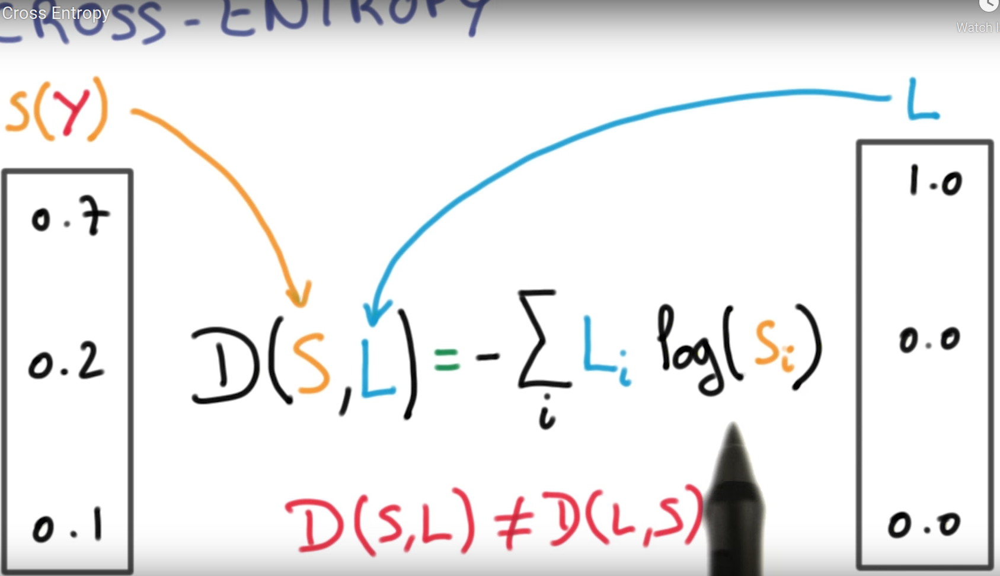
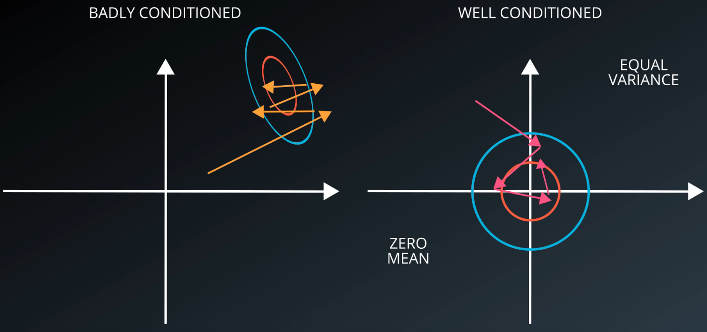
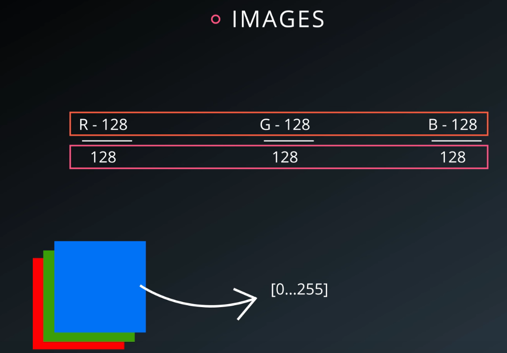
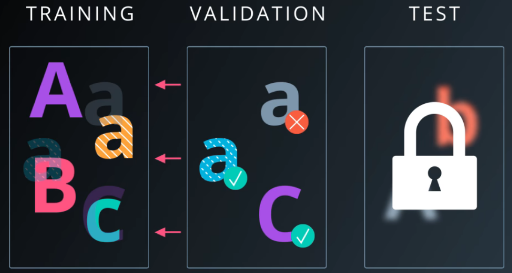
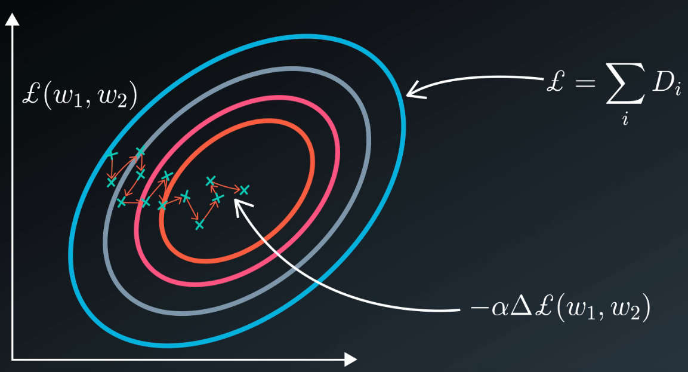
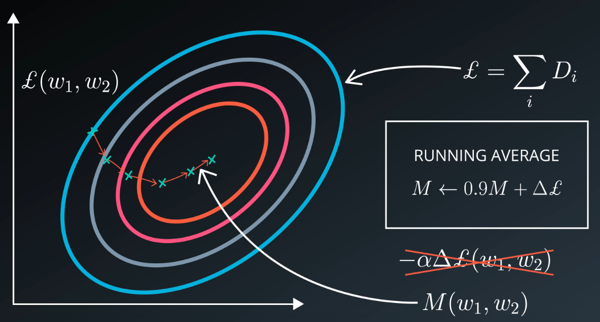

### 6. Installing TensorFlow

- コースにはまだTensorFlow 1.Xらしい。まだsessionを使っているから。https://www.tensorflow.org/guide/effective_tf2#functions_not_sessions

### 21. Cross entropy

- one-hot encodingにたくさん0があって、you don't want to take log of 0.

### 25. normalized inputs and initial weights

- one good guiding principle is that we always want our variables to have 0 mean and equal variance whenever possible.

- badly conditioned vs. well conditioned problem: 
- 画像の正規化：

### 26. Measuring performance

- validation setの情報もtraining setに流れていく：
  - validation setがないと、test setの情報がtraining setに漏れてしまう。それは最悪。

- validation set size: >30000 examples, そうすると、changes >0.1% in accuracy (つまり30 exampleの結果が正しくなった場合)。30000が難しい場合は、cross-validationを利用できる。でもデータを増やした方がいい。

### 32. stochastic gradient descent

- stochastic gradient descent scales well with both data and model size, and we want both big data and big models.

### 33. momentum and learning rate decay

- momentumを使わない場合：
  - At each step, we're taking a very small step in a random direction. But **on aggregate**, those steps take us towards the minimum of the loss. We can take advantage of the knowledge that we've accumulated from previous steps about where we should be headed.
- momentumを使う(running average)：
  - A cheap way to do that is to keep a running average of the gradients and to use that running average instead of the direction of the current batch of the data.

- learning rate($\alpha$) decayについて、one thing that's always the case is that it's beneficial to make that step smaller and smaller as you train. Some like to apply an exponential decay to their learning rate. Some like to make it smaller every time the loss reaches a plateau.

- When things don't work, always try to lower your learning rate first.

### 34. parameter hyperspace!

- Adagrad is a modification of SGD which implicitly does momentum and learning rate decay for you.