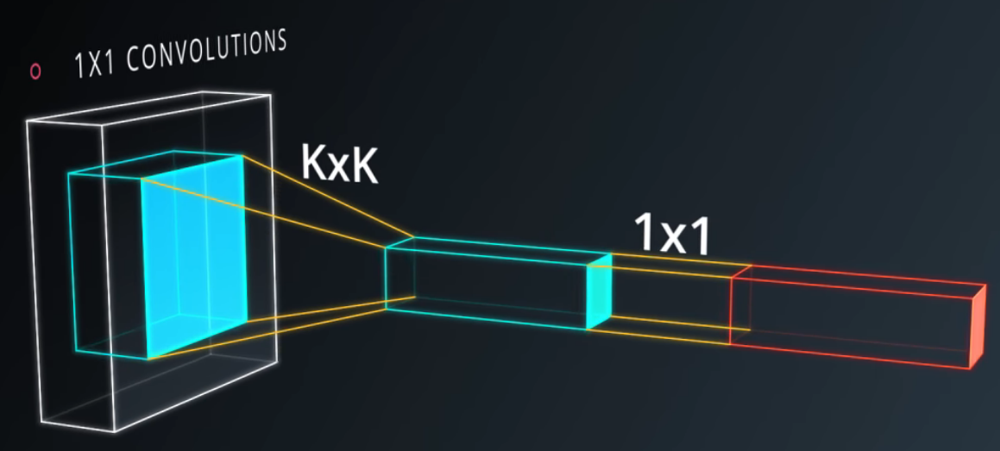
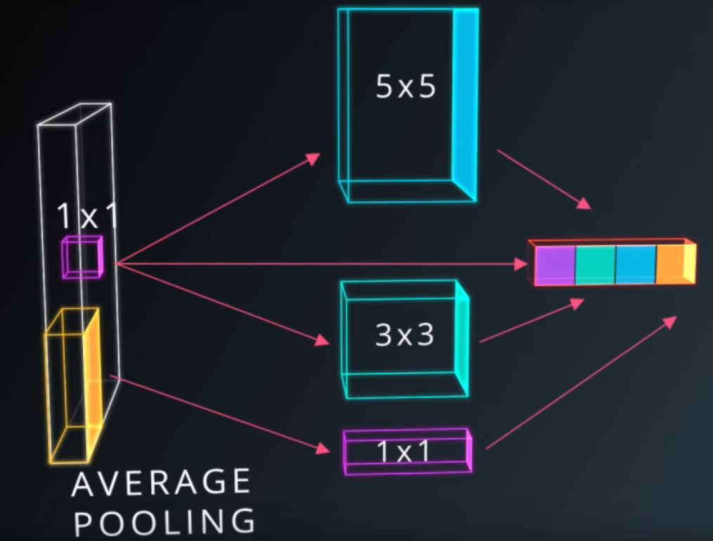

### 18. tensorflow convolution layer

```python
# Output depth
k_output = 64

# Image Properties
image_width = 10
image_height = 10
color_channels = 3

# Convolution filter
filter_size_width = 5
filter_size_height = 5

# Input/Image
input = tf.placeholder(
    tf.float32,
    shape=[None, image_height, image_width, color_channels])

# Weight and bias
weight = tf.Variable(tf.truncated_normal(
    [filter_size_height, filter_size_width, color_channels, k_output]))
bias = tf.Variable(tf.zeros(k_output))

# Apply Convolution
conv_layer = tf.nn.conv2d(input, weight, strides=[1, 2, 2, 1], padding='SAME')
# Add bias
conv_layer = tf.nn.bias_add(conv_layer, bias)
# Apply activation function
conv_layer = tf.nn.relu(conv_layer)
```

- TensorFlow uses a stride for each `input` dimension, `[batch, input_height, input_width, input_channels]`. 
- The `tf.nn.bias_add()` function adds a 1-d bias to the last dimension in a matrix.

### 20. tensorflow max pooling

```python
...
conv_layer = tf.nn.conv2d(input, weight, strides=[1, 2, 2, 1], padding='SAME')
conv_layer = tf.nn.bias_add(conv_layer, bias)
conv_layer = tf.nn.relu(conv_layer)
# Apply Max Pooling
conv_layer = tf.nn.max_pool(
    conv_layer,
    ksize=[1, 2, 2, 1],
    strides=[1, 2, 2, 1],
    padding='SAME')
```

- Recently, pooling layers have fallen out of favor:
  - recent datasets are so big and complex, we're more concerned about underfitting.
  - dropout is a much better regularizer.
  - pooling results is a loss of information.

- NOTE: For a pooling layer the output depth is the same as the input  depth. Additionally, the pooling operation is applied individually for  each depth slice.

### 29. 1x1 convolutions



- If you add a 1x1 convolution in the middle, suddenly you have a mini neural network running over the patch instead of a linear classifier.

### 30. inception module



- instead of having a single convolution, you have a composition of average pooling followed by 1x1, then a 1x1 convolution, then a 1x1 followed by 3x3, then a 1x1 followed by 5x5.
- what's interesting is that you can choose these parameters in such a way that the total number of parameters in your model is very small, yet the model performs better than if you had a simple convolution.

### 31. convolutional network in tensorflow

- conv2d:

  ```python
  def conv2d(x, W, b, strides=1):
      x = tf.nn.conv2d(x, W, strides=[1, strides, strides, 1], padding='SAME')
      x = tf.nn.bias_add(x, b)
      return tf.nn.relu(x)
  
  def conv2d(input):
      # Filter (weights and bias)
      F_W = tf.Variable(tf.truncated_normal((2, 2, 1, 3)))
      F_b = tf.Variable(tf.zeros(3))
      strides = [1, 2, 2, 1]
      padding = 'VALID'
      return tf.nn.conv2d(input, F_W, strides, padding) + F_b
  
  # out_height = ceil(float(in_height - filter_height + 1) / float(strides[1]))
  # out_width  = ceil(float(in_width - filter_width + 1) / float(strides[2]))
  ```

- maxpool2d:

  ```python
  def maxpool2d(x, k=2):
      return tf.nn.max_pool(
          x,
          ksize=[1, k, k, 1],
          strides=[1, k, k, 1],
          padding='SAME')
  ```

  