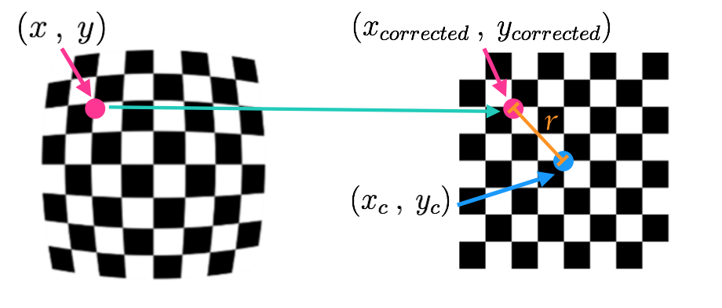

## 5. Distortion Correction

- distorted images: 

### 7. Pinhole Camera Model

- Real cameras don't use tiny pinholes like this, they use lenses to focus multiple light rays at a time, **which allows them to quickly form images**.  
  - But **lenses can introduce distortion** too. Light rays often bend a little too much or too little at the edges of a **curved lens** of a camera. (radial distortion)

- Another type is **tangential distortion**. If the camera's **lens is not aligned perfectly parallel to the imaging plane** where the camera film or sensor is, this makes an image look tilted (傾いた、かたむいた). 
- There are even example of lenses that **purposefully distort images like fisheye or wide angle lenses** which keep radial distortion for stylistic effect.

- Luckily, this distortion can generally be captured by 5 numbers called **distortion coefficients**, whose values reflect the amount of radial and tangential distortion in an image. $Distortion_{coefficients}=(k_1,k_2,p_1,p_2,k_3)$.
  - In severely distorted cases, sometimes even more than 5 coefficients are required to capture the amount of distortion.
  - Three coefficients need to be corrected for **radial distortion**: $k_1,k_2,k_3$.

- Radial distortion correction: 
  - To undistort these points, OpenCV calculates **r**, which is the known distance between a point in an undistorted (corrected) image $(x_{corrected},y_{corrected})$ and the center of the image distortion, which is often the center of that image $(x_c,y_c)$.
  - The distortion coefficient $k_3$ is required to accurately reflect major radial distortion (like in wide angle lenses). However, for minor radial distortion, which most regular camera lenses have, $k_3$ has a value close to or equal to zero and is negligible.

- Tangential distortion correction: $x_{corrected}=x+2p_1xy+p_2(r^2+2x^2), y_{corrected}=y+p_1(r^2+2y^2)+2p_2xy$.

### 9. Measuring Distortion

- Use chessboard to **create a transform that maps these distorted points to undistorted points**. 
  - And finally undistort any images.

### 10. Finding Corners (Jupyter notebookを参考)

- Use OpenCV functions `findChessboardCorners()` and `drawChessboardCorners()` to automatically find and draw corners in an image of a chessboard pattern.

### 11. Calibrating your camera

- *Note*: If you are reading in an image using `mpimg.imread()` this will read in an **RGB** image and you should convert to grayscale using *cv2.COLOR_RGB2GRAY*, but if you are using `cv2.imread()` or the `glob` API, as happens in this video example, this will read in a **BGR** image and you should convert to grayscale using *cv2.COLOR_BGR2GRAY*. 
- Camera calibration: `ret, mtx, dist, rvecs, tvecs = cv2.calibrateCamera(objpoints, imgpoints, gray.shape[::-1], None, None)`. 
  - `objpoints`はreal chessboardのcorners, `imgpoints`は歪んだchessboardのcorners. `dist`はdistortion coefficients. `mtx`はcamera matrix that we need to transform 3D object points to 2D image points. `rvecs, tvecs`はthe position of the camera in the world, with values for rotation and translation vectors.
  - channelも含まれたcolor imageだったら、`img.shape[1::-1]`でask for just the first two values in the shape array and reverse them.

- Undistort a test image: `dst = cv2.undistort(img, mtx, dist, None, mtx)`.
  - `dst`はan undistorted, often called destination image.

- `objpoints, imgpoints`を集めるプロセスが含まれたrepository：https://github.com/udacity/CarND-Camera-Calibration
  - `cv2.calibrateCamera()`に渡したimage shapeを変えてもundistorted imageは変わっていないけど。。。

### 14. Perspective Transform

- Perspective: objects appear smaller the farther away they are from a viewpoint. Parallel lines seem to converge to a point. 

- Doing a bird's-eye view transform is especially helpful for road images because it will also allow us to match a car's location directly with a map, since map displays roads and scenery from a top down view.
- A perspective transform let us change our perspective to view the same scene from different viewpoints and angles.
  - This could be **viewing a scene from the side of a camera, from below the camera, or looking down on the road from above**.
-  The process of applying a perspective transform will be kind of similar to how we applied undistortion. But this time, instead of mapping object points to image points, we want to map the points in a given image to different desired image points with a new perspective. 
  - And again, this perspective can be done for all kinds of different viewpoints, whether that's from above like with a map or from different camera angles.

### 16. Transform a Stop Sign

- 4点は十分：

- 下記の関数を使えば：

  ```python
  M = cv2.getPerspectiveTransform(src, dst)
  Minv = cv2.getPerspectiveTransform(dst, src)
  warped = cv2.warpPerspective(img, M, img_size, flags=cv2.INTER_LINEAR)
  ```

