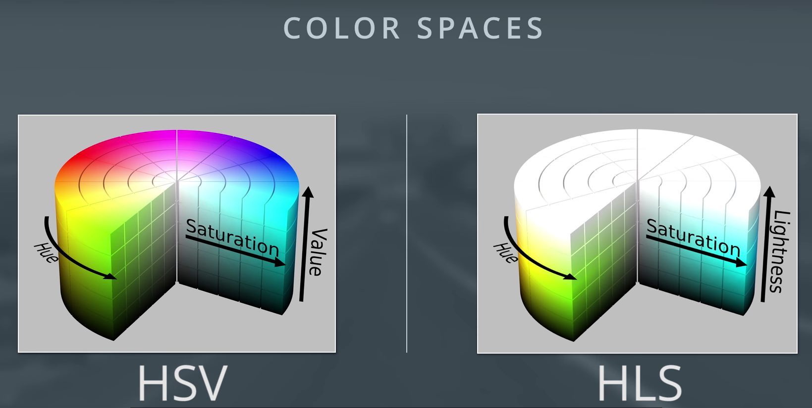
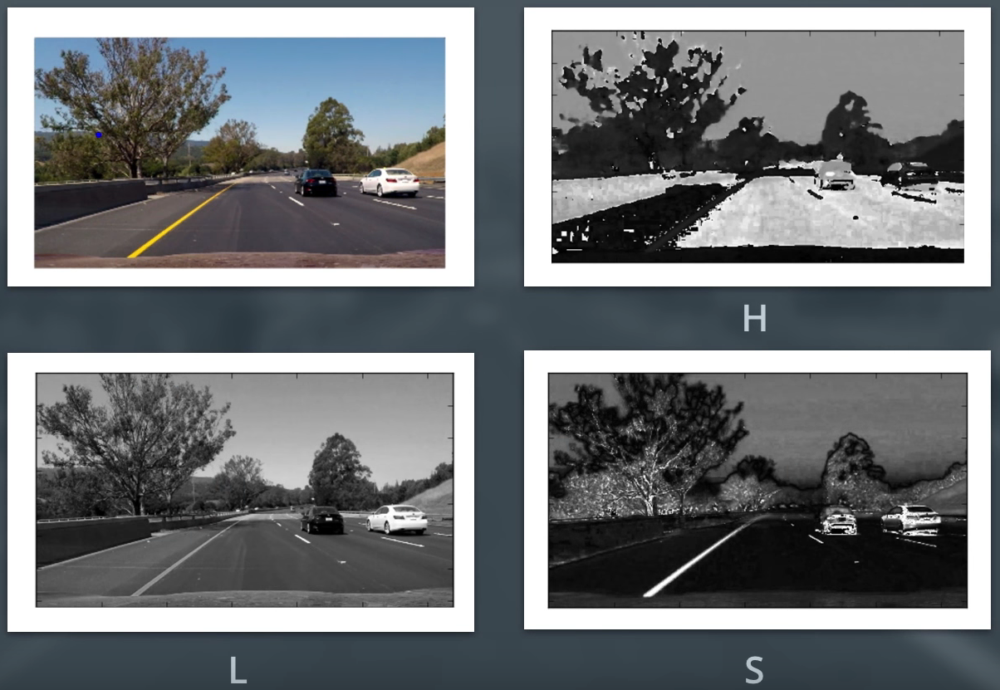

### 2. Sobel operator

```python
# 1, 0 denotes x direction
sobelx = cv2.Sobel(gray, cv2.CV_64F, 1, 0)
# 0, 1 denotes y direction
sobely = cv2.Sobel(gray, cv2.CV_64F, 0, 1)

abs_sobelx = np.absolute(sobelx)
# Convert the absolute value image to 8-bit
scaled_sobel = np.uint8(255*abs_sobelx/np.max(abs_sobelx))

# Create a binary threshold to select pixels based on gradient strength
thresh_min = 20
thresh_max = 100
sxbinary = np.zeros_like(scaled_sobel)
sxbinary[(scaled_sobel >= thresh_min) & (scaled_sobel <= thresh_max)] = 1
plt.imshow(sxbinary, cmap='gray')
```

### 4. Magnitude of the Gradient

- It's also worth considering the size of the region in the image over which you'll be taking the gradient. 
  - You can modify the kernel size for the Sobel operator to change the size of this region.
  - Taking the gradient over larger regions can smooth over noisy intensity fluctuations on small scales.

### 5. Direction of the Gradient

$arctan(sobel_y/sobel_x)$.

### 8. Color Threholding

- HSV and HLS color spaces: 
  - **HLS** color space: isolates the lightness (L) component, which varies the most under different lighting conditions.
  - H and S channels stay fairly consistent in shadow or excessive brightness. 
  - Saturation also plays a part in this; saturation is a measurement of **colorfulness**. So, as colors get lighter and closer to white, they have a lower saturation value, whereas colors that are **the most intense**, like a bright primary color (imagine a bright red, blue, or yellow), have a high saturation value.
- Most of these different color spaces were either **inspired by the human vision system**, and/or developed for efficient use in **television screen displays and computer graphics**.

- RGBからHLSへの変換：
  - Constants: $V_{max}\leftarrow max(R,G,B)$, $V_{min}\leftarrow min(R,G,B)$.
  - H channel conversion:
    - $H\leftarrow \frac{30(G-B)}{V_{max}-V_{min}}$, if $V_{max}=R$.
    - $H\leftarrow 60+\frac{30(B-R)}{V_{max}-V_{min}}$, if $V_{max}=G$.
    - $H\leftarrow 120+\frac{30(R-G)}{V_{max}-V_{min}}$, if $V_{max}=B$.
    -  In OpenCV, for 8-bit images, the range of H is from 0-179. It's  typically from 0-359 for degrees around the cylindrical colorspace, but  this number is **divided in half so that the range can be represented in  an 8-bit image** whose color values range from 0-255. 
  - L channel conversion: $L\leftarrow \frac{V_{max}+V_{min}}{2}$.
  - S channel conversion:
    - $S\leftarrow \frac{V_{max}-V_{min}}{V_{max}+V_{min}}$, if $L<0.5$.
    - $S\leftarrow \frac{V_{max}-V_{min}}{2-(V_{max}+V_{min})}$, if $L\geq 0.5$.