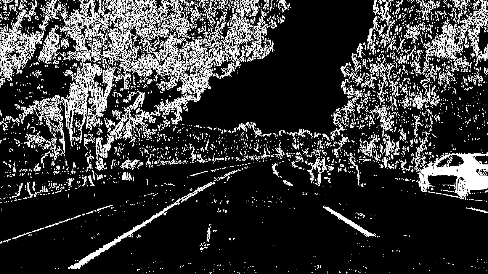
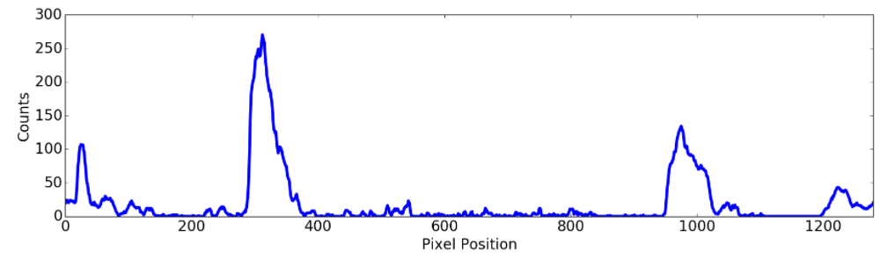
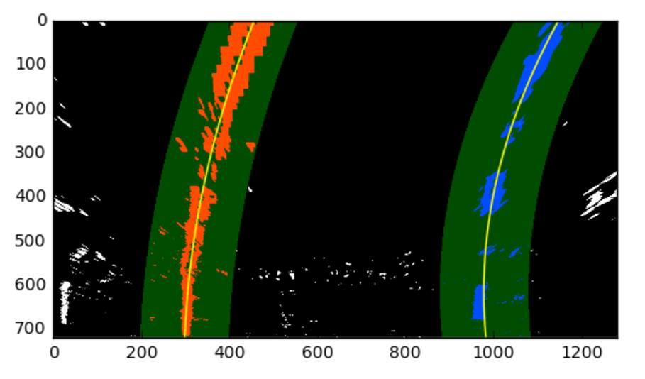

### 2. Processing Each Image

- Thresholding: 

- Perspective transform: 

  

### 3. Finding the lines: histogram peaks

### 4. Finding the lines: sliding window

### 5. Finding the lines: search from prior

- However, using the full algorithm from before and **starting fresh on every frame may seem inefficient**, as the **lane lines don't necessarily move a lot from frame to frame**.

- In the next frame of video, you don't need to do a blind search again, but instead you can **just search in a margin around the previous lane line position**. 先端技術案件にこれを考えられてなかった（理解できなかった）。

### 6. Measuring Curvature

#### Radius of curvature

- $R_{curve}=\frac{[1+(\frac{dx}{dy})^2]^{\frac{3}{2}}}{|\frac{d^2 x}{dy^2}|}$.（$x=f(y)=Ay^2+By+C$だから）

- $f'(y)=2Ay+B$, $f''(y)=2A$.
- $R_{curve}=\frac{(1+(2Ay+B)^2)^{\frac{3}{2}}}{|2A|}$.

- The $y$ values of your image increase from top to bottom, so if, for example, you wanted to measure the radius of curvature closest to your vehicle, you could evaluate the formula above at the $y$ value corresponding to the bottom of your image, or in Python, at `yvalue = image.shape[0]`.

#### From pixels to real-world

- Or, if you prefer to derive a conversion from pixel space to world space in your own images, compare your images with U.S. regulations that require a minimum lane width of 12 feet or 3.7 meters, and the dashed lane lines are 10 feet or 3 meters long each.