### 12. Perceptrons

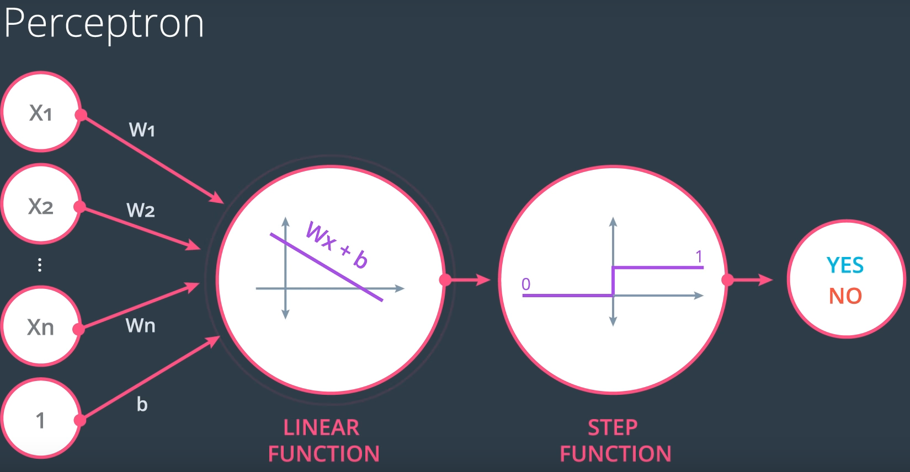

### 14. Why "Neural Networks"?

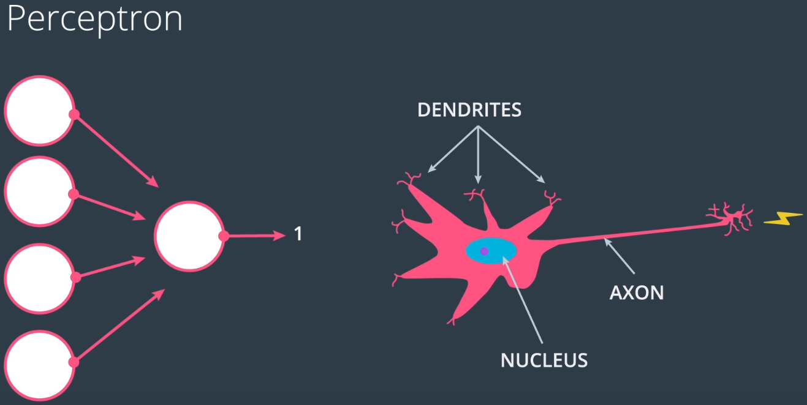

### 20. Discrete vs Continuous

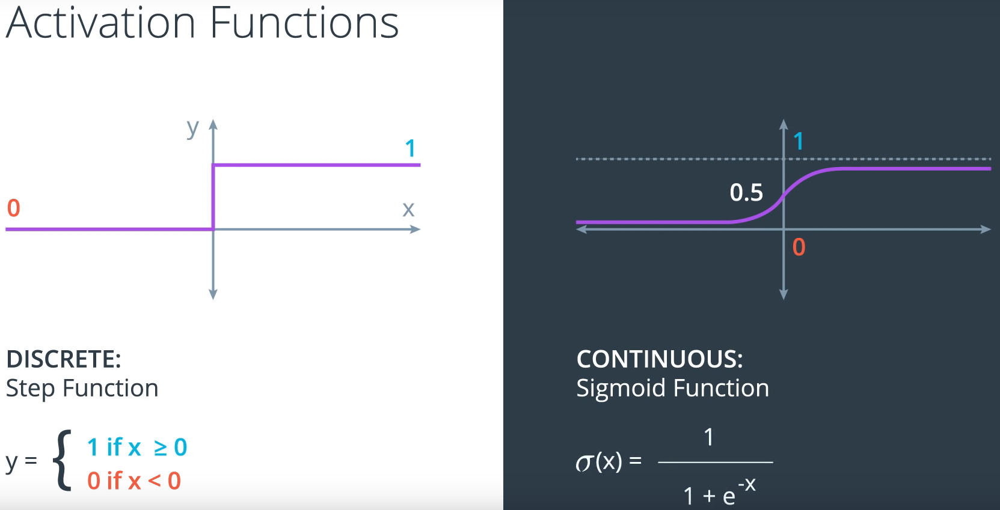

- gradient descentを使うために。ここの横軸はWx+bだ。

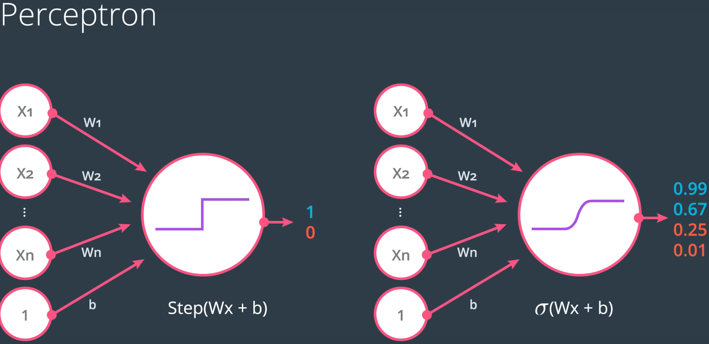

### 31. Perceptron vs Gradient descent

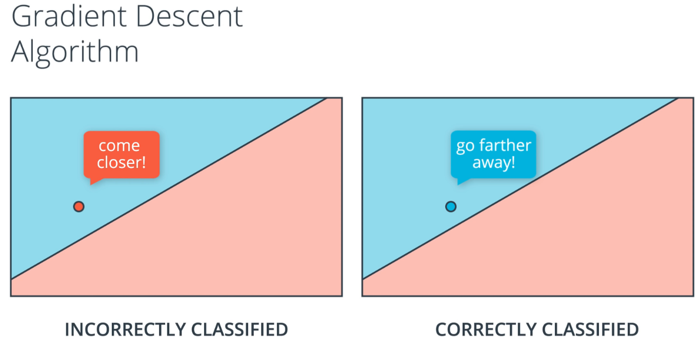

- perceptron algorithmだと、correctly classified pointの場合は何もしない。gradient descent algorithmだと、境界線を自分から遠くさせる。

### 35. Neural Network Architecture

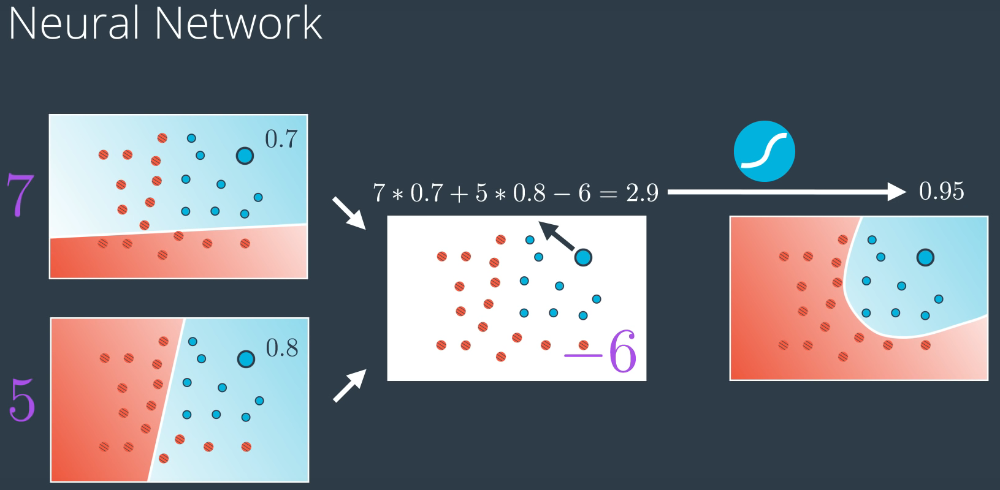

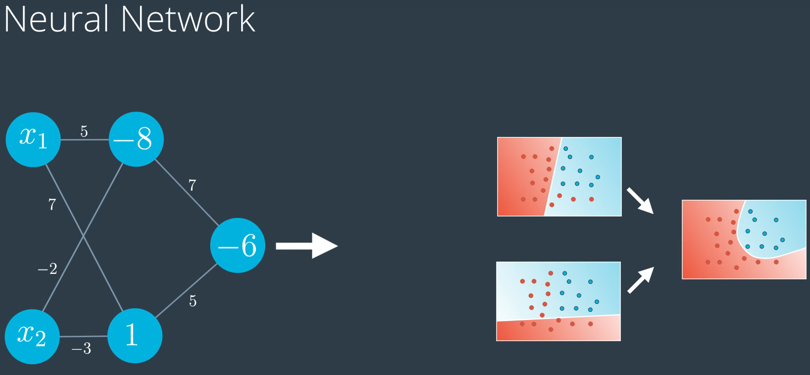

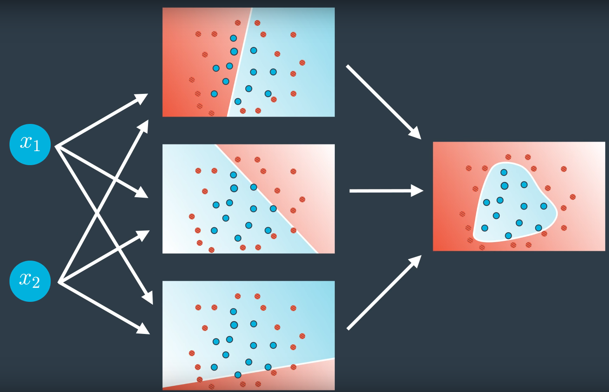

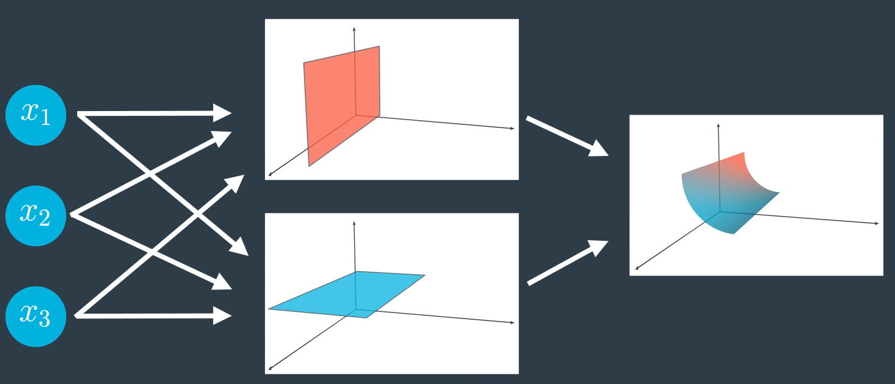

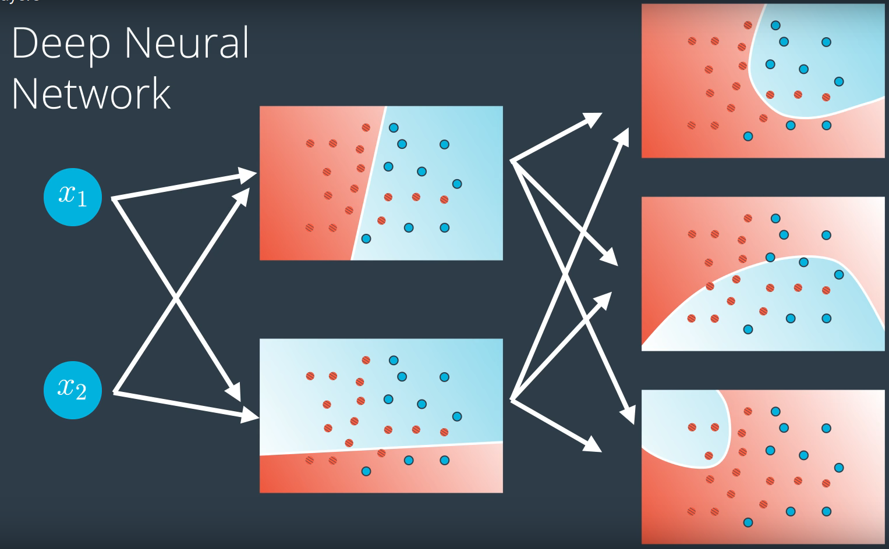

- multiclass classification model: catの確率、dogの確率、birdの確率。

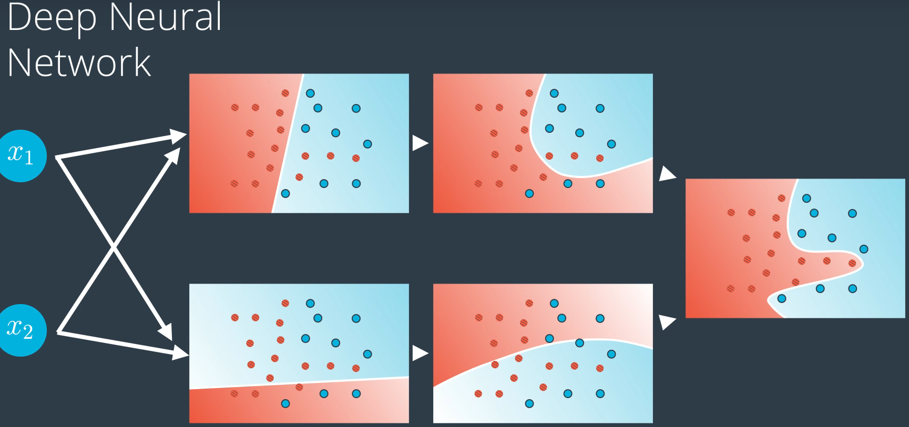

### 37. Multilayer Perceptrons

- It's possible to get the transpose of an array like so `arr.T`, but **for a 1D array, the transpose will return a row vector**. Instead, **use `arr[:,None]` to create a column vector**:

  ```python
  print(features)
  > array([ 0.49671415, -0.1382643 ,  0.64768854])
  
  print(features.T)
  > array([ 0.49671415, -0.1382643 ,  0.64768854])
  
  print(features[:, None])
  > array([[ 0.49671415],
         [-0.1382643 ],
         [ 0.64768854]])
  ```

- Alternatively, you can **create arrays with two dimensions**. Then, you can use `arr.T` to get the column vector.

  ```python
  np.array(features, ndmin=2)
  > array([[ 0.49671415, -0.1382643 ,  0.64768854]])
  
  np.array(features, ndmin=2).T
  > array([[ 0.49671415],
         [-0.1382643 ],
         [ 0.64768854]])
  ```

- vectorとmatrixの掛け算はnp.dotでできる。