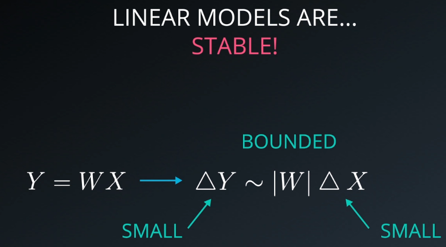
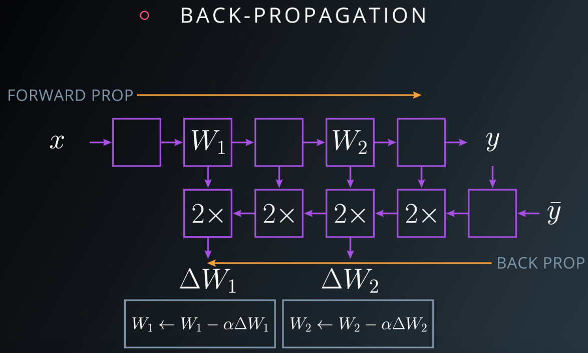
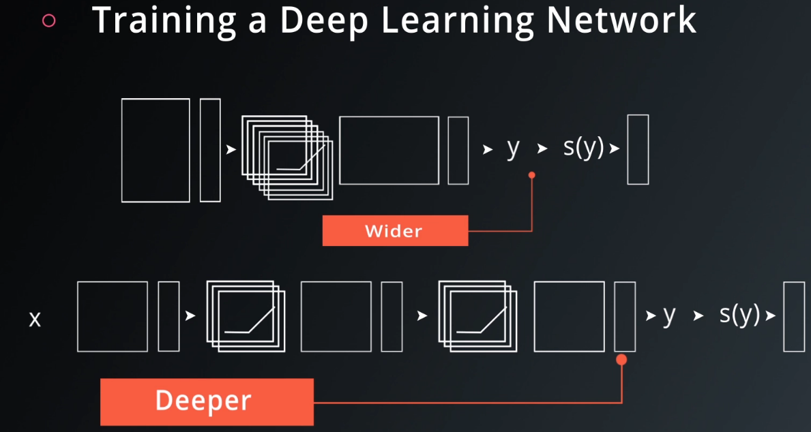
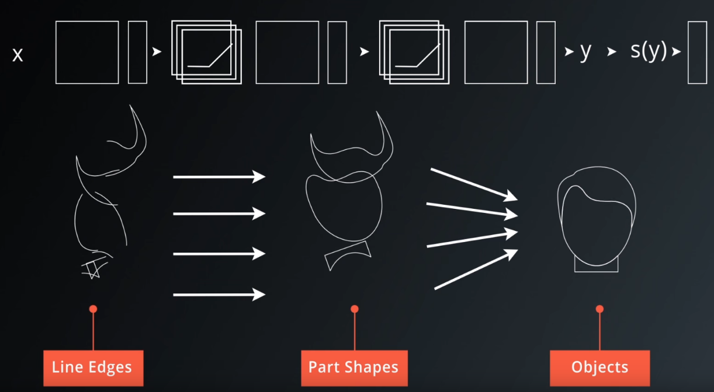
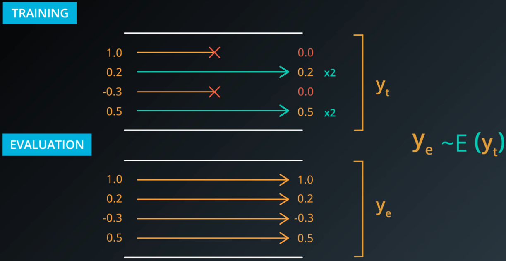

### 4. linear models are limited

- Numerically linear operations are very stable: 
  - small changes in the input can never yield big changes in the output.

### 8. tensorflow relu

```python
# TODO: Create Model
hidden_layer = tf.add(tf.matmul(features, weights[0]), biases[0])
hidden_layer = tf.nn.relu(hidden_layer)
logits = tf.add(tf.matmul(hidden_layer, weights[1]), biases[1])

# TODO: save and print session results on variable output
with tf.Session() as sess:
    sess.run(tf.global_variables_initializer())
    output = sess.run(logits)
    print(output)
```

- logitsをprintするのではない！

### 11. backprop



- In particular, each block of the back prop often takes about twice the memory that's needed for the forward prop and twice to compute.

### 12. deep neural network in tensorflow

- https://github.com/aymericdamien/TensorFlow-Examples

### 13. training a deep learning network

- you can typically get much more performance with fewer parameters by going deeper, rather than wider. 
- a lot of natural phenomena, that you might be interested in, tend to have a hierarchical structure which deep models naturally capture. 

### 14. save and restore tensorflow models

- saving variables:

  ```python
  import tensorflow as tf
  
  # The file path to save the data
  save_file = './model.ckpt'
  
  # Two Tensor Variables: weights and bias
  weights = tf.Variable(tf.truncated_normal([2, 3]))
  bias = tf.Variable(tf.truncated_normal([3]))
  
  # Class used to save and/or restore Tensor Variables
  saver = tf.train.Saver()
  
  with tf.Session() as sess:
      # Initialize all the Variables
      sess.run(tf.global_variables_initializer())
  
      # Show the values of weights and bias
      print('Weights:')
      print(sess.run(weights))
      print('Bias:')
      print(sess.run(bias))
  
      # Save the model
      saver.save(sess, save_file)
  ```

- loading variables:

  ```python
  # Remove the previous weights and bias
  tf.reset_default_graph()
  
  # Two Variables: weights and bias
  weights = tf.Variable(tf.truncated_normal([2, 3]))
  bias = tf.Variable(tf.truncated_normal([3]))
  
  # Class used to save and/or restore Tensor Variables
  saver = tf.train.Saver()
  
  with tf.Session() as sess:
      # Load the weights and bias
      saver.restore(sess, save_file)
  
      # Show the values of weights and bias
      print('Weight:')
      print(sess.run(weights))
      print('Bias:')
      print(sess.run(bias))
  ```

  - Since [`tf.train.Saver.restore()`](https://www.tensorflow.org/api_docs/python/tf/train/Saver#restore) sets all the TensorFlow Variables, you don't need to call [`tf.global_variables_initializer()`](https://www.tensorflow.org/api_docs/python/tf/global_variables_initializer).

### 15. Finetuning

- naming errorを防ぐために、Instead of letting TensorFlow set the `name` property, let's set it manually:

  ```python
  import tensorflow as tf
  
  tf.reset_default_graph()
  
  save_file = 'model.ckpt'
  
  # Two Tensor Variables: weights and bias
  weights = tf.Variable(tf.truncated_normal([2, 3]), name='weights_0')
  bias = tf.Variable(tf.truncated_normal([3]), name='bias_0')
  
  saver = tf.train.Saver()
  
  # Print the name of Weights and Bias
  print('Save Weights: {}'.format(weights.name))
  print('Save Bias: {}'.format(bias.name))
  
  with tf.Session() as sess:
      sess.run(tf.global_variables_initializer())
      saver.save(sess, save_file)
  
  # Remove the previous weights and bias
  tf.reset_default_graph()
  
  # Two Variables: weights and bias
  bias = tf.Variable(tf.truncated_normal([3]), name='bias_0')
  weights = tf.Variable(tf.truncated_normal([2, 3]) ,name='weights_0')
  
  saver = tf.train.Saver()
  
  # Print the name of Weights and Bias
  print('Load Weights: {}'.format(weights.name))
  print('Load Bias: {}'.format(bias.name))
  
  with tf.Session() as sess:
      # Load the weights and bias - No Error
      saver.restore(sess, save_file)
  
  print('Loaded Weights and Bias successfully.')
  ```

### 19. dropout

- it also makes your network act as if taking the consensus over an ensemble of networks, which is always a good way to improve performance.
- if dropout doesn't work for you, you should probably be using a bigger network.
- dropoutのtrainingやevaluation: 
  - when you evaluate the network that's been trained with dropout, you obviously no longer want this randomness. you want something deterministic. instead, you're going to want to take the consensus over these redundant models. you get the consensus opinion by averaging the activations.
  - here's a trick to make sure **this expectation holds**. during training, not only to use zero out to the activations that you drop out, but also scale the remaining activations by a factor of 2. this way, when it comes time to **average them during evaluation**, you just removed these dropouts and scaling operations from you neural net. and the result is an average of these activations that is properly scaled.

- tensorflow dropout:

  ```python
  keep_prob = tf.placeholder(tf.float32) # probability to keep units
  
  hidden_layer = tf.add(tf.matmul(features, weights[0]), biases[0])
  hidden_layer = tf.nn.relu(hidden_layer)
  hidden_layer = tf.nn.dropout(hidden_layer, keep_prob)
  
  logits = tf.add(tf.matmul(hidden_layer, weights[1]), biases[1])
  
  # save and print session results as variable named "output"
  with tf.Session() as sess:
      sess.run(tf.global_variables_initializer())
      output = sess.run(logits, feed_dict={keep_prob: 0.5})
  print(output)
  ```

  - `keep_prob` allows you to adjust the number of units to drop. **In order to compensate for dropped units, `tf.nn.dropout()` multiplies all units that are kept (i.e. *not* dropped) by `1/keep_prob`**. 
  - **During testing, use a `keep_prob` value of `1.0` to keep all units and maximize the power of the model**.