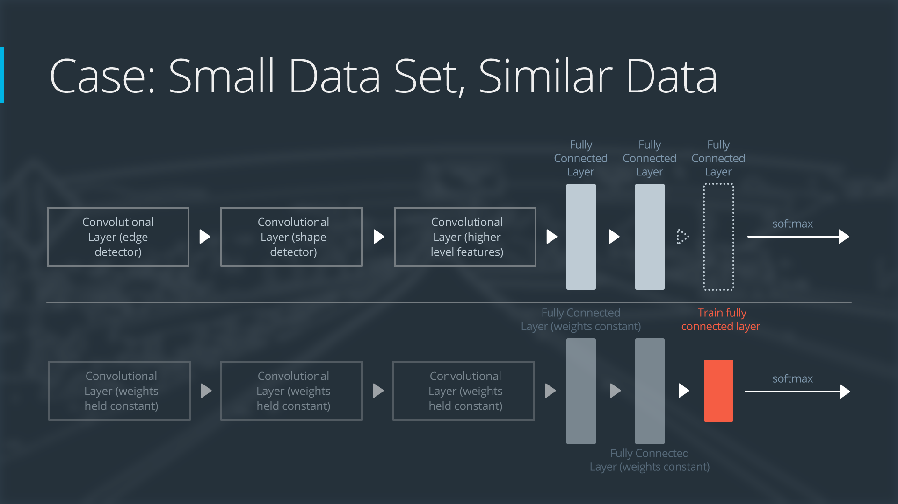

### 4. transfer learning

- 4 cases when using transfer learning: 
- transfer learningの4種類を説明するためのサンプルネットワーク：
- small, similarの場合のやり方：
  - slice off the end of the neural network.
  - add a new fully connected layer that matches the number of classes in the new data set.
  - randomize the weights of the new fully connected layer; freeze all the weights from the pre-trained network.
  - train the network to update the weights of the new fully connected layer.

- small, differentの場合のやり方：
  - slice off most of the pre-trained layers near the beginning of the network
  - add to the remaining pre-trained layers a new fully connected layer that matches the number of classes in the new data set
  - randomize the weights of the new fully connected layer; freeze all the weights from the pre-trained network
  - train the network to update the weights of the new fully connected layer
  - the original training set and the new data set do not share higher level features. In this case, the new network will only use the layers  containing lower level features.

- large, similarの場合のやり方：
  - remove the last fully connected layer and replace with a layer matching the number of classes in the new data set
  - randomly initialize the weights in the new fully connected layer
  - **initialize the rest of the weights using the pre-trained weights** 
  - re-train the entire neural network

- large, differentの場合のやり方：
  - remove the last fully connected layer and replace with a layer matching the number of classes in the new data set
  - retrain the network from scratch with **randomly initialized weights**
  - alternatively, you could just use the same strategy as the "large and similar" data case
  - Even though the data set is different from the training data,  **initializing the weights from the pre-trained network might make  training faster. So this case is exactly the same as the case with a  large, similar data set**.
  - If using the pre-trained network as a starting point does not produce a  successful model, another option is to randomly initialize the  convolutional neural network weights and train the network from scratch.
- differentの可能性は低い：given the large size of the ImageNet dataset (remember, it's  over 14 million images from 1,000 classes!), it's highly unlikely this  is really the case - it will almost always make the most sense to start  with ImageNet pre-trained weights, and only fine-tune from there

### 7. alexnet

### 11. googlenet

- GoogLeNet's great advantage is that it runs really fast. The team that developed GoogLeNet developed a clever concept called an Inception module, which trains really well and is efficiently deployable.
- GoogLeNet is a great choice to investigate if you need to run your network in real time, like maybe in a self-driving car.

- Don't forget to perform the necessary pre-processing steps to any inputs you include! While the original Inception model used a 224x224 input  like VGG, InceptionV3 actually uses a 299x299 input.

### papers

- behavioral cloning: [ChauffeurNet: Learning to Drive by Imitating the Best and Synthesizing the Worst](https://arxiv.org/abs/1812.03079) by M. Bansal, A. Krizhevsky and A. Ogale
- object detection and tracking:
  - [SSD: Single Shot MultiBox Detector](https://arxiv.org/abs/1512.02325) by W. Liu, et. al.
  - [VoxelNet: End-to-End Learning for Point Cloud Based 3D Object Detection](https://arxiv.org/abs/1711.06396) by Y. Zhou and O. Tuzel
  - [Fast and Furious: Real Time End-to-End 3D Detection, Tracking and Motion Forecasting with a Single Convolutional Net](http://openaccess.thecvf.com/content_cvpr_2018/papers/Luo_Fast_and_Furious_CVPR_2018_paper.pdf) by W. Luo, *et. al.*

- semantic segmentation: [SegNet: A Deep Convolutional Encoder-Decoder Architecture for Image Segmentation](https://arxiv.org/abs/1511.00561) by V. Badrinarayanan, A. Kendall and R. Cipolla.