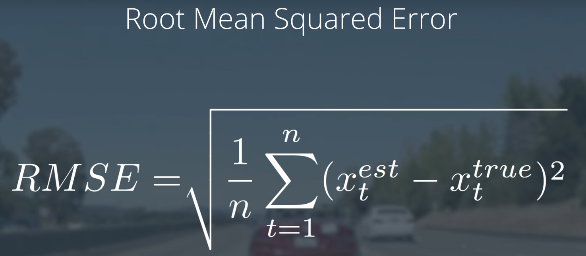

### 6. kalman filter intuition

- The K matrix, often called the Kalman filter gain, **combines** the **uncertainty of where we think we are** P′ with the **uncertainty of our sensor measurement** R.
  - If our sensor measurements are very uncertain (R is high relative to  P'), then the Kalman filter will give more weight to where we think we  are: x′. 
  - If where we think we are is uncertain (P' is high relative to R), the  Kalman filter will put more weight on the sensor measurement: z. 

### 10. process covariance matrix

### 15. radar measurements

### 17. extended kalman filter

### 19. jacobian matrix

### 21. ekf algorithm generalization

### 22. sensor fusion general flow

### 23. evaluating kf performance

