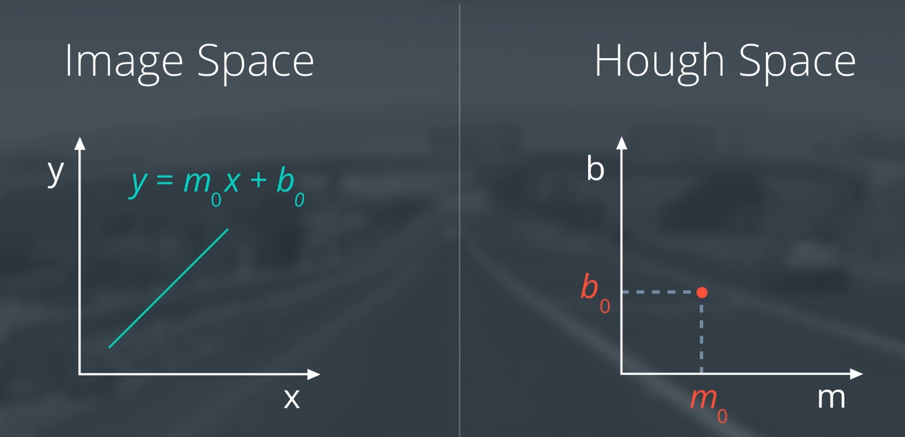
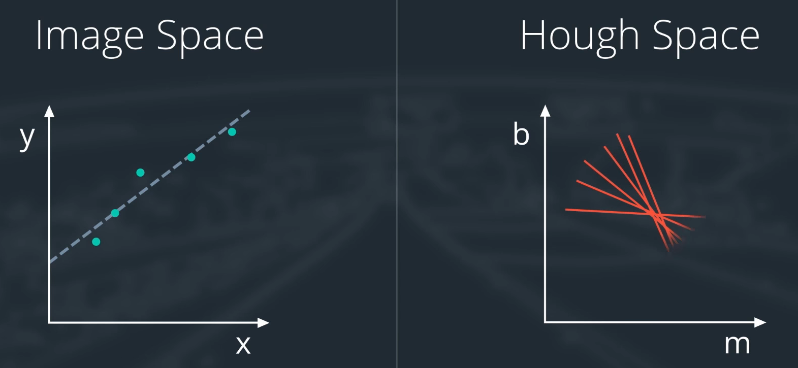
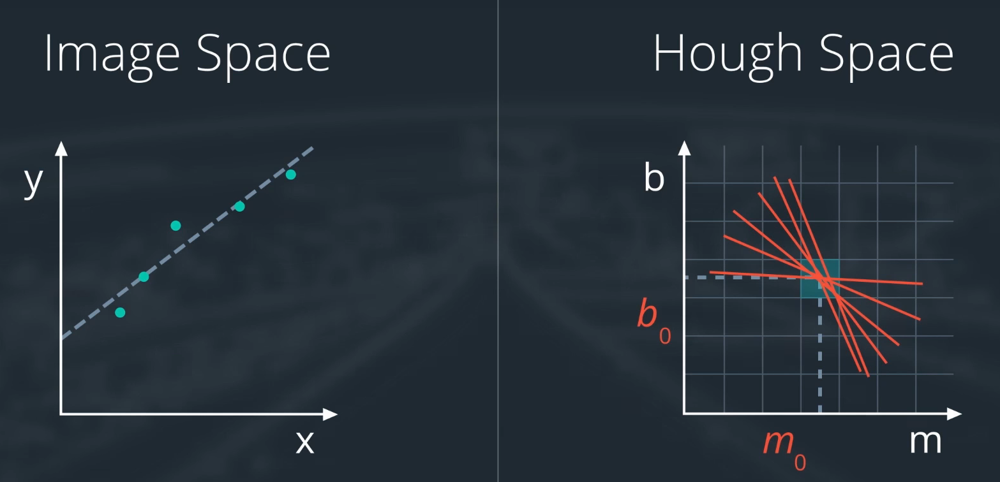
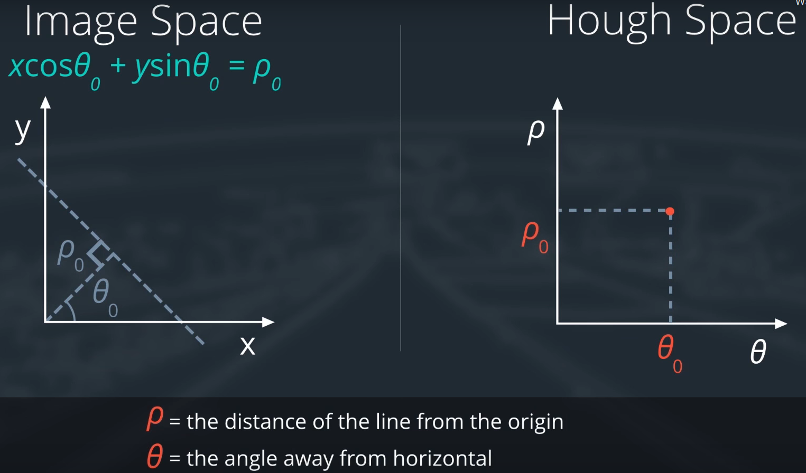
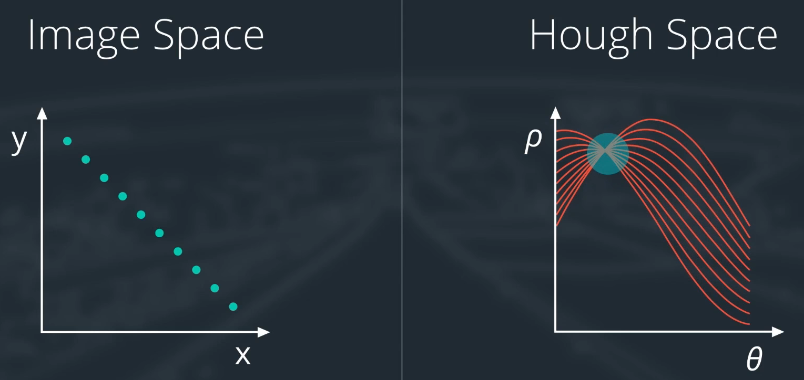

## 3. Color Selection

- RGB閾値（例えば`[200, 200, 200]`）で白いピクセルをfilter outする。
- 0 is the darkest possible value and 255 is the brightest possible value.
- Always make a copy of arrays or other variables in Python. `color_select = np.copy(image)`.

## 6. Region Masking

```python
# Fit lines (y=Ax+B) to identify the  3 sided region of interest
# np.polyfit() returns the coefficients [A, B] of the fit
fit_left = np.polyfit((left_bottom[0], apex[0]), (left_bottom[1], apex[1]), 1)
fit_right = np.polyfit((right_bottom[0], apex[0]), (right_bottom[1], apex[1]), 1)
fit_bottom = np.polyfit((left_bottom[0], right_bottom[0]), (left_bottom[1], right_bottom[1]), 1)

# Find the region inside the lines
XX, YY = np.meshgrid(np.arange(0, xsize), np.arange(0, ysize))
region_thresholds = (YY > (XX*fit_left[0] + fit_left[1])) & 
                    (YY > (XX*fit_right[0] + fit_right[1])) & 
                    (YY < (XX*fit_bottom[0] + fit_bottom[1]))

# Color pixels red which are inside the region of interest
region_select[region_thresholds] = [255, 0, 0]
```

- `left_bottom, right_bottom, apex`は三角形の3点。

- 四角形のmaskの例：

  ```python
  # Next we'll create a masked edges image using cv2.fillPoly()
  mask = np.zeros_like(edges)   
  ignore_mask_color = 255   
  
  # This time we are defining a four sided polygon to mask
  imshape = image.shape
  vertices = np.array([[(0,imshape[0]),(450, 290), (490, 290), (imshape[1],imshape[0])]], dtype=np.int32)
  cv2.fillPoly(mask, vertices, ignore_mask_color)
  masked_edges = cv2.bitwise_and(edges, mask)
  ```

  - `edges`はCanny Edge検知の結果、また`masked_edges`はHoughLinesPのinputになる。

## 7. Color and Region Combined

```python
# Mask pixels below the threshold
color_thresholds = (image[:,:,0] < rgb_threshold[0]) | 
                    (image[:,:,1] < rgb_threshold[1]) | 
                    (image[:,:,2] < rgb_threshold[2])

# Find the region inside the lines
XX, YY = np.meshgrid(np.arange(0, xsize), np.arange(0, ysize))
region_thresholds = (YY > (XX*fit_left[0] + fit_left[1])) & 
                    (YY > (XX*fit_right[0] + fit_right[1])) & 
                    (YY < (XX*fit_bottom[0] + fit_bottom[1]))
# Mask color selection
color_select[color_thresholds] = [0,0,0]
# Find where image is both colored right and in the region
line_image[~color_thresholds & region_thresholds] = [255,0,0]
```

## 11. Canny Edge Detection

- 上記のやり方はwhiteにのみ有効。ほかの色のlane markもあるので、Canny Edge detectionを使う。
- Computing the gradient gives us **thick edges**. With Canny algorithm, we will **thin out these edges** to find just the individual pixels that follow the strongest gradients.
  - We'll then extend those strong edges to include pixels all the way down to a lower threshold that we defined when calling the Canny function.

- image座標系のoriginが左上にあることについて、this might seem weird at first, but if you think about **an image as a matrix**, it makes sense that the "00" element is in the upper left.

- Canny Edgeを使う前に、grayscaleに変更されている。

## 12. Canny to Detect Lane Lines

- もっとCannyアルゴリズムを厳密に述べると、The algorithm will first detect strong edge (strong gradient) pixels above the `high_threshold`, and **reject pixels below the `low_threshold`**.
  - Next, pixels with values between the `low_threshold` and `high_threshold` will be included **as long as they are connected to strong edges**.

- `low_threshold`や`high_threshold`の選択について、
  - grayscale pixelの値が`[0, 255]`なので、a **reasonable range** for your threshold parameters would also be in the **tens to hundreds**.
  - As far as a ratio of `low_threshold` to `high_threshold`, John Canny himself recommended a low to high ratio of **`1:2` or `1:3`**.

- We'll also include Gaussian smoothing, **before running `Canny`**, which is essentially a way of suppressing noise and spurious gradients by averaging.

## 14. Hough Transform

- Image space vs. Hough space (parameter space): 
  - The Hough Transform is just the conversion from image space to Hough space.

- ではsingle point `(x_0, y_0)`は、Hough spaceだと、`b=y-mx`なので、直線になる。

- 2点`(x1, y1), (x2, y2)`だったら、Hough spaceだと、`b=-x1*m+y1, b=-x2*m+y2`の2本直線、また、`x1!=x2`だったら、その2本直線は交差する（slopeが違うから）。
  - 交差する点が`(m0, b0)`だったら、image spaceには`(x1, y1), (x2, y2)`を通る線だ。`m0=(y2-y1)/(x2-x1)`だから。

- だからImage spaceで直線にfitすることは、Hough spaceだと、直線らの交差点を見つけることになる：
  - Divide Hough space into grids and define intersecting lines as all lines passing through a given grid cell. 
  - Consider every point in the edge-detected image as a line in Hough space. And **where many lines in Hough space intersect**, I declare I have found **a collection of points that describe a line** in image space.

- しかし、vertical線のmは未定義なので、polar座標系（極座標系）のパラメータを使う！！
- この場合は、image spaceのsingle点はHough spaceのsine curveになる！なので、image spaceの直線に並んでいる点列は、sine curveらの交差になる！

## 15. Hough Transform to Find Lane Lines

- パラメータの説明：

  ```python
  lines = cv2.HoughLinesP(masked_edges, rho, theta, threshold, np.array([]), min_line_length, max_line_gap)
  ```

  - `rho(pixel), theta(radian)` are the distance and angular **resolution** of our **grid** in Hough space.
- `threshold` specifies the minimum number of votes (intersections in a given grid cell) a candidate line needs to have to make it into the output. 

## 17. Parameter Tuning

- Computer Visionでのチューニングは、GUIツールのほうがよさそう。https://github.com/maunesh/opencv-gui-helper-tool

## Project

- The reviewer mentioned this paper that I should read later: https://www.sciencedirect.com/science/article/pii/S240595952030240X 

- Reviewerの意見は、HSV or HSL color spaceの利用： https://naokishibuya.medium.com/finding-lane-lines-on-the-road-30cf016a1165
- また、Canny edge detectionのhigh threshold, low thresholdの選択について：https://stackoverflow.com/questions/21324950/how-can-i-select-the-best-set-of-parameters-in-the-canny-edge-detection-algorith
- また、Hough transformの曲線検知について：https://airccj.org/CSCP/vol5/csit53211.pdf
- また、using clustering to remove the outliers by considering the historical data: https://www.researchgate.net/publication/221324943_A_Simple_and_Efficient_Lane_Detection_using_Clustering_and_Weighted_Regression

