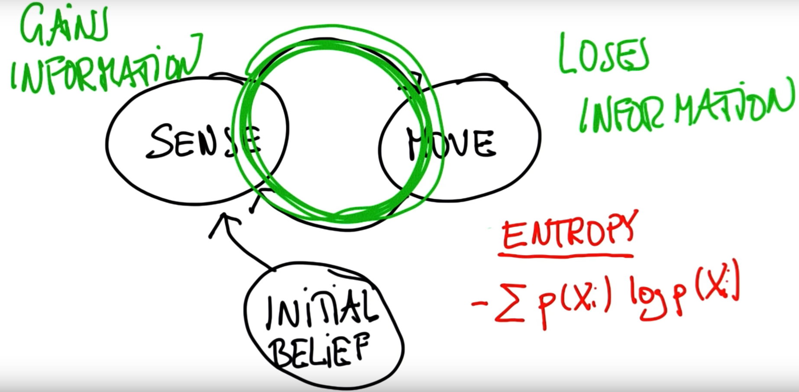

### 19. multiple measurements

```python
p=[0.2, 0.2, 0.2, 0.2, 0.2] # prior
world=['green', 'red', 'red', 'green', 'green']
measurements = ['red', 'green']
pHit = 0.6
pMiss = 0.2

def sense(p, Z):
    q=[]
    for i in range(len(p)):
        hit = (Z == world[i])
        q.append(p[i] * (hit * pHit + (1-hit) * pMiss))
    s = sum(q)
    for i in range(len(q)):
        q[i] = q[i] / s
    return q
for measurement in measurements:
    p = sense(p, measurement)
print p
```

- 最初の`p`はprior, 観測値を考慮し初めてからposteriorになる。
- robotの本当の位置はworldの5位置の中の一つ。今robotは２つ観測値を見たら、robotが5位置のそれぞれにいる確率は？という問題。
  - combine probability with sensor measurements.

### 30. sense and move



```python
#Given the list motions=[1,1] which means the robot 
#moves right and then right again, compute the posterior 
#distribution if the robot first senses red, then moves 
#right one, then senses green, then moves right again, 
#starting with a uniform prior distribution.

p=[0.2, 0.2, 0.2, 0.2, 0.2]
world=['green', 'red', 'red', 'green', 'green']
measurements = ['red', 'green']
motions = [1,1]
pHit = 0.6
pMiss = 0.2
pExact = 0.8
pOvershoot = 0.1
pUndershoot = 0.1

def sense(p, Z):
    q=[]
    for i in range(len(p)):
        hit = (Z == world[i])
        q.append(p[i] * (hit * pHit + (1-hit) * pMiss))
    s = sum(q)
    for i in range(len(q)):
        q[i] = q[i] / s
    return q

def move(p, U):
    q = []
    for i in range(len(p)):
        s = pExact * p[(i-U) % len(p)]
        s = s + pOvershoot * p[(i-U-1) % len(p)]
        s = s + pUndershoot * p[(i-U+1) % len(p)]
        q.append(s)
    return q

for measurement, motion in zip(measurements, motions):
    p = sense(p, measurement)
    p = move(p, motion)
# [0.21157894736842103, 0.1515789473684211, 0.08105263157894739, 0.16842105263157897, 0.3873684210526316] which means robot thinks it's likely in 5th cell of world.
```

- The maximum uncertainty occurs when all positions have equal probabilities [0.2,0.2,0.2,0.2,0.2].

### 36. bayes' rule

- for measurements


- p(z|x): large if the color is correct and small otherwise.

### 38. theorem of total probability

- for motion: 


