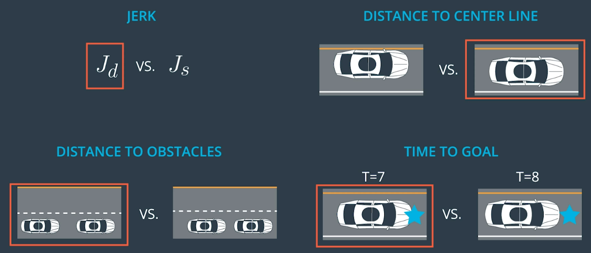

### 3. the motion planning problem


### 4. properties of motion planning algorithms


### 5. types of motion planning algorithms

- combinatorial methods. 小さいspaceに分割するらしい。また小さいspaceのsolutionを結合する。
- potential field methods. reacting methods.
  - Each obstacle is going to create a sort of **anti-gravity field** which makes it harder for the vehicle to come close to it. 
- optimal control.
  - consists in trying to solve the motion planning problem and the **control input generation** in one algorithm.
- sampling based methods. 
  - deterministic graph searchだったら、sampling-basedとは言える？？

### 7. A* reminder solution

- 正しいstatements:
  - It uses an optimistic heuristic function to guide grid cell expansion. heuristicはいつも<=real distance.
  - It always finds a solution if it exists.
  - Solutions it finds are always optimal.
- 曖昧なstatement:
  - Solutions it finds are drivable. これは保証ない（例えば曲がれない）。保証するために、we can define a more complex search space including **heading** and restrict connections between cells such that the transition from the closing cell to the new cells are drivable. This corresponds to **running A* on a lattice**.

### 10. hybrid A* tradeoffs solutions

- A*の課題：パスは走れないかもしれない。
- hybrid A*のやり方（自分の理解）：探索中robotのheadingを考えて、そのheadingに次にいけるgridは限定される。また、探索中headingを記録する。

### 11. hybrid A* in practice

- maximum steering angleを考えると、一周期でheadingの変化は限定される。
- hybrid A*: 
  - hybrid A*は各白い点のheading, x, yを記録する。
  - 青い矢印の長さが一定？ここは3種類の離散矢印しかない（つまりheading search spaceはまだない）。これも課題。
  - 最終のパスは：

- 読みたい論文：https://d17h27t6h515a5.cloudfront.net/topher/2017/July/595fe838_junior-the-stanford-entry-in-the-urban-challenge/junior-the-stanford-entry-in-the-urban-challenge.pdf

### 13. hybrid A* pseudocode

```python
def expand(state, goal):
    next_states = []
    for delta in range(-35, 40, 5): 
        # Create a trajectory with delta as the steering angle using 
        # the bicycle model:

        # ---Begin bicycle model---
        delta_rad = deg_to_rad(delta)
        omega = SPEED/LENGTH * tan(delta_rad)
        next_x = state.x + SPEED * cos(theta)
        next_y = state.y + SPEED * sin(theta)
        next_theta = normalize(state.theta + omega)
        # ---End bicycle model-----

        next_g = state.g + 1
        next_f = next_g + heuristic(next_x, next_y, goal)

        # Create a new State object with all of the "next" values.
        state = State(next_x, next_y, next_theta, next_g, next_f)
        next_states.append(state)

    return next_states

def search(grid, start, goal):
    # The opened array keeps track of the stack of States objects we are 
    # searching through.
    opened = []
    # 3D array of zeros with dimensions:
    # (NUM_THETA_CELLS, grid x size, grid y size).
    closed = [[[0 for x in range(grid[0])] for y in range(len(grid))] 
        for cell in range(NUM_THETA_CELLS)]
    # 3D array with same dimensions. Will be filled with State() objects 
    # to keep track of the path through the grid. 
    came_from = [[[0 for x in range(grid[0])] for y in range(len(grid))] 
        for cell in range(NUM_THETA_CELLS)]

    # Create new state object to start the search with.
    x = start.x
    y = start.y
    theta = start.theta
    g = 0
    f = heuristic(start.x, start.y, goal)
    state = State(x, y, theta, 0, f)
    opened.append(state)

    # The range from 0 to 2pi has been discretized into NUM_THETA_CELLS cells. 
    # Here, theta_to_stack_number returns the cell that theta belongs to. 
    # Smaller thetas (close to 0 when normalized  into the range from 0 to 
    # 2pi) have lower stack numbers, and larger thetas (close to 2pi when 
    # normalized) have larger stack numbers.
    stack_num = theta_to_stack_number(state.theta)
    closed[stack_num][index(state.x)][index(state.y)] = 1

    # Store our starting state. For other states, we will store the previous 
    # state in the path, but the starting state has no previous.
    came_from[stack_num][index(state.x)][index(state.y)] = state

    # While there are still states to explore:
    while opened:
        # Sort the states by f-value and start search using the state with the 
        # lowest f-value. This is crucial to the A* algorithm; the f-value 
        # improves search efficiency by indicating where to look first.
        opened.sort(key=lambda state:state.f)
        current = opened.pop(0)

        # Check if the x and y coordinates are in the same grid cell 
        # as the goal. (Note: The idx function returns the grid index for 
        # a given coordinate.)
        if (idx(current.x) == goal[0]) and (idx(current.y) == goal.y):
            # If so, the trajectory has reached the goal.
            return path

        # Otherwise, expand the current state to get a list of possible 
        # next states.
        next_states = expand(current, goal)
        for next_s in next_states:
            # If we have expanded outside the grid, skip this next_s.
            if next_s is not in the grid:
                continue
            # Otherwise, check that we haven't already visited this cell and
            # that there is not an obstacle in the grid there.
            stack_num = theta_to_stack_number(next_s.theta)
            if closed[stack_num][idx(next_s.x)][idx(next_s.y)] == 0 
                and grid[idx(next_s.x)][idx(next_s.y)] == 0:
                # The state can be added to the opened stack.
                opened.append(next_s)
                # The stack_number, idx(next_s.x), idx(next_s.y) tuple 
                # has now been visited, so it can be closed.
                closed[stack_num][idx(next_s.x)][idx(next_s.y)] = 1
                # The next_s came from the current state, and is recorded.
                came_from[stack_num][idx(next_s.x)][idx(next_s.y)] = current
```

- `index()`: an inbuilt function in Python, which searches for a given element from the start of the list and returns **the lowest index** where the element appears. 上記の呼び出し方と違うけど...いいえ、上記の`index(x), idx(x)`などはただxがgridのどの行にあるかを計算する。

- **`closed, came_from`が`(NUM_THETA_CELLS, grid x size, grid y size)`の3次元配列になっている理由は、同じ方向から同じcellに二度と入るのはダメ。でも違う方向から同じcellに二度と入るのは大丈夫！！**
- 2`pi`は`NUM_THETA_CELLS`分に分けられて、同じ方向かどうかの判定は、同じ`theta_cell`（扇型、おうぎがた）にあるかどうか。

### 16. environment classification


- A*はunstructured environmentの方得意だそう。structured環境では、別のtrajectory generation方法もある。

### 18. the need for time

- trajectoryにs, dだけじゃなく、timeも必要。driving in traffic is a 3 dimensional problem. timeの部分はvelocity profileに含まれるでしょう。
- 一つの手法は、`s(t), d(t)`の２つ関数でtrajectoryを述べる。縦方向、横方向のtimeに対する関数。

### 19. structured trajectory generation overview

- boundary conditions.
- jerk minimization.
- polynomial trajectories.
- derive coefficients.
- example - highway trajectory.
- evaluate feasibility and cost.
- trajectory generation algorithm.
- position->velocity->acceleration->jerk->snap->crackle->pop.

### 23. jerk minimizing trajectories


- なぜ`a6`以上が0にならないといけないか、まだ分かっていない。
- 6 coefficients -> 6 boundary conditions. 
  - Courseraからの印象だと、boundary conditionsにはheadingがあるはずだ。

### 26. polynomial trajectory generation


- alpha_0~2はt=0のboundary条件で計算できる。残るalpha_3~5はmatrix calculationで計算できる。

### 31. putting it all together

- end boundary conditionsは固定じゃなくて、エリアに成る場合、いくつかのend boundary conditionsをサンプリングして、trajectoryを生成してから、その中から１つを選ぶ。そのために、cost functionが必要。
- cost functionsは、例えば、
  - In practice, most of the hard work is in the details of balancing these cost functions.

