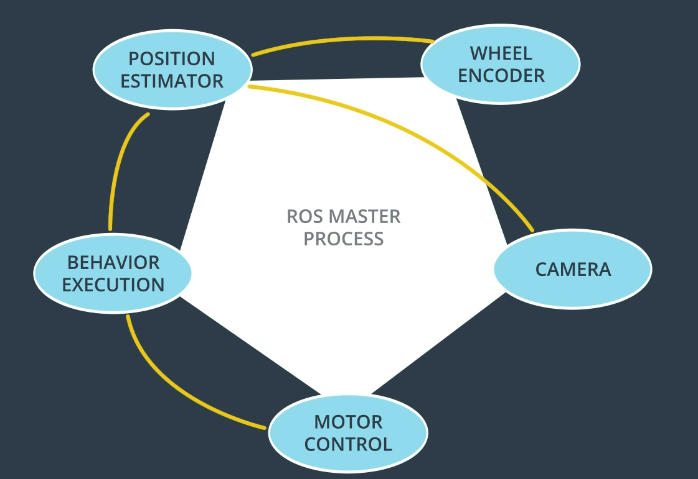

### 6. nodes and topics

- The ROS master maintains a registry of all the active nodes on a system. It then allows each node to discover other nodes in the system and establish lines of communication with them. 
- ROS master also hosts what's called the parameter server. The parameter server is typically used to store parameters and configuration values that are **shared amongst the running nodes**. 例えばwheel radius.
  - Rather than storing the same information in multiple places, nodes can look up values as needed.

### 7. message passing

- Each ROS distribution comes with a variety of predefined messages.
  - Physical quantities: positions, velocities, accelerations, rotations, durations.
  - Sensor readings: laser scans, images, point clouds, inertial measurements.

### 9. Compute graph

- `rqt_graph`.

### 14. source the ROS environment

- There’s a subtle distinction between the two commands, in that `source` executes the script in the current session, while `./` will start a new session, containing a copy of the current environment. **When a script executed via `./` is exited, all environment variables set by it will be lost**. 
  - Because "./" executes in a new environment, which is destroyed when the  script is done running, it's not possible to set the ROS environment  variables by using the command `./opt/ros/kinetic/setup.bash`.

- `rosnode list`.
- `rostopic list`.
- `rostopic info /turtle1/cmd_vel`.
  - If we wish to get information about a specific topic, **who is publishing  to it, subscribed to it**, or the type of message associated with it, we  can use the command `$rostopic` info.
- show message information:
  - `rosmsg info geometry_msgs/Twist`.
  - `rosed geometry_msgs Twist.msg`.
    - Sometimes, the message definition won’t provide an ample amount of  detail about a message type. For example, in the example above, how can  we be sure that linear and angular vectors above refer to velocities,  and not positions? One way to get more detail would be to look at the  comments in the message’s definition file. To do so, we can issue the  following command: `rosed geometry_msgs` `Twist.msg`.
- `rostopic echo /turtle1/cmd_vel`.

