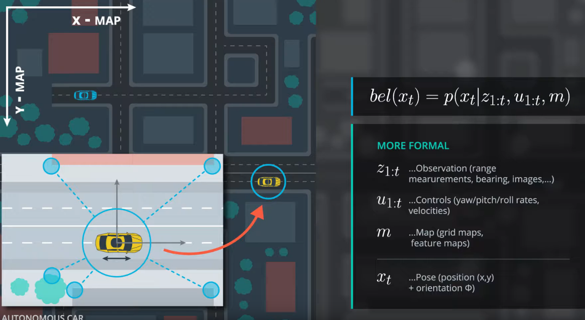
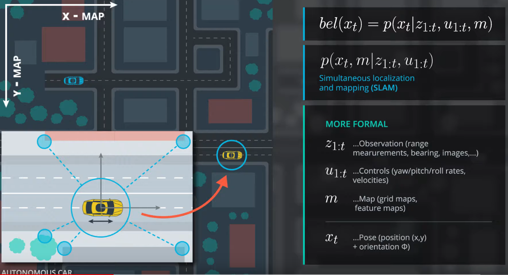
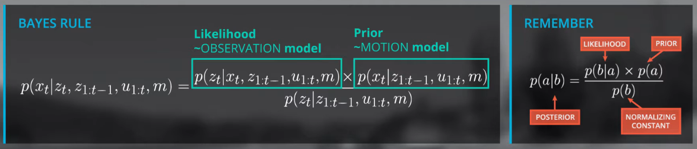
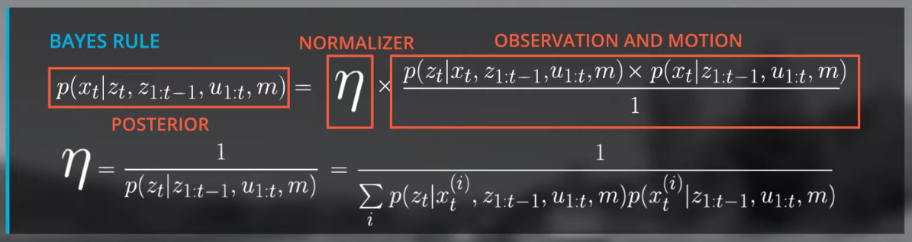
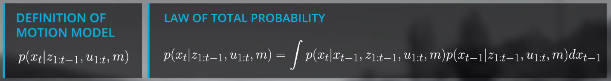
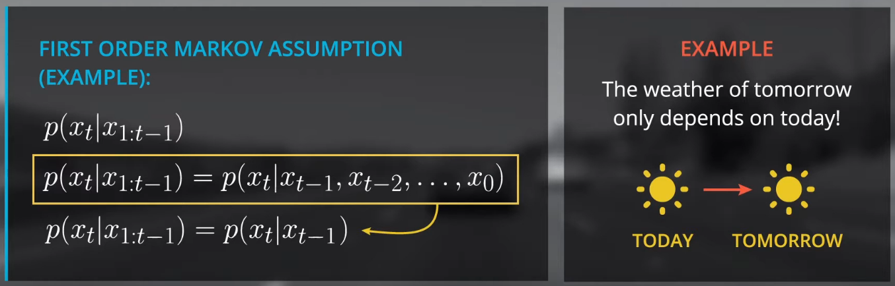
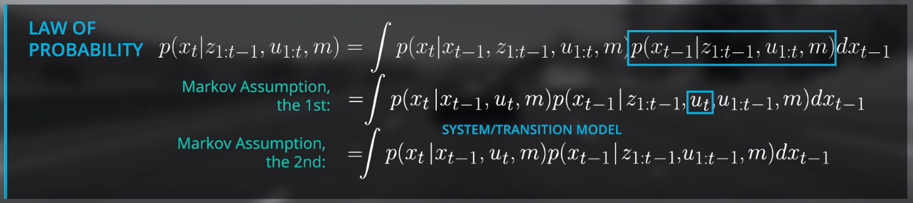
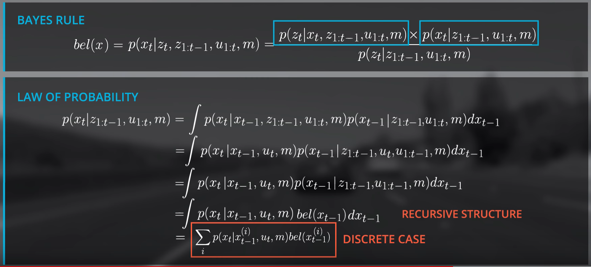
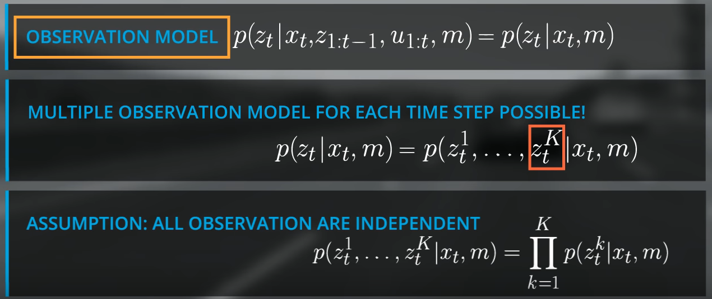
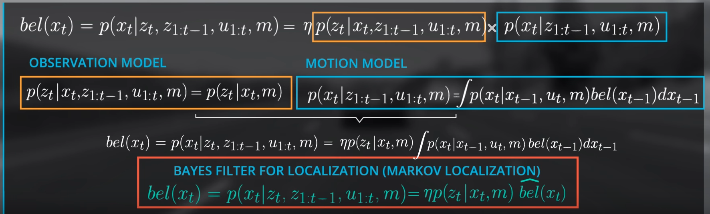

### 2. overview

- As such, we generally think of our vehicle location as a probability  distribution, each time we move, our distribution becomes more diffuse  (wider).  We pass our variables (map data, observation data, and control data) into the filter to concentrate (narrow) this distribution, at  each time step.  Each state prior to applying the filter represents our  prior and the narrowed distribution represents our Bayes' posterior.

### 3. localization posterior



- what we want to estimate is the transformation between the local coordinate system of the car and the global coordinate system of the map.

- If we would like to **estimate also the map**, then we would solve the simultaneous localization and mapping problem: 

### 6. bayes' filter for localization

- In fact, many localization filters, including the Kalman filter are special cases of **Bayes' Filter**.

- With respect to localization, these terms are:
  1. **P(location∣observation)**: This is P(a|b), the **normalized** probability of a position given an observation (**posterior**). 
  2. **P(observation∣location)**: This is P(b|a), the probability of an observation given a position (**likelihood**). 分かりにくい。
  3. **P(location)**:  This is P(a), the **prior** probability of a position.
  4. **P(observation)**: This is P(b), the total probability of an observation. 分かりにくい。

- Without going into detail yet, be aware that **P(location) is determined by the motion model**.  The probability returned by the  motion model is the **product** of the transition model probability (the  probability of moving from $x_{t-1}$ --> $x_t$  and the probability of the state $x_{t-1}$. 

- なんとなく、この部分はKalman Filter以外、Courseraの[Module 2: Mapping for Planning](https://github.com/youngsend/LearningSelfDrivingCars/blob/master/Self-Driving-Cars_Coursera/Motion-Planning-for-Self-Driving-Cars/m2-mapping-for-planning.pdf)と強く関連している！！！

### 15. bayes rule and law of total probability



- 分母を分解すると：
- normalizer: the **product of the observation and the motion model over all possible states**.
  - you **only have to define the observation and motion model** to estimate the beliefs.

- motion modelの部分を分解すると：

### 18. markov assumption for motion model



- $x_0$ must be initialized correctly!

- markov assumptionをmotion modelに適用すると：



- The process of predicting $x_t$ with a previous beliefs ($x_{t-1}$) and the transition model is technically a convolution.

### 31. markov assumption for observation model



### 32. finalize the bayes localization filter



### 33. bayes filter theory summay

- bayes (localization) filter is a general framework for recursive state estimation.
- 1d markov localization, **kalman filters, and particle filters are realizations of the bayes filters**.

### 39. coding the full filter

```c++
vector<float> initialize_priors(int map_size, vector<float> landmark_positions,
                                float position_stdev);

float motion_model(float pseudo_position, float movement, vector<float> priors,
                   int map_size, int control_stdev);

// function to get pseudo ranges
vector<float> pseudo_range_estimator(vector<float> landmark_positions, 
                                     float pseudo_position);

// observation model: calculate likelihood prob term based on landmark proximity
float observation_model(vector<float> landmark_positions, 
                        vector<float> observations, vector<float> pseudo_ranges,
                        float distance_max, float observation_stdev);

int main() {  
  // set standard deviation of control
  float control_stdev = 1.0f;

  // set standard deviation of position
  float position_stdev = 1.0f;

  // meters vehicle moves per time step
  float movement_per_timestep = 1.0f;

  // set observation standard deviation
  float observation_stdev = 1.0f;

  // number of x positions on map
  int map_size = 25;

  // set distance max
  float distance_max = map_size;

  // define landmarks
  vector<float> landmark_positions {3, 9, 14, 23};

  // define observations vector, each inner vector represents a set 
  //   of observations for a time step
  vector<vector<float> > sensor_obs {{1,7,12,21}, {0,6,11,20}, {5,10,19},
                                     {4,9,18}, {3,8,17}, {2,7,16}, {1,6,15}, 
                                     {0,5,14}, {4,13}, {3,12}, {2,11}, {1,10},
                                     {0,9}, {8}, {7}, {6}, {5}, {4}, {3}, {2},
                                     {1}, {0}, {}, {}, {}};

  // initialize priors
  vector<float> priors = initialize_priors(map_size, landmark_positions, position_stdev);
    
  // initialize posteriors
  vector<float> posteriors(map_size, 0.0);

  // specify time steps
  int time_steps = sensor_obs.size();
    
  // declare observations vector
  vector<float> observations;
    
  // cycle through time steps
  for (int t = 0; t < time_steps; ++t) {
    if (!sensor_obs[t].empty()) {
      observations = sensor_obs[t]; 
    } else {
      observations = {float(distance_max)};
    }

    // step through each pseudo position x (i)
    for (unsigned int i = 0; i < map_size; ++i) {
      float pseudo_position = float(i);

      //get the motion model probability for each x position
      float motion_prob = motion_model(pseudo_position, movement_per_timestep, priors,
                   map_size, control_stdev);

      // get pseudo ranges
      vector<float> pseudo_ranges = pseudo_range_estimator(landmark_positions, pseudo_position);

      // get observation probability
      float observation_prob = observation_model(landmark_positions, observations, pseudo_ranges,
                        distance_max, observation_stdev);

      // calculate the ith posterior and pass to posteriors vector
      posteriors[i] = motion_prob * observation_prob;
    } 

    // normalize posteriors (see helpers.h for a helper function)
    posteriors = Helpers::normalize_vector(posteriors);

    // update priors
    priors = posteriors;

    // print posteriors vectors to stdout
    for (int p = 0; p < posteriors.size(); ++p) {
            cout << posteriors[p] << endl;  
    } 
  }
  return 0;
}

// observation model: calculate likelihood prob term based on landmark proximity
float observation_model(vector<float> landmark_positions, 
                        vector<float> observations, vector<float> pseudo_ranges, 
                        float distance_max, float observation_stdev) {
  // initialize observation probability
  float distance_prob = 1.0f;

  // run over current observation vector
  for (int z=0; z< observations.size(); ++z) {
    // define min distance
    float pseudo_range_min;
    // check, if distance vector exists
    if (pseudo_ranges.size() > 0) {
      // set min distance
      pseudo_range_min = pseudo_ranges[0];
      // remove this entry from pseudo_ranges-vector
      pseudo_ranges.erase(pseudo_ranges.begin());
    } else {  // no or negative distances: set min distance to a large number
        pseudo_range_min = std::numeric_limits<const float>::infinity();
    }
    // estimate the probability for observation model, this is our likelihood 
    distance_prob *= Helpers::normpdf(observations[z], pseudo_range_min,
                                      observation_stdev);
  }
  return distance_prob;
}

vector<float> pseudo_range_estimator(vector<float> landmark_positions, 
                                     float pseudo_position) {
  // define pseudo observation vector
  vector<float> pseudo_ranges;
  // loop over number of landmarks and estimate pseudo ranges
  for (int l=0; l< landmark_positions.size(); ++l) {
    // estimate pseudo range for each single landmark 
    // and the current state position pose_i:
    float range_l = landmark_positions[l] - pseudo_position;
    // check if distances are positive: 
    if (range_l > 0.0f) {
      pseudo_ranges.push_back(range_l);
    }
  }
  // sort pseudo range vector
  sort(pseudo_ranges.begin(), pseudo_ranges.end());
  return pseudo_ranges;
}

// motion model: calculates prob of being at an estimated position at time t
float motion_model(float pseudo_position, float movement, vector<float> priors,
                   int map_size, int control_stdev) {
  // initialize probability
  float position_prob = 0.0f;
  // loop over state space for all possible positions x (convolution):
  for (float j=0; j< map_size; ++j) {
    float next_pseudo_position = j;
    // distance from i to j
    float distance_ij = pseudo_position-next_pseudo_position;
    // transition probabilities:
    float transition_prob = Helpers::normpdf(distance_ij, movement, 
    // estimate probability for the motion model, this is our prior
    position_prob += transition_prob*priors[j];
  }
  return position_prob;
}

// initialize priors assuming vehicle at landmark +/- 1.0 meters position stdev
vector<float> initialize_priors(int map_size, vector<float> landmark_positions,
                                     float position_stdev) {
  // set all priors to 0.0
  vector<float> priors(map_size, 0.0);
  // set each landmark positon +/-1 to 1.0/9.0 (9 possible postions)
  float norm_term = landmark_positions.size() * (position_stdev * 2 + 1);
  for (int i=0; i < landmark_positions.size(); ++i) {
    for (float j=1; j <= position_stdev; ++j) {
      priors.at(int(j+landmark_positions[i]+map_size)%map_size) += 1.0/norm_term;
      priors.at(int(-j+landmark_positions[i]+map_size)%map_size) += 1.0/norm_term;
    }
    priors.at(landmark_positions[i]) += 1.0/norm_term;
  }
  return priors;
}
```

- observation modelの実現に疑問を持っているが。
