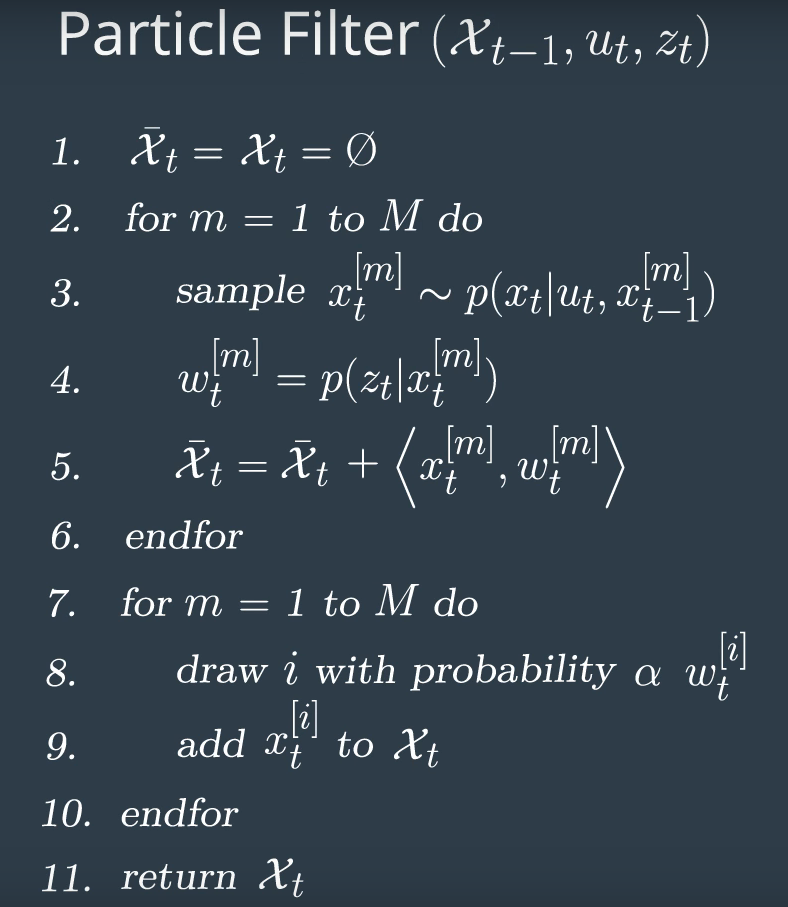
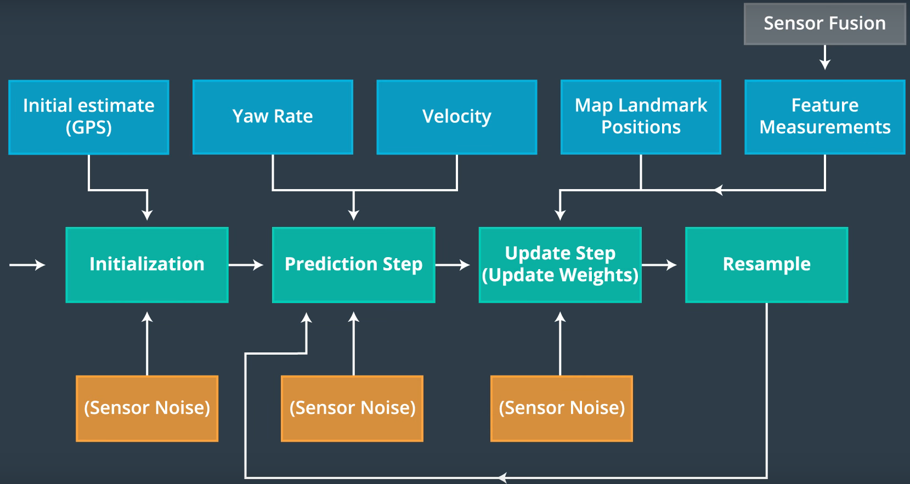
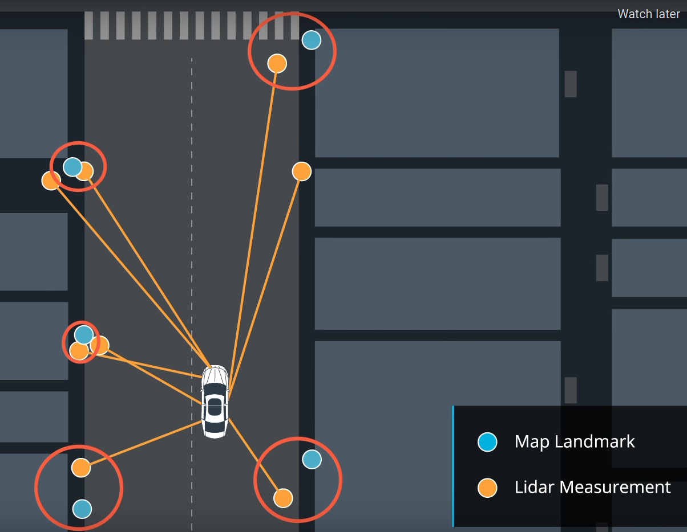
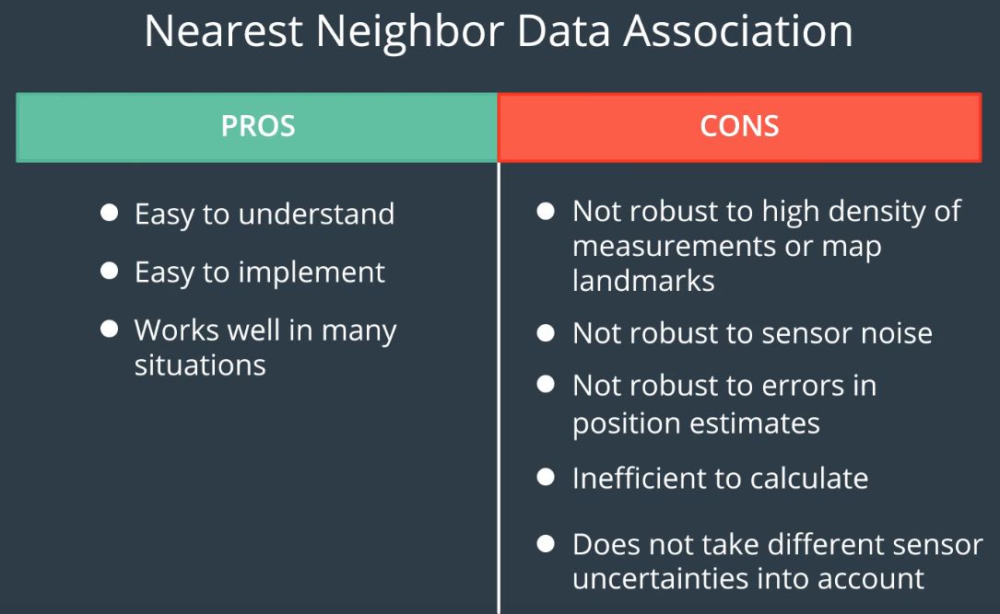
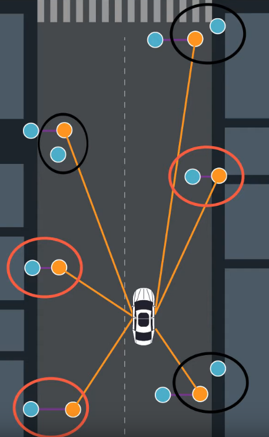
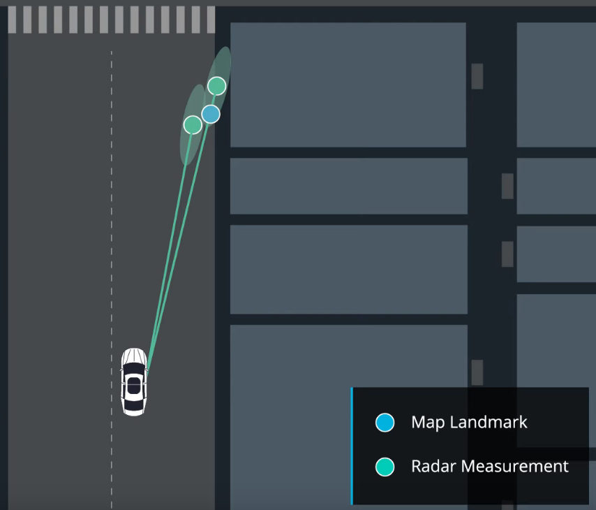
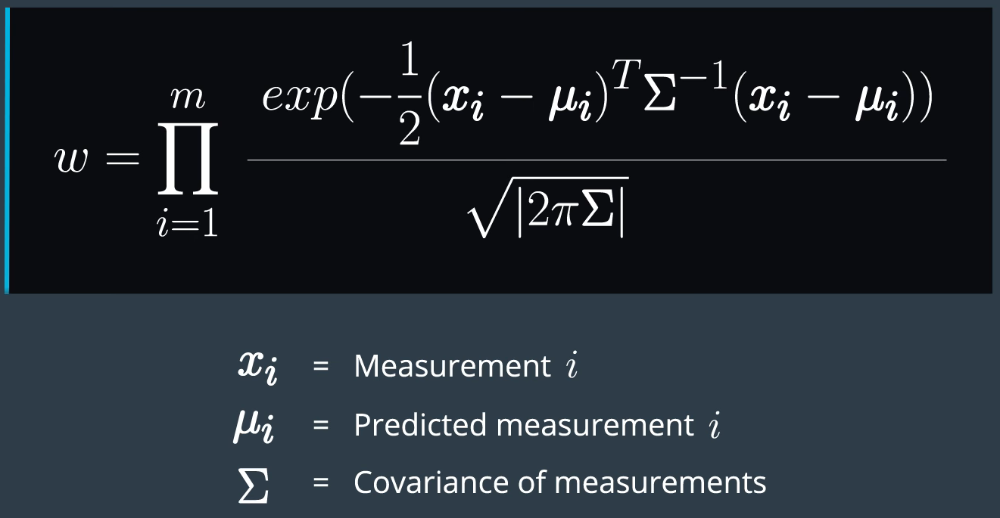
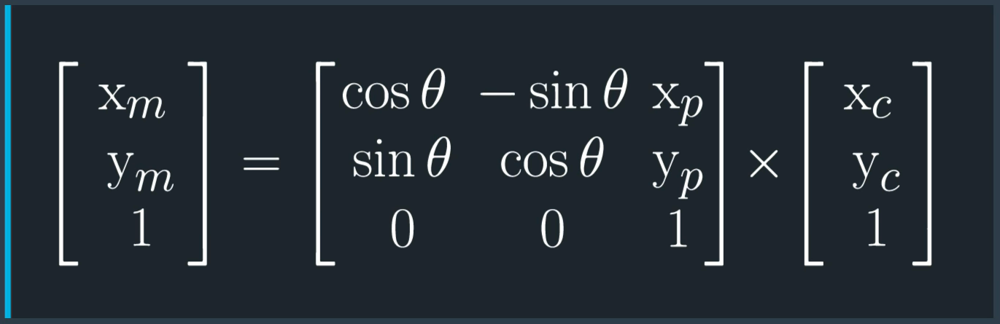

### 3. pseudo code

- 上記pseudo codeのflowchart: 
- (1) At the initialization step we estimate our position from **GPS input**.  The subsequent steps in the process will refine this estimate to localize  our vehicle.
- (3) During the prediction step we add the **control input (yaw rate & velocity) for all particles**.

- (4~5) During the update step, we update our particle weights using map landmark positions and feature measurements.

- (7~10) During resampling we will resample M times drawing a particle i (i is the particle index)  proportional to its weight.
  - resampling wheel.

### 4. initialization

- GPSでparticleを初期化する理由は、自動運転車にとって可能な位置が多すぎるから（地球地面）。
- GPSのx, y, thetaをmeanとして、std_x, std_y, std_thetaの正規分布でparticleをサンプリングする。

### 10. data association: nearest neighbor

- nearest neighbor方法の評価：
- CONS-3: not robust to errors in position estimates: 
- CONS-4: inefficient to calculate: kd-treeを使うべきでしょう。
- CONS-5: dose not take different sensor uncertainties into account: 
  - radarのbearingの精度が高い、rangeの精度が低い。距離のみで紐付けすると、radarの特性を無視する。

### 12. update step

- Instead of the feature measurements directly affecting the prediction of the state of the car, the measurements will instead **inform the weight of each particle**.
- weightの計算：
  - This function tells us how likely a set of landmark measurements is, given our predicted state of the car and the assumption that the sensors have Gaussian noise.
  - we also assume each landmark measurement is independent.

### 15. converting landmark observations

- car coordinates to map coordinates: 
  - $x_p,y_p$はparticleの座標。
  - thetaはmap座標系からcar座標系に曲がる角度。時計回りだったらminus. 反時計回りだったらplus.

- using our observations in the car coordinate system and our particle pose in the map system, we have everything we need to transform observations into map coordinates, and ultimately determine the final weight of our particle.
  - つまりparticle poseはcarのmapでの座標とする。

- observationsをmap座標系に変換したら、次はobservationsとlandmarksのassociation.
- associationが終わったら、このparticleのweightの計算。

### 19. particle weights

- The particles final weight will be calculated as the **product of each measurement's Multivariate-Gaussian probability density**.

- The **mean** of the Multivariate-Gaussian is the measurement's **associated  landmark position** and the Multivariate-Gaussian's standard deviation is  described by our initial uncertainty in the x and y ranges.