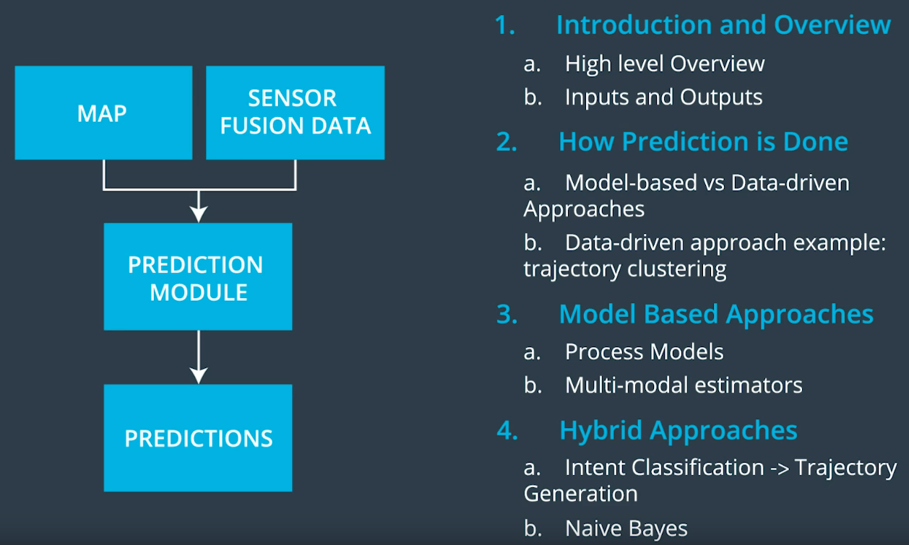
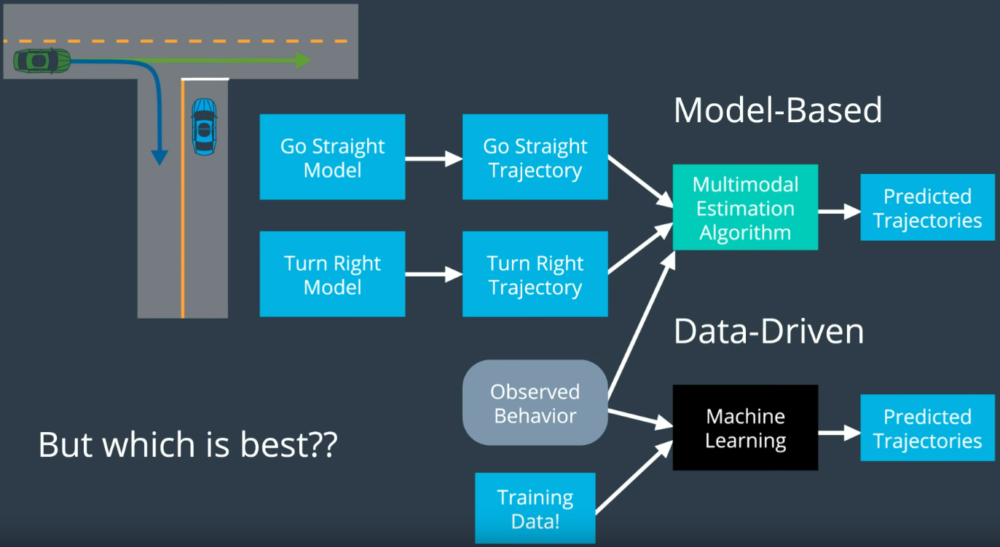
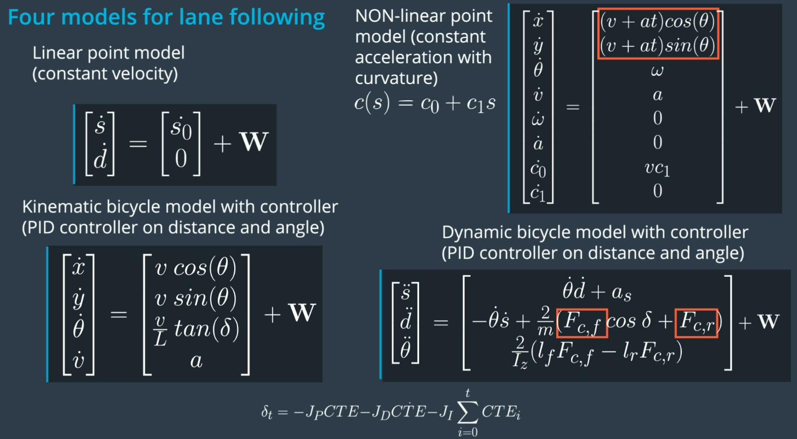

### 1. introduction and overview



### 2. inputs and outputs to prediction

- 例えば、input: 

  ```json
  {
      "timestamp" : 34512.21,
      "vehicles" : [
          {
              "id"  : 0,
              "x"   : -10.0,
              "y"   : 8.1,
              "v_x" : 8.0,
              "v_y" : 0.0,
              "sigma_x" : 0.031,
              "sigma_y" : 0.040,
              "sigma_v_x" : 0.12,
              "sigma_v_y" : 0.03,
          },
          {
              "id"  : 1,
              "x"   : 10.0,
              "y"   : 12.1,
              "v_x" : -8.0,
              "v_y" : 0.0,
              "sigma_x" : 0.031,
              "sigma_y" : 0.040,
              "sigma_v_x" : 0.12,
              "sigma_v_y" : 0.03,
          },
      ]
  }
  ```

- output:

  ```json
  {
      "timestamp" : 34512.21,
      "vehicles" : [
          {
              "id" : 0,
              "length": 3.4,
              "width" : 1.5,
              "predictions" : [
                  {
                      "probability" : 0.781,
                      "trajectory"  : [
                          {
                              "x": -10.0,
                              "y": 8.1,
                              "yaw": 0.0,
                              "timestamp": 34512.71
                          },
                          {
                              "x": -6.0,
                              "y": 8.1,
                              "yaw": 0.0,
                              "timestamp": 34513.21
                          },
                          {
                              "x": -2.0,
                              "y": 8.1,
                              "yaw": 0.0,
                              "timestamp": 34513.71
                          },
                          {
                              "x": 2.0,
                              "y": 8.1,
                              "yaw": 0.0,
                              "timestamp": 34514.21
                          },
                          {
                              "x": 6.0,
                              "y": 8.1,
                              "yaw": 0.0,
                              "timestamp": 34514.71
                          },
                          {
                              "x": 10.0,
                              "y": 8.1,
                              "yaw": 0.0,
                              "timestamp": 34515.21
                          },
                      ]
                  },
                  {
                      "probability" : 0.219,
                      "trajectory"  : [
                          {
                              "x": -10.0,
                              "y": 8.1,
                              "yaw": 0.0,
                              "timestamp": 34512.71
                          },
                          {
                              "x": -7.0,
                              "y": 7.5,
                              "yaw": -5.2,
                              "timestamp": 34513.21
                          },
                          {
                              "x": -4.0,
                              "y": 6.1,
                              "yaw": -32.0,
                              "timestamp": 34513.71
                          },
                          {
                              "x": -3.0,
                              "y": 4.1,
                              "yaw": -73.2,
                              "timestamp": 34514.21
                          },
                          {
                              "x": -2.0,
                              "y": 1.2,
                              "yaw": -90.0,
                              "timestamp": 34514.71
                          },
                          {
                              "x": -2.0,
                              "y":-2.8,
                              "yaw": -90.0,
                              "timestamp": 34515.21
                          },
                      ]
  
                  }
              ]
          },
          {
              "id" : 1,
              "length": 3.4,
              "width" : 1.5,
              "predictions" : [
                  {
                      "probability" : 1.0,
                      "trajectory" : [
                          {
                              "x": 10.0,
                              "y": 12.1,
                              "yaw": -180.0,
                              "timestamp": 34512.71
                          },
                          {
                              "x": 6.0,
                              "y": 12.1,
                              "yaw": -180.0,
                              "timestamp": 34513.21
                          },
                          {
                              "x": 2.0,
                              "y": 12.1,
                              "yaw": -180.0,
                              "timestamp": 34513.71
                          },
                          {
                              "x": -2.0,
                              "y": 12.1,
                              "yaw": -180.0,
                              "timestamp": 34514.21
                          },
                          {
                              "x": -6.0,
                              "y": 12.1,
                              "yaw": -180.0,
                              "timestamp": 34514.71
                          },
                          {
                              "x": -10.0,
                              "y": 12.1,
                              "yaw": -180.0,
                              "timestamp": 34515.21
                          }
                      ]
                  }
              ]
          }
      ]
  }
  ```

### 3. model-based vs data-driven approaches



- Model-based approaches incorporate our knowledge of physics, constraints imposed by the road traffic, etc.
- Data-driven approaches let us use data to extract subtle patterns that would otherwise be missed by model-based approaches, for example, differences in vehicle behavior at an intersection during different times of the day.

### 9. process models



- W: uncertainty on the process model.

### 12. summary of data driven and model based approaches

- model-based approaches: あんまり具体的ではないが。
  - *Defining* process models (offline).
  - *Using* process models to compare driver behavior to what would be expected for each model.
  - *Probabilistically classifying* driver intent by comparing the likelihoods of various behaviors with a multiple-model algorithm.
  - *Extrapolating* process models to generate trajectories.

### 16. implement naive bayes C++


```c++
#include "classifier.h"
#include <math.h>
#include <string>
#include <vector>

using Eigen::ArrayXd;
using std::string;
using std::vector;

// Initializes GNB
GNB::GNB() {
  /**
   * TODO: Initialize GNB, if necessary. May depend on your implementation.
   */
  left_means = ArrayXd(4);
  left_means << 0,0,0,0;
  
  left_sds = ArrayXd(4);
  left_sds << 0,0,0,0;
    
  left_prior = 0;
    
  keep_means = ArrayXd(4);
  keep_means << 0,0,0,0;
  
  keep_sds = ArrayXd(4);
  keep_sds << 0,0,0,0;
  
  keep_prior = 0;
  
  right_means = ArrayXd(4);
  right_means << 0,0,0,0;
  
  right_sds = ArrayXd(4);
  right_sds << 0,0,0,0;
  
  right_prior = 0;
}

GNB::~GNB() {}

void GNB::train(const vector<vector<double>> &data, 
                const vector<string> &labels) {
  /**
   * Trains the classifier with N data points and labels.
   * @param data - array of N observations
   *   - Each observation is a tuple with 4 values: s, d, s_dot and d_dot.
   *   - Example : [[3.5, 0.1, 5.9, -0.02],
   *                [8.0, -0.3, 3.0, 2.2],
   *                 ...
   *                ]
   * @param labels - array of N labels
   *   - Each label is one of "left", "keep", or "right".
   *
   * TODO: Implement the training function for your classifier.
   */
  
  // For each label, compute ArrayXd of means, one for each data class 
  //   (s, d, s_dot, d_dot).
  // These will be used later to provide distributions for conditional 
  //   probabilites.
  // Means are stored in an ArrayXd of size 4.
  
  float left_size = 0;
  float keep_size = 0;
  float right_size = 0;
  
  // For each label, compute the numerators of the means for each class
  //   and the total number of data points given with that label.
  for (int i=0; i<labels.size(); ++i) {
    if (labels[i] == "left") {
      // conversion of data[i] to ArrayXd
      left_means += ArrayXd::Map(data[i].data(), data[i].size());
      left_size += 1;
    } else if (labels[i] == "keep") {
      keep_means += ArrayXd::Map(data[i].data(), data[i].size());
      keep_size += 1;
    } else if (labels[i] == "right") {
      right_means += ArrayXd::Map(data[i].data(), data[i].size());
      right_size += 1;
    }
  }

  // Compute the means. Each result is a ArrayXd of means 
  //   (4 means, one for each class)
  left_means = left_means/left_size;
  keep_means = keep_means/keep_size;
  right_means = right_means/right_size;
  
  // Begin computation of standard deviations for each class/label combination.
  ArrayXd data_point;
  
  // Compute numerators of the standard deviations.
  for (int i=0; i<labels.size(); ++i) {
    data_point = ArrayXd::Map(data[i].data(), data[i].size());
    if (labels[i] == "left"){
      left_sds += (data_point - left_means)*(data_point - left_means);
    } else if (labels[i] == "keep") {
      keep_sds += (data_point - keep_means)*(data_point - keep_means);
    } else if (labels[i] == "right") {
      right_sds += (data_point - right_means)*(data_point - right_means);
    }
  }
  
  // compute standard deviations
  left_sds = (left_sds/left_size).sqrt();
  keep_sds = (keep_sds/keep_size).sqrt();
  right_sds = (right_sds/right_size).sqrt();
    
  //Compute the probability of each label
  left_prior = left_size/labels.size();
  keep_prior = keep_size/labels.size();
  right_prior = right_size/labels.size();
}

string GNB::predict(const vector<double> &sample) {
  /**
   * Once trained, this method is called and expected to return 
   *   a predicted behavior for the given observation.
   * @param observation - a 4 tuple with s, d, s_dot, d_dot.
   *   - Example: [3.5, 0.1, 8.5, -0.2]
   * @output A label representing the best guess of the classifier. Can
   *   be one of "left", "keep" or "right".
   *
   * TODO: Complete this function to return your classifier's prediction
   */
  
  // Calculate product of conditional probabilities for each label.
  double left_p = 1.0;
  double keep_p = 1.0;
  double right_p = 1.0; 

  for (int i=0; i<4; ++i) {
    left_p *= (1.0/sqrt(2.0 * M_PI * pow(left_sds[i], 2))) 
            * exp(-0.5*pow(sample[i] - left_means[i], 2)/pow(left_sds[i], 2));
    keep_p *= (1.0/sqrt(2.0 * M_PI * pow(keep_sds[i], 2)))
            * exp(-0.5*pow(sample[i] - keep_means[i], 2)/pow(keep_sds[i], 2));
    right_p *= (1.0/sqrt(2.0 * M_PI * pow(right_sds[i], 2))) 
            * exp(-0.5*pow(sample[i] - right_means[i], 2)/pow(right_sds[i], 2));
  }

  // Multiply each by the prior
  left_p *= left_prior;
  keep_p *= keep_prior;
  right_p *= right_prior;
    
  double probs[3] = {left_p, keep_p, right_p};
  double max = left_p;
  double max_index = 0;

  for (int i=1; i<3; ++i) {
    if (probs[i] > max) {
      max = probs[i];
      max_index = i;
    }
  }
  
  return this -> possible_labels[max_index];
}
```

