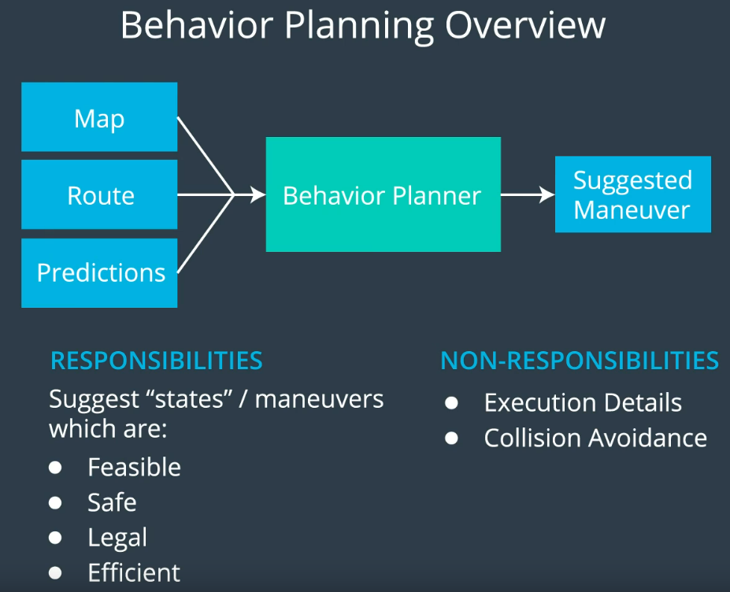
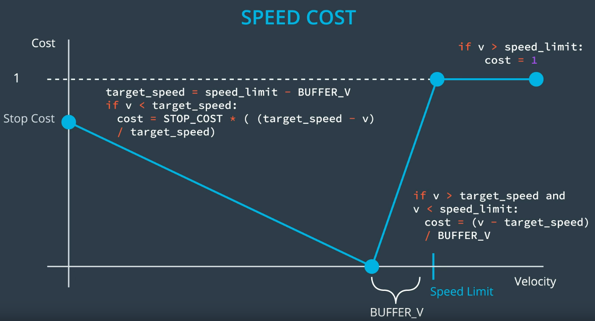
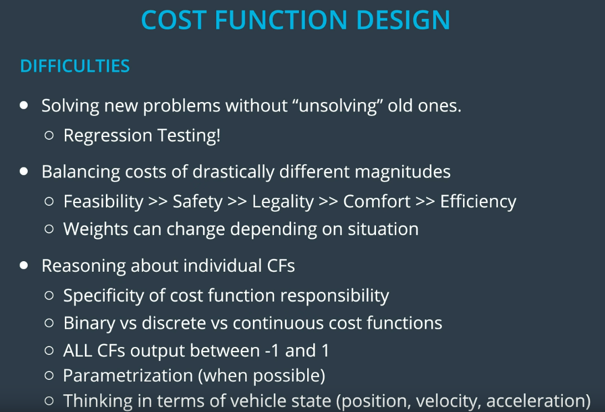
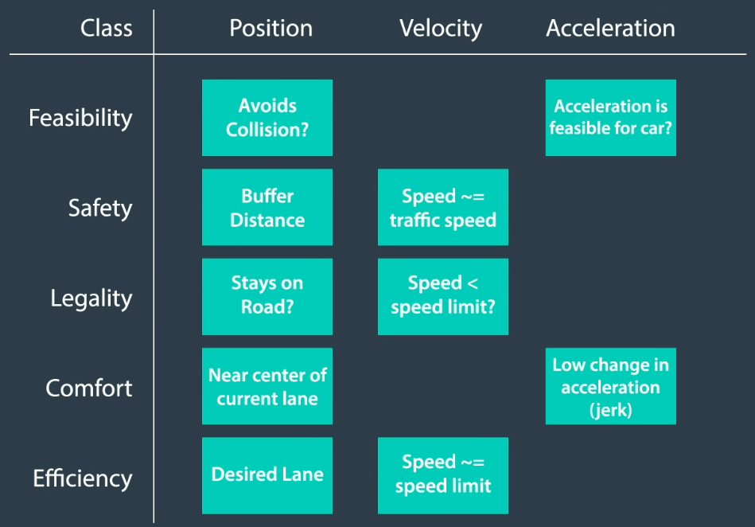
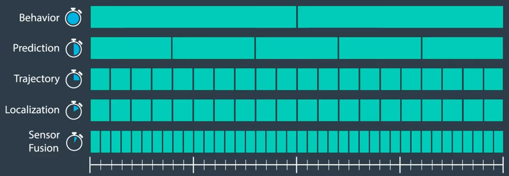

### 4. the behavior problem



### 11. behavior planning pseudocode

- One way to implement a transition function is by generating rough  trajectories for each accessible "next state" and then finding the best. To "find the best" we generally use **cost functions**. We can then figure out how costly each rough trajectory is and then select the state with the lowest cost trajectory. 

- pseudocode:

  ```python
  def transition_function(predictions, current_fsm_state, current_pose, cost_functions, weights):
      # only consider states which can be reached from current FSM state.
      possible_successor_states = successor_states(current_fsm_state)
  
      # keep track of the total cost of each state.
      costs = []
      for state in possible_successor_states:
          # generate a rough idea of what trajectory we would
          # follow IF we chose this state.
          trajectory_for_state = generate_trajectory(state, current_pose, predictions)
  
          # calculate the "cost" associated with that trajectory.
          cost_for_state = 0
          for i in range(len(cost_functions)) :
              # apply each cost function to the generated trajectory
              cost_function = cost_functions[i]
              cost_for_cost_function = cost_function(trajectory_for_state, predictions)
  
              # multiply the cost by the associated weight
              weight = weights[i]
              cost_for_state += weight * cost_for_cost_function
           costs.append({'state' : state, 'cost' : cost_for_state})
  
      # Find the minimum cost state.
      best_next_state = None
      min_cost = 9999999
      for i in range(len(possible_successor_states)):
          state = possible_successor_states[i]
          cost  = costs[i]
          if cost < min_cost:
              min_cost = cost
              best_next_state = state 
  
      return best_next_state
  ```

### 12. create a cost function - speed penalty



- goal distance cost:

  ```c++
  double goal_distance_cost(int goal_lane, int intended_lane, int final_lane, 
                            double distance_to_goal) {
    // The cost increases with both the distance of intended lane from the goal
    //   and the distance of the final lane from the goal. The cost of being out 
    //   of the goal lane also becomes larger as the vehicle approaches the goal.
    int delta_d = 2.0 * goal_lane - intended_lane - final_lane;
    double cost = 1 - exp(-(std::abs(delta_d) / distance_to_goal));
  
    return cost;
  }
  ```

- inefficiency cost（なるべく速いレーンに走りたい）:

  ```c++
  double inefficiency_cost(int target_speed, int intended_lane, int final_lane, 
                           const std::vector<int> &lane_speeds) {
    // Cost becomes higher for trajectories with intended lane and final lane 
    //   that have traffic slower than target_speed.
    double speed_intended = lane_speeds[intended_lane];
    double speed_final = lane_speeds[final_lane];
    double cost = (2.0*target_speed - speed_intended - speed_final)/target_speed;
  
    return cost;
  }
  ```

### 18. cost function design and weight tweaking

- difficulties: 
- thinking in terms of vehicle state (position, velocity, acceleration)のサンプル：

### 20. scheduling compute time



- 各moduleの更新頻度が違う。Behavior moduleのインプットは、localization, predictionから来る。