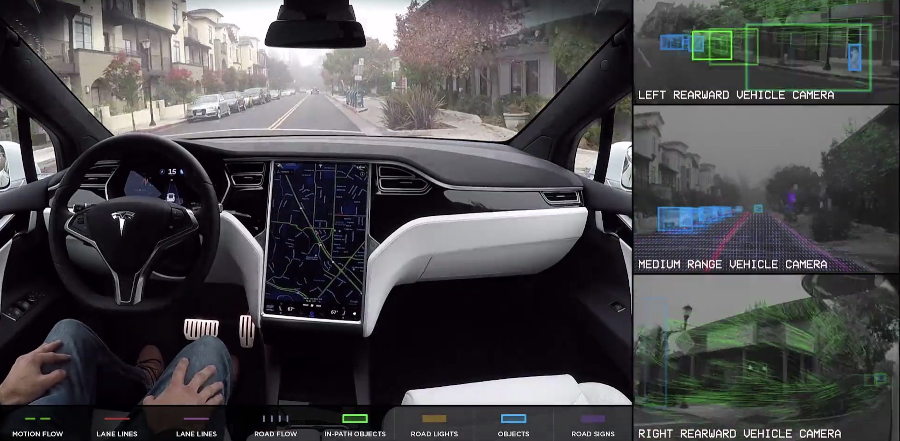
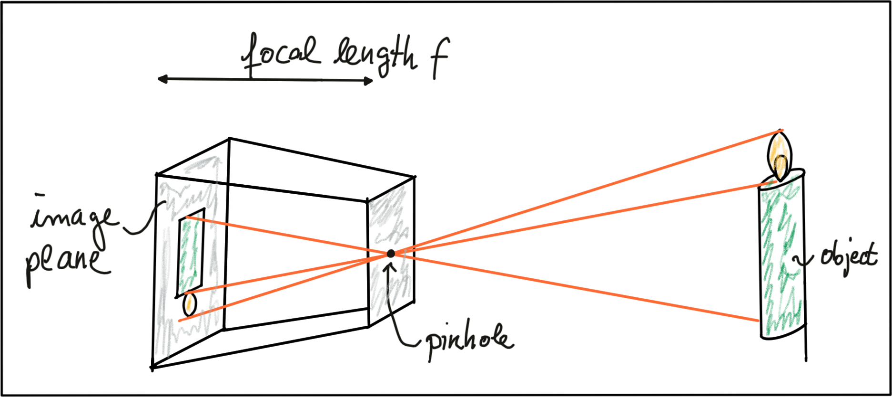
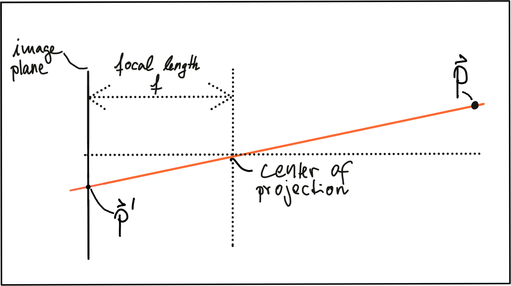
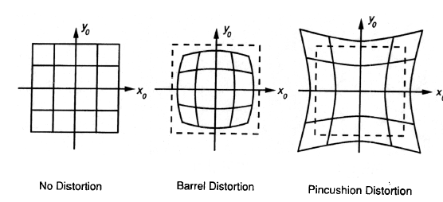
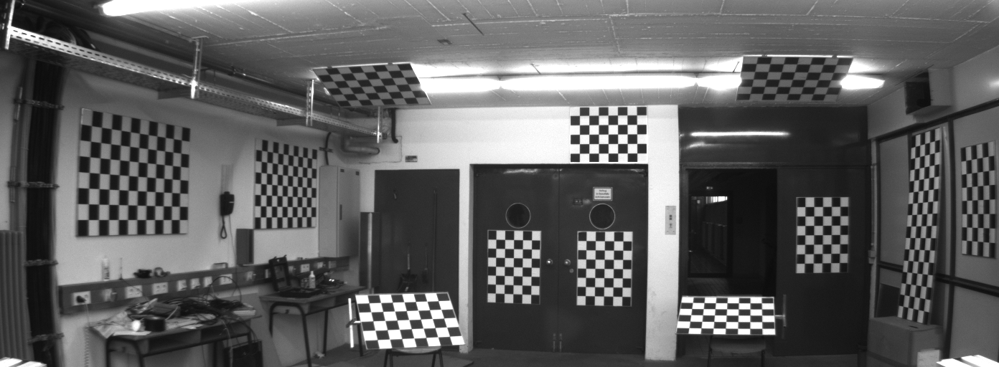
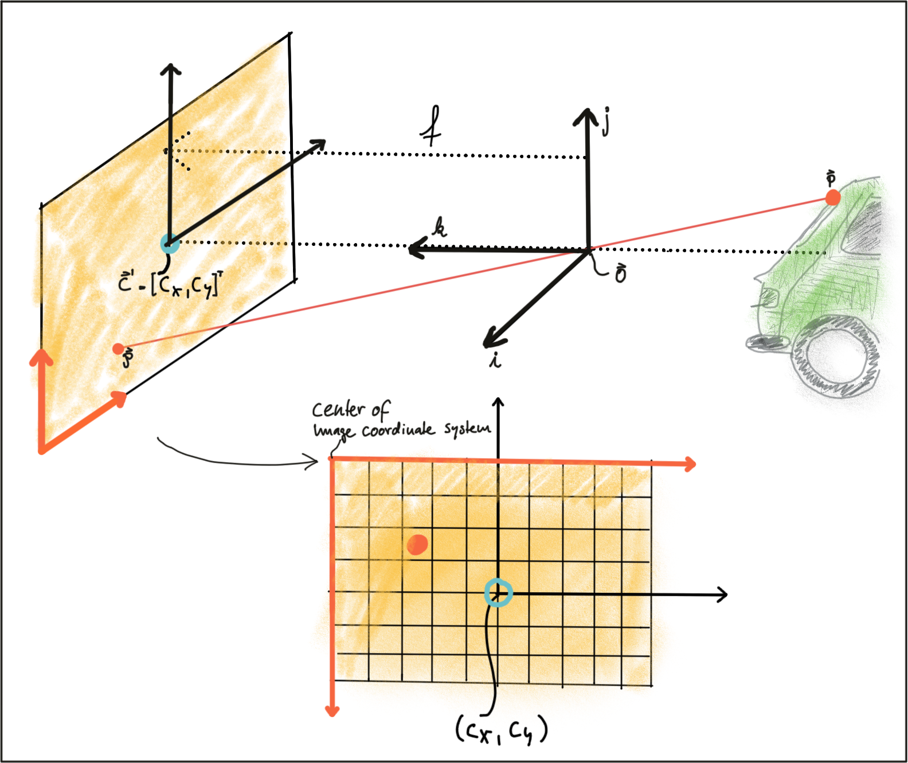

## 1. Levels of Autonomous Driving


- Many experts believe that **level 3 systems** will only be a **transition step** to more advanced systems which are operating on levels 4 and 5. つまり研究用だけ、商品化しない。
  - 理由3: The readiness of the driver to take control of the vehicle can not be guaranteed at all times. There are many situations in which this is not possible due to human reaction times and alertness levels.
  - From a legal viewpoint this means that the responsibility for the driving tasks is with the car and thus with the manufacturer.
    - This is why we do not see a large number of commercially available vehicles with level 3 systems on board yet (May 2019).

- 見るべきproject: Waymo, SPOTICAR, nuTonomy.

## 2. Autonomous Vehicle Sensor Sets

### The Uber ATG Autonomous Vehicle


- Radar:
  - The returning waves can be analyzed with regard to their runtime (which gives distance) as well as their **shifted frequency** (which gives **relative speed**).
  - The latter property clearly distinguished the radar from the other two sensor types as it is the **only one** who is able to directly measure the **speed** of objects.
  - When it comes to detecting smaller or "soft" objects (**human, animals**) with reduced reflective properties, the radar detection performance drops.

- Lidar:
  - Lidar works in a similar way to radar, but instead of emitting radio waves (電波), it uses infrared light. 赤外線のwavelength(波長)が電波より短い(in the electromagnetic spectrum(電磁スペクトル、でんじ))。
  - In case of the Velodyne VLS-128, a total of 128 laser beams is used to detect obstacles up to a distance of 300 meters.
  - During a single spin through 360 degrees, a total of up to 4 million datapoints per second is generated.

- UberのLidar 3D point cloud and camera images: 

### Mercedes Benz Autonomous Prototype

- Mercedes states that the stereo camera alone generates a total of 100 gigabytes of data for every kilometer driven.
- If you consider depth estimation from the stereo camera, the density(?) of the depth map compared to any other sensor is **really high** and the **precision is also great in the near field**.
  - It's just a **problem in the far field**.
- If you compare stereo to **structure from motion** with a single camera.
  - If you have a single camera, you can either reconstruct the 3D environment based on your own motion.
  - Or you can use features in the static environment to estimate your own motion.
  - But as soon as you have **dynamic objects** in the scene and you're also **moving yourself**, then you cannot really estimate the distance and velocity of other traffic participants anymore. これはcan only do with stereo.

- しかし、If you have a LiDAR and a RADAR who can measure distance much more precisely and measure velocity much more precisely, I (Timo) think the benefit for stereo is decreasing.
  - It's still redundancy though.

### The Tesla Autopilot




- Tesla Autopilotのセンサーlayout, Cameraいっぱい使っている。Lidarは使っていない。

- Wide Forward Camera: designed to read road signs and traffic lights, allowing the car to react accordingly.
- The ultrasonic sensors can also be used to assist the car when automatically switching lanes.

### Sensor Selection Criteria（大事）

- Range.
  - Many **Lidar** systems have **difficulties detecting objects** at **very close distances**, whereas radar can detect objects from less that a meter, depending on the system type (either long, mid or short range).
  - Mono cameras are not able to reliably measure metric distance to object - this is only possible by making some assumptions about the nature of the world (e.g. planar road surface).
  - **Stereo cameras** on the other hand can measure distance, but only up to a distance of **approx. 80m** with accuracy deteriorating(悪化する) significantly **from there**.

- Spatial resolution.
  - Lidar scans have a spatial resolution in the **order of 0.1 degree** due to the short wavelength of the emitted IR laser light.
  - Radar on the other hand can not resolve small features very well, especially as distances increase.
  - The spatial resolution of camera systems is defined by the optics, by the **pixel size on the image** and by its signal-to-noise ratio.
    - **Details on small object are lost** as soon as the light rays emanating from them are **spread to several pixels** on the image sensor (**blurring**).
    - Also, when little ambient light exists to illuminate objects, spatial resolution increases as objects' details are **superimposed** by increasing noise levels of the image. 

- Robustness in darkness.
  - While daytime performance of **Lidar** systems is very good, they have an **even better performance at night** because there is no ambient sunlight that might interfere with the detection of IR laser reflections.
- Robustness in rain, snow, fog.
  - **Radars** are not significantly affected by snow, heavy rain or any other obstruction in the air such as fog or sand particles.

- Classification of objects.
  - **Lidar** scans with their high-density 3D point clouds also allow for a certain level of classification, albeit with **less object diversity than cameras**.
- Perceiving 2D structures.
  - Camera systems are the only sensor able to interpret two-dimensional information such as speed signs, lane markings or **traffic lights**, as they are able to measure both color and light intensity.
- Measure speed.
  - Radar can directly measure the velocity of objects by exploiting the **Doppler(ドップラー効果) frequency shift**.
  - Lidar can only approximate speed by using successive distance measurements, which makes it less accurate in this regard.
  - Cameras, even though they are not able to measure distance, can measure **time to collision** by observing the displacement of objects on the image plane. 距離を測るのは、scaleが必要。scaleがなくても、時間は測れる。`pixel / (pixel / s)`.
- System cost.
  - Due to technological advances, Lidar's cost has dropped from more than US$75,000 to below US$5,000.
    - Many experts predict that the cost of a Lidar module might drop to less than US$500 over the next years.
- **Package size**. 大きさ。
- Computational requirements.
  - **Lidar and radar** require **little back-end processing**. Lidarの要求はRadarよりも低い。
  - While cameras are a cost-efficient and easily available sensor, they require significant processing to extract useful information from the images, which adds to the overall system cost.

|        | Range measurement | Robustness in darkness | Robustness in rain, snow, or fog | Classification of objects | Perceiving 2D Structures | Measure speed / TTC | Package size |
| ------ | ----------------- | ---------------------- | -------------------------------- | ------------------------- | ------------------------ | ------------------- | ------------ |
| Camera | -                 | -                      | -                                | ++                        | ++                       | +                   | +            |
| Radar  | ++                | ++                     | ++                               | -                         | -                        | ++                  | +            |
| Lidar  | +                 | ++                     | +                                | +                         | -                        | +                   | -            |

## 3. Camera Technology Overview

### The Pinhole camera

- The light emitted by the object passes through the pinhole and lands on a photosensitive surface which stores the light information as an image.
  - The reason why the pinhole has been made so small is to **avoid image blurring** due to **superimposing rays of light** stemming from **various parts of the object** of interest.





- PとP'の座標の関係：
  - ***f***はちょっと見にくいけど。。。また、the resulting coordinates x' and y' are metrical coordinates and not pixel positions yet.

- **The problem with pinhole cameras** is that the **amount of light** passing through the pinhole is **not sufficient** to generate a **decent image** on an image sensor.
- If one were to increase the amount of light by widening the pinhole opening as shown in the figure below, rays of light from other parts of the object of interest would superimpose each other, leading to a blurring effect:
  - **The larger the pinhole, the brighter the image** but at the same time, **the more severe the blurring** of the object on the image plane would be. 
  - **One way to solve** this problem is **use a lens**, which is able to **capture multiple rays of light** that emanate **from the same point** on the object of interest.

### Lenses and Aperture(開口、かいこう)（大事）

- A **properly sized and positioned** lens **refracts all rays of light** that emanate **from a point P1** on an object in space such that **they converge to a single point P1'** in the image plane. 
  - Points on the object that are **closer or farther away**, such as P2, appear out of focus on the image plane, because the set of light rays emanating from them does not converge in a point but rather **in a circle with a finite radius** instead.
    - This **blurry circle** is usually referred to as ***circle of confusion (COF)***.
    - **To reduce blurring**, **an aperture** can be used, which is a concentric(同心円) opening of usually **adjustable size** placed directly behind the lens.
  - By reducing the diameter of the aperture, light rays passing through the lens on the outer edges are blocked, which **reduces the size of the COF** on the image plane.
    - It can easily be seen that a smaller aperture results in reduced blurring, but at the expense of **low light sensitivity**. 

- In practice, **lenses** introduce **distortion**(歪み、ゆがみ、歪曲収差、わいきょくしゅうさ) into images, depending on the lens type.
  - The distortion most relevant to practice is called "radial distortion".
    - It is caused by the **focal length of the lens not being uniform over its diameter**. （大事）
    - Therefore, the **magnification**(拡大、倍率) effect of the lens changes depending on the distance between the camera center (the optical axis) and the ray of light passing through the lens.
    - If the magnification increases, the resulting distortion effect is called *pincushion(針刺、はりさし、裁縫「さいほう」用の針を刺しておくための道具) distortion*.
    - If it decreases, it is called *barrel(たる、樽) distortion*.
    - **Barrel distortion usually occur, when wide-angle lenses are used**. 
- **Calibration**の由来：When extracting information from camera images, many applications seek to draw conclusions on the **spatial location of objects** of interest (e.g. vehicles).
  - To get there, the distortion effect of the lens **must be removed or at least mitigated**.

- For each camera-lens-setup, a calibration procedure must be performed so the distortion parameters can be individually computed.
  - This is usually done by taking a set of pictures of well-known objects such as **planar checkerboard patterns**, from whose **known geometry**, all lens and image sensor parameters can be robustly derived.
  - The process of removing distortions from a camera image is called *rectification(改正、矯正「きょうせい」、修正)*. 
    - It can easily be seen that **lines** at both left and right are distorted significantly.
- このコースで使う画像は全部レンズ歪みないが、When using your own camera setup, however, a calibration procedure **must** be performed when precise measurements and a spatial reconstruction of objects is the goal.

- How images can be expressed in **discrete pixels**? 
  - Move from metric to pixel coordinates. To do so, we can use parameters *k* and *l* provided by the **calibration procedure** which **converts meters to pixels**. 
    - *k*や*l*はちょっと見にくいですが。*k, l*の単位は`pixels/m`だ。

- In many applications (e.g. feature tracking), it makes sense to process **the original image** to avoid interpolation errors when the rectified image is computed and **transformed pixels** do **not** fall exactly onto the **center of a discrete pixel** in the rectified image but **close to the border to another pixel** instead.
  - In such a case, it is advisable to locate the features in the unmodified original image and then transform the resulting coordinates.
- When using deep learning based on a set of **trained weights**, it make sense to **rectify the image first before feeding it to a network** - if we would use the original image, distortions (such as from a fish-eye lens) would lead to detection errors as networks are **usually trained on a distortion-free image set**.

### Imagers and Bayer Pattern（大事）

- How rays of light with a certain wavelength are converted into color pixels that can be stored digitally.
- When an image is captured by a camera, light passes through the lens and **falls on the image sensor**.
  - This sensor consists of **light sensitive elements** that **register the amount of light** that **fall on them** and convert it into a corresponding number of electrons.
  - Once the **exposure time** is complete, the **generated electrons** are converted into a **voltage**, which is finally transformed into a discrete number by means of an A/D-converter.
- **Two main image technologies**: CCD(Charge(電荷「でんか」)-Coupled Device、電荷結合素子「そし」) and CMOS(Complementary Metal-oxide Semiconductor). （大事）
  - Both technologies convert electrons into voltage and are **inherently color blind**, as they **can not distinguish the different wavelengths** which generate the electrons.
  - **To enable color vision**, **tiny filter** elements (also **micro-lenses**) are placed **in front of each pixel** which **only allow a certain wavelength** to pass through.
  - One way to **map wavelength to color** is to **arrange the filter** elements in an RGB (Red, Green, Blue) pattern to allow **primary colors** to pass through **individually**, which gives us **three individual images** - **one for each primary color**. **面白い！**
  - When each discrete color value is coded with 8bits (i.e. 256 values), a total of 16.7 million different colors can be created with the RGB filter concept.
  - The most common way of **arranging the RGB filters** is called a ***Bayer pattern***, which has **alternating rows** of **red-green and green-blue filters**. つまり１つのpixelの前に３つfilterを置くのは無理？
    - Since the **human eye** is **more sensitive to green that to red or blue**, the Bayer array has **twice as many green color filters**. 
- When processing color images in a computer vision application, all three RGB layers are available and it has to be decided which color layers to use.
  - If processing power is limited, the different channels are **combined into a gray scale image**. https://docs.opencv.org/3.1.0/de/d25/imgproc_color_conversions.html

### CCD vs. CMOS

- The major disadvantages of CCD are a higher production price and a **higher power consumption** (up to 100x more than CMOS), which usually leads to **heat issues** in the camera.
- Unlike CCD, CMOS chips **incorporate amplifiers and A/D-converters**, which brings a huge cost advantage.
  - With CCD, those components are located **outside of the chip**.

- In automotive applications, almost all cameras use CMOS sensors because of these advantages.
- このコースのcamera setupはKITTIのsensor setupと同じ：http://www.cvlibs.net/datasets/kitti/setup.php

### Timoへの取材

- The resolution is actually not that important for self-driving cars, it's really about the sensitivity.
  - fourth pixelも時々存在している：every fourth pixel basically has no color filter, and then you can have better light sensitivity.

- Right now automotive-grade cameras have resolutions from one megapixel up to eight megapixel, so it's not that crazy compared to your standard smartphone camera (これより低い).

## 5. The OpenCV Computer Vision Library

- The library has more than 2500 algorithms that can be used to detect and recognize faces, identify objects, classify human actions in videos, track camera movements, track moving objects, perform machine learning and many more.
- Despite this ease of use however, a **good understanding of the theories behind those concepts** is needed to use them correctly.

### OpenCV Library Overview

```c++
#include "opencv2/core/core.hpp" // all of the basic object types and their operations.
#include "opencv2/highgui/highgui.hpp" // display images or take simple user input.
#include "opencv2/imgproc/imgproc.hpp" // basic transformations on images, such as image filtering, geometric transformations, feature detection and tracking.
#include "opencv2/features2d/features2d.hpp" // detecting, describing, and matching keypoints between images.
```

## The OpenCV Matrix Datatype

- The basic data type in OpenCV to store and manipulate images is the `cv::Mat` datatype.
  - The data stored in `cv::Mat` is arranged in a so-called **raster(ラスター) scan order**.

- 3 channelsの画像matrixを作る：`cv::Mat m3_8u(nrows, ncols, CV_8UC3, cv::Scalar(255,0,0))`
  - 面白いのは、この画像が青です。

- `cv::Mat::at`を使う時、データタイプによって、data typeのtemplateも変わる：https://docs.opencv.org/master/d3/d63/classcv_1_1Mat.html#aa5d20fc86d41d59e4d71ae93daee9726
  - If matrix is of type `CV_8U` then use `Mat.at<uchar>(y,x)`.
  - If matrix is of type `CV_8S` then use `Mat.at<schar>(y,x)`.
  - If matrix is of type `CV_16U` then use `Mat.at<ushort>(y,x)`.
  - If matrix is of type `CV_16S` then use `Mat.at<short>(y,x)`.
  - If matrix is of type `CV_32S` then use `Mat.at<int>(y,x)`.
  - If matrix is of type `CV_32F` then use `Mat.at<float>(y,x)`.
  - If matrix is of type `CV_64F` then use `Mat.at<double>(y,x)`.

