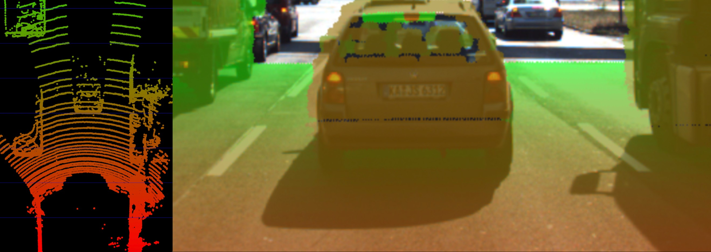

## 1. Collision Detection Basics

### The Collision Detection Problem

- If a preceding vehicle is present, the CAS (*collision avoidance system*) continuously estimates the time-to-collision (TTC).
  - When the TTC falls below a lower threshold, the CAS can then decide to either warn the driver of the imminent(差し迫った) danger or - depending on the system - apply the vehicle brakes autonomously. 

### Constant velocity vs. constant acceleration

- Two **assumptions**:
  - Assumption 1: The **relative velocity** between the yellow and green vehicle were constant. *constant velocity model* (CVM). LidarだけでOK、距離のみを測る。
  - Especially in dynamic traffic situations where a vehicle is braking hard, the CVM is not accurate enough however, as the relative velocity between both vehicles changes between measurements. 
  - Assumption 2: Assume velocity to be a function of time. *constant acceleration model* (CAM). **Radar**を使って、速度を測る。

- Should you be involved in building a **commercial** version of such a system, keep in mind that you should be using a **constant acceleration model**. このコースはconstant velocity model. なので、下にLidarを使ってTTCを予測している。

## 2. Estimating TTC with Lidar

### The Math Behind Time-to-Collision (TTC)

- Note however that a **radar** sensor would be the **superior solution for TTC computation** as it can directly measure the relative speed, whereas with the Lidar sensor we need to compute $v_0$ from two (noisy) distance measurements.

### Preparing the Lidar Point Cloud

- Lidar point cloud overlays a camera image. 
- As **measurement accuracy** is **correlated** to the **amount of light reflected** from an object, it makes sense to consider the reflectiveness r (多分intensityだろう) of each Lidar point which can access in addition to the x, y and z coordinates.
  - The image below highlights **high reflectiveness with green**, whereas regions with **low reflectiveness** are shown as **red**. 
- In order to derive a stable TTC measurement from the given point cloud.
  - **Remove measurements on the road surface**.
  - **Remove measurements with low reflectivity**. 
- Project Lidar points into the camera image, perform the removal procedureの紹介はまだ。

### Computing TTC from Distance Measurements

- In the figure below, Lidar measurements located on the tailgate of the preceding vehicle are measured at times $t_0$ (green) and $t_1$ (red).
  - It can be seen, that the distance to the vehicle has decreased slightly between both time instants. 
- point cloudの自車から一番近い点を前走車との距離として使う。これはちょっと外れ値があったらヤバい。上記の図にも、tailgate(後尾「こうび」扉)より手前の点も存在している。
  - It is thus a good idea to perform a more robust computation of minXCurr and minXPrev which is able to cope with **a certain number of outliers** (in the final project) and also look at a **second sensor** which is able to **compute the TTC**, such as the **camera**.

- また、自車レーンのみのpointsを考えるので、自車レーンの幅以外のpointsを全部削除したい。

## 3. Estimating TTC with a Camera

### Measuring TTC without distance

- Stereo cameraの現状：With more advanced ADAS products and with autonomous vehicles however, stereo cameras have **started to disappear from the market** due to their package size, the high price and the **high computational load** for **finding corresponding features**.

- Mono cameraを使いましょう。 

  

### The Problem with Bounding Box Detection

-  For each vehicle, the network returns a bounding box, whose width and/or height could in principle be used to compute the **height ratio** in the TTC equation.
- しかし、bounding boxを利用するのがよくない。Bounding boxes do not always reflect the true vehicle dimensions and the **aspect ratio(アスペクト比、アスペクトレシオ、縦横「じゅうおう」の比率) differs between images**. 
- でもBounding Boxの役は、enable us to focus properly on the relevant object in the image.

### Using Texture Keypoints Instead

- Instead of relying on the detection of the vehicle **as a whole**, we now want to analyze its structure on a smaller scale.
- If it were possible to locate **uniquely identifiable keypoints** that could be tracked from one frame to the next, we could use the distance between all keypoints on the vehicle relative to each other to compute a robust estimate of the height ratio in TTC equation. 
  - In (b), 4 keypoints have been matched between successive images (**with keypoint 3 being a mismatch**) using a **higher-dimensional similarity measure** called ***descriptor***.
    - 2フレームのkeypoint 3の位置がそもそも違うから。
  - Replace the height ratio $h_1/h_0$ with the **mean or median** of all distance ratios $d_k/d_k'$. medianの方がいいらしい、meanは外れ値(mismatches)に影響されるから。

## 4. Course Structure (Building Blocks)

- Camera. 
  - ３つ理解しないといけないこと：
    - How to find keypoints.
    - How to describe them in a unique way.
    - How to find them again in another image.
- Lidar. 
  - CameraやLidarの共通課題は**exclude the road surface and static objects**.
  - また、Lidarの処理について、Lidarのコースに僕Croppingをやっていたが、Cropping will not be reliable enough, especially when the preceding vehicle is **not directly in front of the sensor**.
- CameraやLidarのどっちを使っても足りないので、Sensor Fusionが登場：
  - 特に8番は実際にやらないと、分からないでしょう。
- コースの構成：

### Timoへの取材：Early Fusion vs. Late Fusion

- Late Fusion:
  - Track the object in the camera;
  - Track an object in the lidar and radar.
  - 最後Track to track fusion.
- Early Fusion:
  - **Fusion algorithm** has access to the **raw data** of the camera, of the lidar, of the radar.
  - Process everything together to produce one final output.