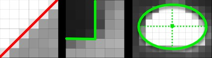
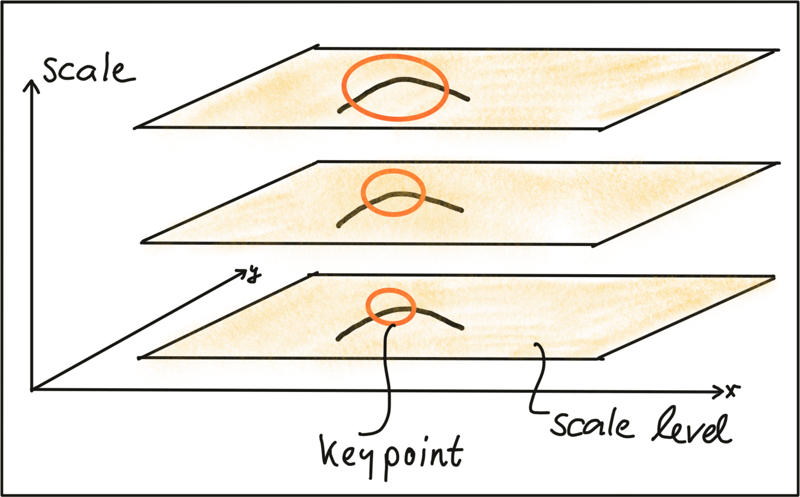
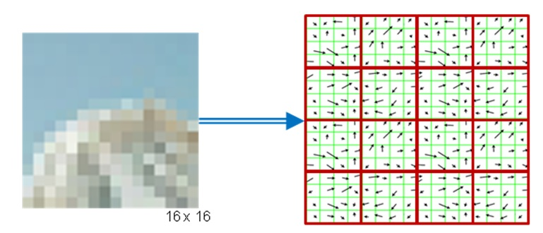
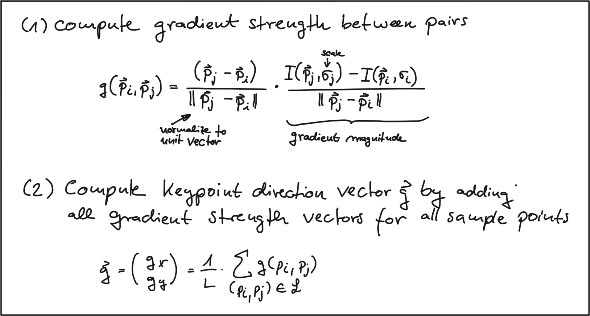
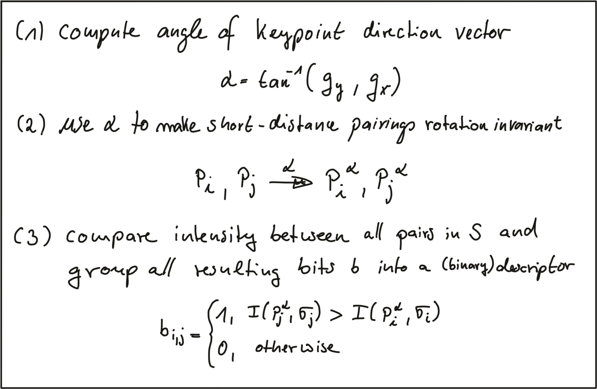
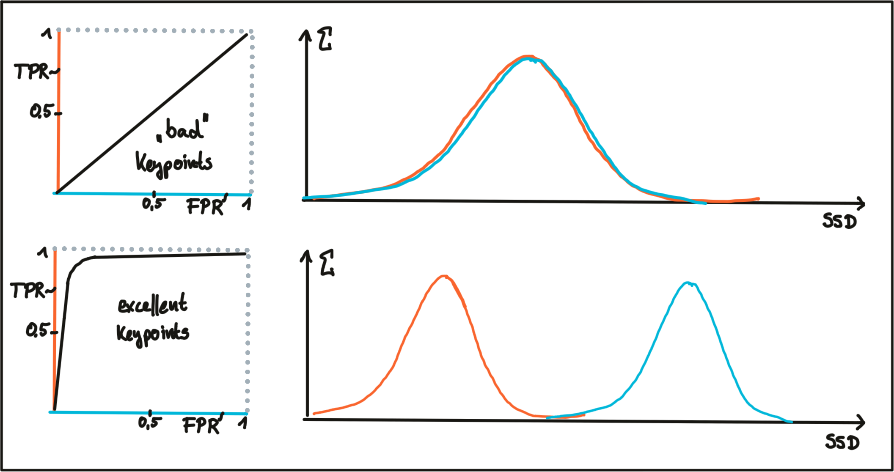

## 1. Intensity Gradient and Filtering

- descriptorの目的：describe keypoints so that we can **find them again on the next image** taken by the same camera.

### Locating Keypoints in an Image

- In order to precisely locate a keypoint in an image, we need a way to assign them a **unique coordinate in both x and y**.
  - **Both the corner as well as the ellipse** can be positioned accurately in x and y, **the line** in the leftmost image **can not**. 

### The Intensity Gradient

- The figure below shows the **intensity profile** of all pixels along the red line in the image as well as the intensity gradient, which is the derivative of image intensity. 

- Look for points which show a **gradient peak** both in **horizontal** and in **vertical** direction and choose them as keypoints with both x and y coordinates.

- gradient imageの計算：

  

  - atanの中の分母と分子は逆じゃない？

- intensity gradientの計算方法について

  - The most straightforward approach would be to simply compute the intensity difference between neighboring pixels.
    - This approach however is **extremely sensitive to noise** and **should be avoided in practice**.
  - 方法：a **well-proven standard approach**, the **Sobel operator**.

### Image Filters and Gaussian Smoothing

- To counteract **noise**, especially under **low-light** conditions, a **smoothing operator** has to be applied to the image before gradient computation.
- Usually, a **Gaussian filter** is used for this purpose which is **shifted over** the image and combined with the intensity values beneath it.
- Gaussian filterの２つパラメータ：
  - The standard deviation: the larger the standard deviation, the wider the area which is covered by the filter. つまり分布を決める。小さければ小さいほど確率密度関数が尖る。
  - The kernel size: defines how many pixels around the center location will contribute to the smoothing operation. これはCNNのfilterのkernel sizeと同じ意味だろう。filterのkernel sizeは大体同じ意味だろう。
- Gaussian smoothing works by assigning each pixel a **weighted sum** of the **surrounding pixels** based on **the height of the Gaussian curve at each point**.
  - It can easily be seen that the contribution of the surrounding pixels around the center location increases when the standard deviation is large (left image).

- Applying the Gaussian filter (**or any other filter**)のステップ：全然CNNと同じだろう。
  - Create a filter kernel with the desired properties (e.g. Gaussian smoothing or edge detection).
  - Define the anchor point within the kernel (usually the center position) and place it on top of the first pixel of the image.
  - Compute the sum of the products of **kernel coefficients** with the **corresponding image pixel values** beneath.
  - Place the result to the location of the kernel anchor in the input image.
  - Repeat the process for all pixels over the entire image. 
- Gaussian filterから離散kernelへ：
  - kernelは必ず正規化しなきゃいけない。$\sum k(i,j)==1$を保証すること。いいえ、Gaussian kernelだけでしょう。下のSobel kernelは違うから。
- 関係するOpenCV関数：`cv::filter2D`. `cv::GaussianBlur`.

### Computing the Intensity Gradient

- Among the most famous is the `Sobel` operator (proposed in 1968), but there are several others, such as the `Scharr` operator, which is optimized for rotational symmetry. 全部kernelの設計でしょう。

- The Sobel operators are 3x3 kernels, one for gradient in x and one for gradient in y. 

- $S_x$や$S_y$をそれぞれ適用すると、

  

- 流れ：
  - まず`GaussianBlur`でsmoothing.
  - また、`sobel_x, sobel_y`をそれぞれ適用。`result_x, result_y`が得る。
  - 最後に、各pixelのmagnitudeを計算。結果：

## 2. Harris Corner Detection

### Local Measures of Uniqueness

- Corner is the only local structure that can be assigned a unique coordinate in x and y. 
- In order to locate a corner, we consider how the **content of the window(オレンジ色の枠だろう) would change** when **shifting it** by a **small amount**.
  - (a): there is no measurable change in any coordinate direction at the current location of the **red Window W**.
  - (b): there will be significant change into the direction orthogonal to the edge and no change when moving into the direction of the edge.
  - (c): **the window content will change** in any coordinate direction.
- The idea of locating corners by means of an algorithm is to find a way to detect **areas with a significant change** in the image structure based on **a displacement of a local window W**. 
  - After shifting the Window W by **an amount u in x-direction and v in y-direction**, the equation sums up the squared differences of all pixels within W at the **old** and at the **new window position**.
  - テイラー展開：operating pointは(x, y)でしょう。小さいu, vでしょう。
    - $I_x, I_y$はintensity gradientだ。(intensityじゃないよ)
  - Insert the approximated expression of $I(x+u,y+v)$ into the SSD equation. 
    - $\begin{bmatrix} I_x & I_y \end{bmatrix}\begin{bmatrix} u \\ v \end{bmatrix}==\begin{bmatrix} u & v \end{bmatrix}\begin{bmatrix} I_x \\ I_y \end{bmatrix}$だからだ。
- The result of our mathematical transformations is a matrix $H$, which can now be **conveniently analyzed** to locate structural change in a local window $W$ around every pixel position $u,v$ in an image.
  - To do this, it helps to visualize the matrix $H$ as an ellipse, whose **axis length and directions** are given by its **eigenvalues(固有値) and eigenvectors**.
  - The **larger eigenvector** points into the direction of maximal intensity change, whereas the **smaller eigenvector** points into the direction of minimal change.
  - So in order to identify corners, we need to find **positions** in the image which have **two significantly large eigenvalues** of $H$. 下記の位置には固有値が１つ大きい、１つ小さいので、cornerではない。
- Eigenvaluesの計算式：
- In addition to the smoothing of the image before gradient computation, the Harris detector uses a **Gaussian window $w(x,y)$** to compute a weighted sum of the intensity gradients around a local neighborhood. Gaussian filterと似ている。
  - このGaussian分布は画像全体を覆うの？僕の理解はattention見たいな感じ。どこに興味があれば、このGaussian windowをそこに移動する。
  - By adjusting scale, we can thus control the keypoints we are able to detect.

### The Harris Corner Detector

- **Harris corner response**を評価：
  - the factor k being an empirical constant which is usually in the range between k = 0.04 - 0.06.

### Non-Maxima Suppression (NMS)

- 目的：
  - ensure that we get the pixel with maximum **cornerness** in a local neighborhood.
  - **prevent corners from being too close to each other** as we prefer an **even spread of corners** throughout the image.
- やり方：`cv::KeyPoint`オブジェクトを利用する。
  - `cv::KeyPoint::overlap`関数を利用して、corner間の距離を保つ。
  - 疑問：overlapした場合、responseが大きいkeypointに入れ替えるけど。新しいkeypointを入れることで、`keypoints`にある他のKeypointとoverlapすることにならないの？

## 3. Overview of Popular Keypoint Detectors

### Invariance to Photometric(photometry, 測光、そっこう) and Geometric Changes

- **Four basic transformation** types we need to think about when selecting a suitable keypoint detector:

  - Rotation.

  - **Scale change**.

  - **Intensity change**.

  - Affine transformation(アフィン変換、線型変換（回転、拡大縮小、剪断「せんだん」）と平行移動の組み合わせである).

    - In Euclidean geometry, an affine transformation, or an affinity, is a geometric transformation that **preserves lines and parallelism** (but **not necessarily distances and angles**). https://en.wikipedia.org/wiki/Affine_transformation
    - なので、上記のRotation, Scale changeも全部Affine transformationのはずだ。

    

- この４つ基準でHarris corner detectorを評価しましょう。
  - Rotation R: 
  - Intensity change: 
  - Scale change: 
  - 結論：the Harris detector is robust under rotation and **additive intensity shifts**, but sensitive to scale change, **multiplicative intensity shifts** (i.e. changes in contrast, つまりみんなのintensity一緒に同じぐらい変わるではなく、変わる程度が違う) and affine transformations(これについて例がないじゃないか。。。).

### Automatic Scale Selection

- In order to detect keypoints **at their ideal scale**, we must know (or find) their respective dimensions in the image and **adapt the size of the Gaussian window** $w(x,y)$.
  - If the keypoint scale is unknown or if **keypoints with varying size** exist in the image, detection must be performed **successively at multiple scale levels**. 

- やり方：In 1998, Tony Lindebergがproposed a function $F(x,y,scale)$, which could be used to select those keypoints that showed a **stable maximum** of $F$ **over scale**.
  - The scale for which $F$ was maximized was termed the "**characteristic scale**" of the respective keypoint. 
- A good detector is able to automatically select the characteristic scale of a keypoint based on structural properties of its local neighborhood.
  - Modern keypoint detectors usually possess this ability and are thus robust under changes of the image scale.

### Overview of Popular Keypoint Detectors

- Classic detectors: aim at maximizing detection accuracy; computational complexity is not a primary concern.
  - 1988 Harris Corner Detector (Harris, Stephens)
  - 1996 Good Features to Track (Shi, Tomasi). Jianbo Shi.
  - 1999 Scale Invariant Feature Transform (Lowe)
  - 2006 Speeded Up Robust Features (Bay, Tuytelaars, Van Gool)

- **Faster** detectors: aim at real-time applications on smartphones and other portable devices.
  - 2006 Features from Accelerated Segment Test (FAST) (Rosten, Drummond)
  - 2010 Binary Robust Independent Elementary Features (BRIEF) (Calonder, et al.)
  - 2011 Oriented FAST and Rotated BRIEF (ORB) (Rublee et al.)
  - 2011 Binary Robust Invariant Scalable Keypoints (BRISK) (Leutenegger, Chli, Siegwart)
  - 2012 Fast Retina Keypoint (FREAK) (Alahi, Ortiz, Vandergheynst)
  - 2012 KAZE (Alcantarilla, Bartolli, Davidson)

## 4. Gradient-based vs. Binary Descriptors

### Detectors and Descriptors

- In the literature, a large variety of similarity measures (called *descriptors*) have been proposed and in many cases, authors have published **both** a new method for keypoint detection as well as similarity measure which has been optimized for their type of keypoints.
  - A *keypoint* (interest point / salient point) detector is an algorithm that chooses points from an image based on a **local maximum of a function**, such as the "cornerness" metric with the Harris detector.
  - A *descriptor* is a vector of values, which describes **the image patch around a keypoint**.
    - There are various techniques ranging from comparing raw pixel values to much more sophisticated approaches such as histograms of gradient orientations. 

### HOG Descriptors and SIFT（大事）

- An image is divided into cells in which gradients are computed and collected in a histogram.

  - The set of histogram from all cells is then used as a similarity measure to uniquely identify an image patch or object.

- SIFTの5ステップ：

  - First, keypoints are detected in the image using an approach called "**Laplacian-Of-Gaussian (LoG)**", which is based on **second-degree intensity derivatives**.

    - The LoG is applied to **various scale levels** of the image and tends to detect blobs instead of corners.
    - In addition to a unique scale level, keypoints are also assigned **an orientation** based on the intensity gradients in a local neighborhood around the keypoint.

  - Second, for every keypoint, its surrounding area is transformed by **removing the orientation** and thus ensuring a *canonical orientation*. 多分keypointがorientationを持っているので、orientationをremoveするのが可能だ。

    - Also, **the size of the area is resized to 16x16 pixels**, providing a **normalized patch**. 各scale levelから同じscaleにする。

  - Third, the orientation and magnitude of each pixel within the normalized patch are computed based on the intensity gradients lx and ly.

  - Fourth, the normalized patch is divided into a grid of 4x4 cells.

    - Within each cell, the orientations of pixels which **exceed a threshold on magnitude** are collected in a histogram consisting of 8 bins. 理解できていない。多分８は８方向があるからです。

      

  - Last, the 8-bin histograms of all 16 cells are concatenated into a 128-dimensional vector (the descriptor) which is used to uniquely represent the keypoint.

- SIFT detector / descriptorの強み：robustly identify objects even among clutter(乱雑、散らかっているもの) and under partial occlusion.

  - It is invariant to **uniform changes** in scale, to rotation, to changes in both brightness and contrast and it is even partially invariant to affine distortions.

### Binary Descriptors and BRISK

- The central idea of binary descriptors is to **rely solely on the intensity information (i.e. the image itself)** and to encode the information around a keypoint in a string of binary numbers, which can be compared very efficiently in the matching step, when corresponding keypoints are searched.
- Binary descriptorの３parts:
  - A **sampling pattern** which describes where sample points are located around the location of a keypoint. 多分keypoint位置との相対位置。
  - A method for orientation compensation, which removes the influence of rotation of the image patch around a keypoint location.
  - A method for **sample-pair** selection, which generates pairs of sample points which are compared against each other **with regard to their intensity values**.
    - **If the first value is larger than the second, '1' into the binary string, otherwise '0'**.
    - After performing this for **all point-pairs in the sampling pattern**, a long binary chain (or, string) is created.

- The sampling pattern of BRISK is composed out of a number of sample points (blue), where a concentric ring (red) around each sample point denotes an area where Gaussian smoothing is applied.
  - As **opposed to** some other binary descriptors such as **ORB or BRIEF**, the **BRISK sampling pattern is fixed**.
  - The smoothing is important to avoid aliasing (an effect that causes different signals to become indistinguishable when sampled). 
- During sample pair selection, the BRISK algorithm differentiates between **long- and short-distance pairs**.
  - The **long-distance pairs** are used for estimating the **orientation** of the image patch from **intensity gradients**, whereas the **short-distance pairs** are used for the **intensity comparisons** from which the descriptor string is assembled. long-distance pairsはorientationを担当する、short-distance pairsはdescriptorを担当。
  - short pairs (left) and long pairs (right): 
  - long pairsからdirection vector $\overrightarrow{g}$の計算：
  - **Based on** $\overrightarrow{g}$, we can use the direction of the sample pattern to **rearrange the short-distance pairs** and thus ensure **rotation invariance**.
  - Base on the **rotation-invariant short-distance** pairings, the final binary descriptorの計算：
    - 回転してから、descriptorを作る。多分short pairsの内部の順番を変えると思う。単独のpairにたいしては、回転しても結果変わらないでしょう。
    - もしくは、下のimageを回転するけど、上の取る枠は回転しない。なので、回転後、同じ座標のintensityは変わる。

## 5. Descriptor Matching

### Distance between descriptors

- Keypoints can be **described** by transforming their local neighborhood into a high-dimensional vector that captures the unique characteristics of the gradient or **intensity distribution**.

- 3種類distance: 
- SAD (L1 norm)やSSD(L2 norm)について：
  - The shortest distance between both is a straight line.
  - So in terms of the geometric distance between both vectors, the L2-norm is a more accurate measure.
- In the case of a **binary descriptor** who consists only of ones and zeros, the best (and **fastest**) measure to use is the Hamming distance.
- You have to adapt the distance measure to the type of descriptor you are using.
  - In case of gradient-based methods such as SIFT, the L2-norm would be most appropriate.
  - In case of all binary descriptors, the Hamming distance should be used.

### Finding matches

- Brute Force Matching: N x M comparisons. N keypoints for first image, M keypoints for second image.
- **FLANN** (fast library for approximate nearest neighbors): 2014, David Lowe and Marius Muja.
  - The library builds a very efficient data structure (a **KD-tree**) to search for matching pairs and avoids the exhaustive search of the brute force approach.
  - At the time of writing (May 2019), there is a potential bug in the current implementation of the OpenCV, which requires a **conversion of the binary descriptors into floating point vectors**, which is inefficient.

- Both BFMatching and FLANN accept a **descriptor distance threshold** T which is used to limit the number of matches to the 'good' ones (Corresponding, True Positive) and discard matches where the respective pairs are no correspondences (False Positive).
  - True PositiveやFalse Positiveの分布、閾値の選択：
    - In practice, a clear and concise separation of TP and FP is almost never found and therefore, setting a matching threshold is always a compromise between balancing 'good' vs. 'bad' matches.

### Selecting Matches

- **Cross check** approach. 対応する状況：keypoint a, b from frame 1, keypoint c from frame 2. 距離ac, bc全部閾値を超えていなかったら、ac, bc全部マッチングとして出された。でも絶対間違っているから。もしframe 2から見ると、cb < caだったら、cbだけ出す。なので、両方向全部マッチングできたら（bとc）、答えになりそうだ。
  - For each descriptor in the source image, find one or more best matches in the reference image.
  - Switch the order of source and reference image.
  - Repeat the matching procedure between source and reference image from step 1.
  - Select those keypoint pairs whose descriptors are best matches in both directions.

- ***Nearest neighbor distance ratio***: frame Aのkeypoint aにたいして、一番いいmatchingのdistance / 2番めいいmatchingのdistanceの比率を計算。低いratioなら、一番いいmatching keypointはよいmatchingはず。高いratioなら（つまりdistanceは大体同じ）、ambiguous or incorrect matchになりそう。
  - 右の資料の説明がわかりやすい：https://www.uio.no/studier/emner/matnat/its/TEK5030/v19/lect/lecture_4_2_feature_matching.pdf
  - In practice, a (ratio) threshold value of **0.8** has proven to provide a good balance between TP and FP.

- Feature Matching with FLANN: https://docs.opencv.org/3.4/d5/d6f/tutorial_feature_flann_matcher.html
  - 上記のdescriptor distance ratioの実現もある。

### Evaluating Matching Performance

- *True Positive Rate (TPR), recall*: $TP/(TP + FN)$.

- *False Positive Rate (FPR), false alarm rate*: $FP/N=FP/(FP+TN)$. https://en.wikipedia.org/wiki/False_positive_rate

- *Precision*: $TP/(TP+TN)$. https://en.wikipedia.org/wiki/Precision_and_recall

  - divided by the number of **all matches**. 

- *Receiver Operating Characteristic (ROC)*. 

  - 横軸はFPR, 縦軸はTPR.

  - An ideal detector / descriptor would have a TPR of 1.0 while the FPR would be close to 0.0 at the same time.

  - Two examples for good and bad detectors / descriptors.

    

- 他の評価：*Precision-Recall Curve*.

