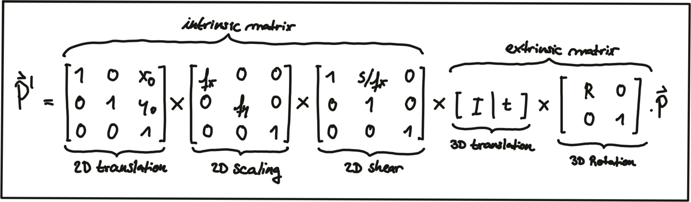

## 1. Lidar-to-Camera Point Projection

### Displaying and Cropping Lidar Points


- While the top view image has been cropped at 20m, the farthest point for this scene in the original dataset is at ~78m.

- 路面の点をfilterする：ここで単純にz座標が-1.4以下の点を無視するやり方。Lidarコースに学んだRANSACでもいい。
- 色はx座標を見て付けている。（intensityじゃないよ）

### Homogeneous coordinates

- 普通の3D座標をimage planeに投影する式：
- 上記変換を**linear変換**で表せるように、***Homogeneous coordinate system***で変換する。

### Intrinsic Parameters

- 目標：カメラ座標系の3D pointをカメラのimage planeに変換。
- 上記投影をlinear変換で表せた。（Homogeneous coordinate systemで）**matrix-vector** form.

- The camera parameters are arranged in a matrix, which conveniently expresses the properties of the **pinhole camera model in a compact way**.
- そのお陰で、**Additional properties of a more complex camera model such as skew or shear can easily be added**.
  - skew(剪断係数)について(https://jp.mathworks.com/help/vision/ug/camera-calibration.html)：

### Extrinsic Parameters

- 目標：他の座標系の3D pointをカメラ座標系の3D pointに変換。
- 自車座標系：
- Translation: 
  - matrix $I$ of size $N$, where $N$ is the number of components in $\overrightarrow{P}$ and the translation vector $\overrightarrow{t}$.

- Rotation: 

  

- The combined matrix consisting of $R$ and $\overrightarrow{t}$ is also referred to as the *extrinsic matrix*, as it models **how points are transformed between coordinate system**.

- *intrinsic matrix*と結合して、他の座標系の3D点をカメラのimage planeに変換できる：
  - The scale component has been integrated into the intrinsic matrix $K$ (with the focal length being the relevant parameter) and is no longer part of the extrinsic matrix.

### Overview of the KITTI sensor setup


- http://www.cvlibs.net/datasets/kitti/raw_data.php
  - raw data毎にcalibrationファイルが提供されている。
- extrinsic parameters: `calib_velo_to_cam.txt`.
  - `R`, `T`.
- intrinsic parameters: `calib_cam_to_cam.txt`.
  - `R_rect_00`, `P_rect_00`.
  - `R_rect_00` is the 3x3 rectifying(直す) rotation to make image planes **co-planar**. (align both cameras of the stereo in a way that one row of pixels in the left camera directly corresponds to another row of pixels in the right camera.)
  - `P_rect_00` contains the intrinsic camera parameters.
- Equation that project a 3D Lidar point X in space to a 2D image point Y (using the notation in the Kitti readme file) on the image plane of the left camera using homegeneous coordinates: 

### Filtering Lidar Points

- Lidarコースにも既に同じことをやっていた。

  ```c++
  auto filtered_cloud = point_processor.FilterCloud(input_cloud, 0.1f,
                                                    Eigen::Vector4f(-10, -6, -2, 1),
                                                    Eigen::Vector4f(30, 7, 1, 1));
  ```

- ここでは、

  ```c++
  for(auto it=lidarPoints.begin(); it!=lidarPoints.end(); ++it) {
      float maxX = 25.0, maxY = 6.0, minZ = -1.4; 
      if(it->x > maxX || it->x < 0.0 || abs(it->y) > maxY || it->z < minZ || it->r<0.01)
          continue; // skip to next point
  ```

  