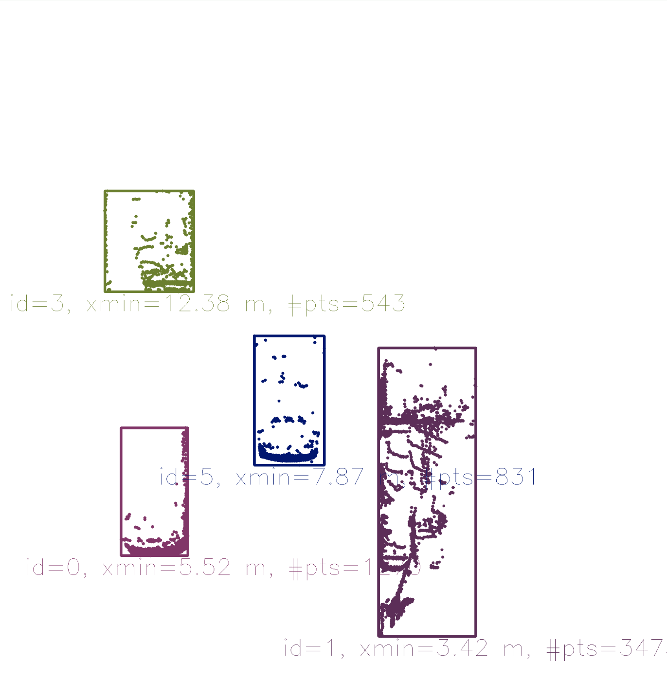

## 1. Lidar-to-Camera Point Projection

### Displaying and Cropping Lidar Points


- While the top view image has been cropped at 20m, the farthest point for this scene in the original dataset is at ~78m.

- 路面の点をfilterする：ここで単純にz座標が-1.4以下の点を無視するやり方。Lidarコースに学んだRANSACでもいい。
- 色はx座標を見て付けている。（intensityじゃないよ）

### Homogeneous coordinates

- 普通の3D座標をimage planeに投影する式：
- 上記変換を**linear変換**で表せるように、***Homogeneous coordinate system***で変換する。

### Intrinsic Parameters

- 目標：カメラ座標系の3D pointをカメラのimage planeに変換。
- 上記投影をlinear変換で表せた。（Homogeneous coordinate systemで）**matrix-vector** form.

- The camera parameters are arranged in a matrix, which conveniently expresses the properties of the **pinhole camera model in a compact way**.
- そのお陰で、**Additional properties of a more complex camera model such as skew or shear can easily be added**.
  - skew(剪断係数)について(https://jp.mathworks.com/help/vision/ug/camera-calibration.html)：

### Extrinsic Parameters

- 目標：他の座標系の3D pointをカメラ座標系の3D pointに変換。
- 自車座標系：
- Translation: 
  
- matrix $I$ of size $N$, where $N$ is the number of components in $\overrightarrow{P}$ and the translation vector $\overrightarrow{t}$.
  
- Rotation: 

  

- The combined matrix consisting of $R$ and $\overrightarrow{t}$ is also referred to as the *extrinsic matrix*, as it models **how points are transformed between coordinate system**.

- *intrinsic matrix*と結合して、他の座標系の3D点をカメラのimage planeに変換できる：
  
  - The scale component has been integrated into the intrinsic matrix $K$ (with the focal length being the relevant parameter) and is no longer part of the extrinsic matrix.

### Overview of the KITTI sensor setup


- http://www.cvlibs.net/datasets/kitti/raw_data.php
  - raw data毎にcalibrationファイルが提供されている。
- extrinsic parameters: `calib_velo_to_cam.txt`.
  - `R`, `T`.
- intrinsic parameters: `calib_cam_to_cam.txt`.
  - `R_rect_00`, `P_rect_00`.
  - `R_rect_00` is the 3x3 rectifying(直す) rotation to make image planes **co-planar**. (align both cameras of the stereo in a way that one row of pixels in the left camera directly corresponds to another row of pixels in the right camera.)
  - `P_rect_00` contains the intrinsic camera parameters.
- Equation that project a 3D Lidar point X in space to a 2D image point Y (using the notation in the Kitti readme file) on the image plane of the left camera using homegeneous coordinates: 

### Filtering Lidar Points

- Lidarコースにも既に同じことをやっていた。

  ```c++
  auto filtered_cloud = point_processor.FilterCloud(input_cloud, 0.1f,
                                                    Eigen::Vector4f(-10, -6, -2, 1),
                                                    Eigen::Vector4f(30, 7, 1, 1));
  ```

- ここでは、

  ```c++
  for(auto it=lidarPoints.begin(); it!=lidarPoints.end(); ++it) {
      float maxX = 25.0, maxY = 6.0, minZ = -1.4; 
      if(it->x > maxX || it->x < 0.0 || abs(it->y) > maxY || it->z < minZ || it->r<0.01)
          continue; // skip to next point
  ```

## 2. Object Detection with YOLO


- カメラの方：In order to compute the time-to-collision for a specific vehicle, we need to **isolate the keypoints on that vehicle ** so that TTC estimation is not distorted due to the inclusion of matches on e.g. the road surface, stationary objects or other vehicles in the scene.
-  Lidarの方：PCLのclustering方法ではなく、ここはまず3D Lidar pointを2D image planeに投影して、またカメラと同じように、bounding boxを利用して、点群をclusterする。

### Introduction into YOLO

- YOLO(**Cで実現した**), a very fast detection framework that is **shipped with OpenCV library**. 

### The YOLOv3 Workflow

- コースのYOLOの原理についての説明が曖昧で、CourseraのSelf-Driving Carsのコース３を復習する必要がある。またはもっと調べる必要がある。曖昧ですが、原文を記す：

  - Each cell is then used for predicting a **set of** bounding boxes.
  - For each bounding box, the network also predicts the confidence that the bounding box encloses a particular object as well as the probability of the object belonging to a particular class.
  - これは印象ある：Lastly, a non-maximum suppression is used to eliminate bounding boxes with a low confidence level as well as redundant bounding boxes enclosing the same object. non-maximum suppressionだったら、後者のredundant bounding boxesを消すのがメインのタスクだろう。

-  Step 1: Initialize the Parameters: `confThreshold, nmsThreshold, inpWidth(416), inpHeight(416)`. cell sizeは`32 x 32`. cellの数はいつも`13 x 13`.

- Step 2: Prepare Model: weights, config, names(80種類クラスの名前)は全部https://github.com/pjreddie/darknet

  ```c++
  // load image from file
  cv::Mat img = cv::imread("./images/img1.png");
  
  // load class names from file
  string yoloBasePath = "./dat/yolo/";
  string yoloClassesFile = yoloBasePath + "coco.names";
  string yoloModelConfiguration = yoloBasePath + "yolov3.cfg";
  string yoloModelWeights = yoloBasePath + "yolov3.weights"; 
  
  vector<string> classes;
  ifstream ifs(yoloClassesFile.c_str());
  string line;
  while (getline(ifs, line)) classes.push_back(line);
  
  // load neural network
  cv::dnn::Net net = cv::dnn::readNetFromDarknet(yoloModelConfiguration, 			yoloModelWeights);
  net.setPreferableBackend(cv::dnn::DNN_BACKEND_OPENCV);
  net.setPreferableTarget(cv::dnn::DNN_TARGET_CPU);
  ```

  - If OpenCV is built with Intel's Inference Engine, `DNN_BACKEND_INFERENCE_ENGINE` should be used.
  - If a (Intel) GPU is available, use `DNN_TARGET_OPENCL`. nvidiaのGPUは？

- Step 3: Generate 4D Blob from Input Image.

  - Mathematically, **a blob is an N-dimensional array stored in a C-contiguous(隣接する) fashion**. 概念はtensorと同じだろう。

  - 画像データのblob: `N x C x H x W`.

  - In OpenCV, blobs are stored as 4-dimensional cv::Mat array with NCHW dimensions order.

  - imageをblobに変換、blobがnetworkのinput：

    ```c++
    // generate 4D blob from input image
    cv::Mat blob;
    double scalefactor = 1/255.0;
    cv::Size size = cv::Size(416, 416);
    cv::Scalar mean = cv::Scalar(0,0,0);
    bool swapRB = false;
    bool crop = false;
    cv::dnn::blobFromImage(img, blob, scalefactor, size, mean, swapRB, crop);
    ```

- Step 4: Run Forward Pass Through the Network.

  - networkのoutputを取る：

    ```c++
    // Get names of output layers
    vector<cv::String> names;
    vector<int> outLayers = net.getUnconnectedOutLayers(); // get indices of output layers, i.e. layers with unconnected outputs
    vector<cv::String> layersNames = net.getLayerNames(); // get names of all layers in the network
    
    names.resize(outLayers.size());
    for (size_t i = 0; i < outLayers.size(); ++i) // Get the names of the output layers in names
    {
        names[i] = layersNames[outLayers[i] - 1];
    }
    
    // invoke forward propagation through network
    vector<cv::Mat> netOutput;
    net.setInput(blob);
    net.forward(netOutput, names);
    ```

  - assemble the bounding boxes with a sufficiently high confidence score into a vector.

    ```c++
    // Scan through all bounding boxes and keep only the ones with high confidence
    float confThreshold = 0.20;
    vector<int> classIds;
    vector<float> confidences;
    vector<cv::Rect> boxes;
    for (size_t i = 0; i < netOutput.size(); ++i) {
        float* data = (float*)netOutput[i].data;
        for (int j = 0; j < netOutput[i].rows; ++j, data += netOutput[i].cols) {
            cv::Mat scores = netOutput[i].row(j).colRange(5, netOutput[i].cols);
            cv::Point classId;
            double confidence;
            
            // Get the value and location of the maximum score
            cv::minMaxLoc(scores, 0, &confidence, 0, &classId);
            if (confidence > confThreshold) {
                cv::Rect box; int cx, cy;
                cx = (int)(data[0] * img.cols);
                cy = (int)(data[1] * img.rows);
                box.width = (int)(data[2] * img.cols);
                box.height = (int)(data[3] * img.rows);
                box.x = cx - box.width/2; // left
                box.y = cy - box.height/2; // top
    
                boxes.push_back(box);
                classIds.push_back(classId.x);
                confidences.push_back((float)confidence);
            }
        }
    }
    ```

    

- Step 5: Post-Processing of Network Output.

  ```c++
  // perform non-maxima suppression
  float nmsThreshold = 0.4;  // Non-maximum suppression threshold
  vector<int> indices;
  cv::dnn::NMSBoxes(boxes, confidences, confThreshold, nmsThreshold, indices);
  ```

  

  - `nmsTheshold`が小さい方が厳しい（重なりへの罰）。

## 3. Standard CV vs. Deep Learning (Timo interview)

- I think it still makes a lot of sense to learn the classical computer vision algorithms like Hough transform (ハフ変換), color spaces(色空間), edge detection.
- You will have to add annotated real data on top, but for pre-training, I think right now it's already pretty usable.

## 4. Creating 3D-Objects

### Grouping Lidar points using a region of interest

- region of interest (ROI), bounding boxのこと。

- If a Lidar point has been found to be within a ROI, it is added to the **BoundingBox data structure**.

  ```c++
  struct BoundingBox { // bounding box around a classified object (contains both 2D and 3D data)
      int boxID; // unique identifier for this bounding box
      int trackID; // unique identifier for the track to which this bounding box belongs
  
      cv::Rect roi; // 2D region-of-interest in image coordinates
      int classID; // ID based on class file provided to YOLO framework
      double confidence; // classification trust
  
      std::vector<LidarPoint> lidarPoints; // Lidar 3D points which project into 2D image roi
      std::vector<cv::KeyPoint> keypoints; // keypoints enclosed by 2D roi
      std::vector<cv::DMatch> kptMatches; // keypoint matches enclosed by 2D roi
  };
  ```

- **Lidar pointsに適用するROI**を少し縮める。理由：In some cases, object detection returns ROI that are too large and thus **overlap into parts of the scene that are not a part of the enclosed object** (e.g. a neighboring vehicle or the road surface).

  ```c++
  vector<vector<BoundingBox>::iterator> enclosingBoxes; // pointers to all bounding boxes which enclose the current Lidar point
  for (vector<BoundingBox>::iterator it2 = boundingBoxes.begin(); it2 != boundingBoxes.end(); ++it2) {
      // shrink current bounding box slightly to avoid having too many outlier points around the edges
      cv::Rect smallerBox;
      smallerBox.x = (*it2).roi.x + shrinkFactor * (*it2).roi.width / 2.0;
      smallerBox.y = (*it2).roi.y + shrinkFactor * (*it2).roi.height / 2.0;
      smallerBox.width = (*it2).roi.width * (1 - shrinkFactor);
      smallerBox.height = (*it2).roi.height * (1 - shrinkFactor);
  ```

  

- ROIが重なる課題：
  
  - 処理：Lidar points enclosed within multiple bounding boxes are excluded.

### Creating 3D Objects

- clusterされたlidar pointsを利用して、鳥瞰図に下記の情報を表示する：distance to closest point in x-direction, object width and height, number of supporting Lidar points. 

