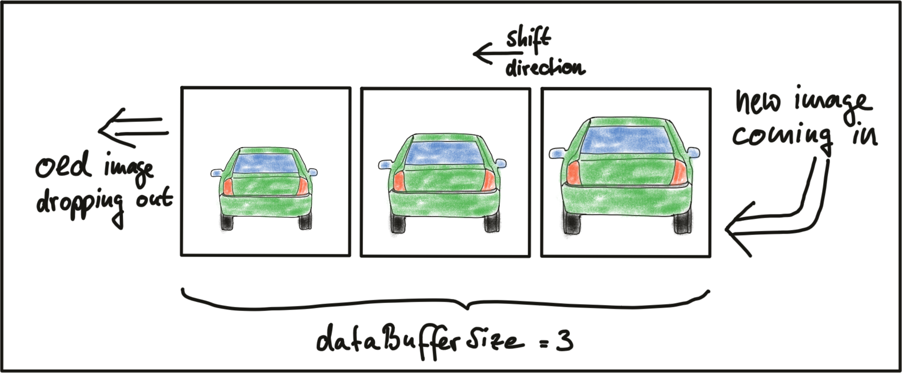

## 2. The Data Buffer

### MP.1 Data Buffer Optimization



- When `dataBuffer.size() < dataBufferSize`, push back current frame.
- When `dataBuffer.size() >= dataBufferSize`.
  - the newest element (current frame) is put in `dataBuffer[imgIndex % dataBufferSize]`.
  - the second newest element (if exists) is in `dataBuffer[imgIndex - 1 % dataBufferSize]`.

## 3. Keypoint Detection

### MP.2 Keypoint Detection

- I referred to the following document which list all detector types. 
  - https://docs.opencv.org/4.1.0/d0/d13/classcv_1_1Feature2D.html
- I just use the default arguments for their `create()` functions.
  - Since they have the same `detect(image, keypoints)` api, I put this call out of the if-else statements for creating detectors.
- `SHITOMASI`: 
- `HARRIS`: 
- `FAST`: 
- `BRISK`: 
- `ORB`: 
- `AKAZE`: 
- `SIFT`: 

### MP.3 Keypoint Removal

- I used the `cv::Keypoint::contains()` to judge whether to erase a keypoint.
- `SIFT` cropped: 
- `ORB` cropped: 

## 4. Descriptor Extraction & Matching

### MP.4 Keypoint Descriptors

- I referred to the same document as that in *Keypoint Detection*.
  - use the default argument values to create extractors.

### MP.5 Descriptor Matching

- `BFMatcher`.

  - If `DES_HOG`, use `cv::NORM_L2`; else, use `cv::NORM_HAMMING`.

- `FLANNBASED` matcher as well as `knnMatch`.

  - I referred to the example in https://docs.opencv.org/4.1.0/d5/d6f/tutorial_feature_flann_matcher.html

- FLANN matcher for binary descriptor.

  - I use `cv::flann::LshIndexParams` to create flann matcher (https://answers.opencv.org/question/59996/flann-error-in-opencv-3/):

    ```c++
    matcher = cv::makePtr<cv::FlannBasedMatcher>(
            cv::makePtr<cv::flann::LshIndexParams>(12,20, 2));
    ```

- `knnMatch`.

  - I first get `std::vector<std::vector<DMatch>>` with inner vector holding `k` best matches.
  - **If the size of inner vector is 0 or 1, do not perform distance ratio and skip it**.

### MP.6 Descriptor Distance Ratio

- For Lowe's ratio test, I referred to the same example as *Descriptor Matching* above.
- Set `k` to 2.
  - Compare distance `a` between descriptors in the best match and distance `b` between descriptors in the second best match.
  - If `a < ratio*b`, then the best match is a good match; if not, the best match is ambiguous and will not be reserved.

## 5. Performance Evaluation

### MP.7 Performance Evaluation 1

### MP.8 Performance Evaluation 2

### MP.9 Performance Evaluation 3

