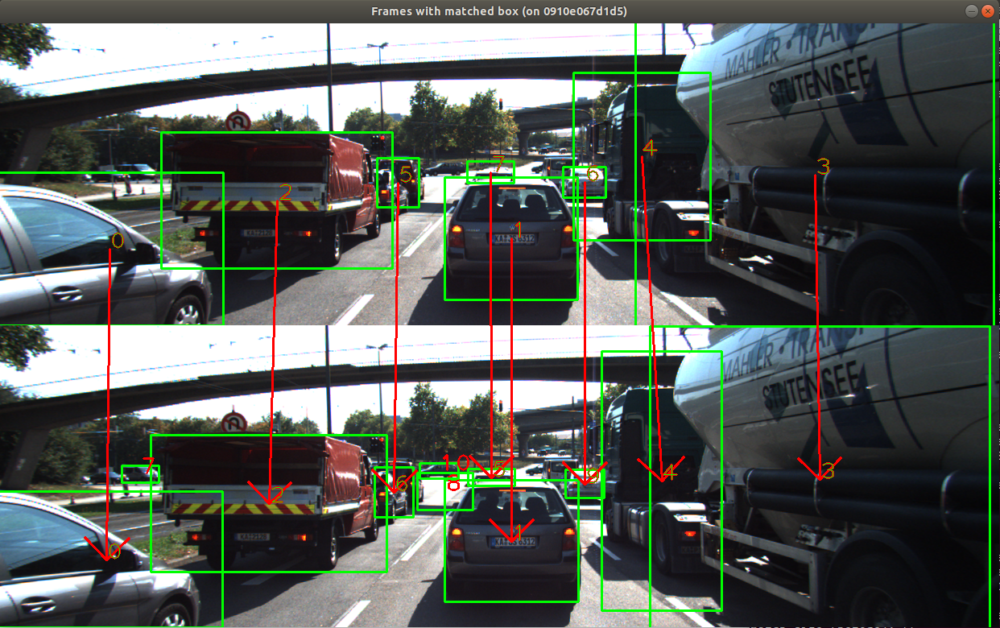
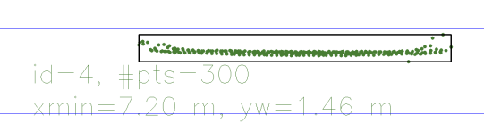
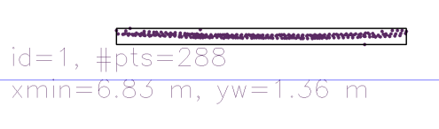
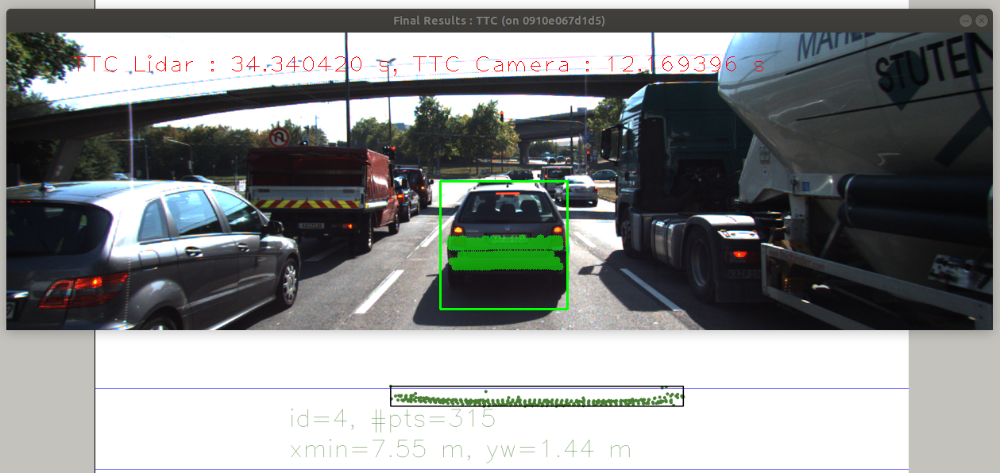

### FP1. Match 3D Objects

- Code: `MatchBoundingBoxes` function in `camFusion_Student.cpp`  is doing this task.

- First, I used `std::map<std::pair<int, int>, std::vector<cv::DMatch>>` to record `DMatch`s corresponding to `<prevBoxId,currBoxId>` pair.
  - I used `std::vector<cv::DMatch>` so that I do not need to do it again in FP.3.
- Second, I sort elements in the map by size of `std::vector<cv::DMatch>` in descending order.
- Third, for sorted elements, I decide that bounding boxes being matched when both `prevBoxId` and `currBoxId` have not been used.
  - At the same time, fill current bounding box's `kptMatches` with the corresponding `std::vector<cv::DMatch>`.
- The result is like this: 

### FP.2 Compute Lidar-based TTC

- Code: `ComputeTTCLidar` function in `camFusion_Student.cpp` is doing this task.

- To account for outliers, I use **kd-tree** to cluster lidar points and remove outliers.
  - The implementation is modified from Lidar course.
  - Different from Lidar course, I **only compared x** coordinate when building kd-tree because **only outliers in x coordinates matter**. (So actually **1d-tree**.)
- I used a **0.05m distance tolerance**.
  
- Comparison between closest distance (m) before and after kd-tree clustering.

  | frame              | 0     | 1     | 2     | 3     | 4     | 5     | 6     | 7     | 8     | 9     | 10    | 11    | 12    | 13    | 14    | 15    | 16    | 17    | 18    |
  | ------------------ | ----- | ----- | ----- | ----- | ----- | ----- | ----- | ----- | ----- | ----- | ----- | ----- | ----- | ----- | ----- | ----- | ----- | ----- | ----- |
  | no clustering      | 7.97  | 7.91  | 7.85  | 7.79  | 7.68  | 7.64  | 7.58  | 7.55  | 7.47  | 7.43  | 7.39  | 7.20  | 7.27  | 7.19  | 7.13  | 7.04  | 6.83  | 6.90  | 6.81  |
  | kd-tree clustering | 7.974 | 7.913 | 7.849 | 7.793 | 7.741 | 7.638 | 7.577 | 7.555 | 7.475 | 7.434 | 7.393 | 7.344 | 7.272 | 7.194 | 7.129 | 7.042 | 6.963 | 6.896 | 6.814 |

  - The 11th frame has an outlier. .
    - The clustering removed this outlier and modified the closest distance to 7.344m.
  - The 16th frame also has an outlier. 
    - The clustering removed this outlier and modified the closest distance to 6.963m.

### FP.3 Associate Keypoint Correspondences with Bounding Boxes

- Code: `RemoveMatchOutliersRansac` in `camFusion_Student.cpp` is doing this task.

- Part 1: Associate `kptMatches` with bounding boxes.
  - This has been done in FP.1.
- Part 2: Outlier removal using `cv::findHomography()`.
  - I don't think euclidean distance between matched keypoints is enough to reject outliers, because, for example, euclidean distance does not see whether this euclidean distance is from x-coordinate or y-coordinate offset.
  - So I used `cv::findHomography()` to compute homography between two frames and mark match inliers.
    - Homography is the transformation model between two frames. In `cv::findHomography()`, I used `RANSAC` method to find homography with the most inliers.

### FP.4 Compute Camera-based TTC

- Code: `ComputeTTCCamera` function in `camFusion_Student.cpp` is doing this task.

- I use the median of all the distance ratios as the distance ratio to compute TTC.

### FP.5 Performance Evaluation 1

- Lidar TTCs are as follows:  

  | frame            | 0     | 1     | 2     | 3     | 4     | 5     | 6     | 7     | 8     | 9     | 10    | 11    | 12    | 13    | 14    | 15    | 16    | 17    | 18    |
  | ---------------- | ----- | ----- | ----- | ----- | ----- | ----- | ----- | ----- | ----- | ----- | ----- | ----- | ----- | ----- | ----- | ----- | ----- | ----- | ----- |
  | closest distance | 7.974 | 7.913 | 7.849 | 7.793 | 7.741 | 7.638 | 7.577 | 7.555 | 7.475 | 7.434 | 7.393 | 7.344 | 7.272 | 7.194 | 7.129 | 7.042 | 6.963 | 6.896 | 6.814 |
  | TTC Lidar     |   |  12.9722 | 12.264 | 13.9161 | 14.8865 | 7.41552 | 12.4213 | 34.3404 | 9.34376 | 18.1318 | 18.0318 | 14.9877 | 10.1 | 9.22307 | 10.9678 | 8.09422 | 8.81392 | 10.2926 | 8.30978 |

- Way off 1: When at `frame 7` .
  
  - From frame 6 to frame 7, the closest Lidar distance only changed for 2cm. And the Lidar TTC formula is $TTC=\frac{d_1}{v_0}=\frac{d_1 \Delta t}{d_0-d_1}$. 
  - So when distance change between successive frames is too short, the **inverse of distance change** tend to make TTC errors get amplified and cause numerical instability.
  - Therefore, using Radar to detect the velocity directly should make TTC result more accurate.
  
- Other ambiguous TTCs are at frame 5 (**7.41552s**), frame 9 (**18.1318s**) and frame 10 (**18.0318s**).

  - I think it's because of the constant velocity model and the low speed scenario when approaching the red traffic light.

### FP.6 Performance Evaluation 2

- The Camera TTC results are as follows for all detector-descriptor pairs (The first row is Lidar result):

| Lidar TTC       | 12.9722 | 12.264  | 13.9161 | 14.8865 | 7.41552 | 12.4213 | 34.3404 | 9.34376 | 18.1318 | 18.0318 | 14.9877 | 10.1    | 9.22307 | 10.9678 | 8.09422 | 8.81392 | 10.2926 | 8.30978 |
| --------------- | ------- | ------- | ------- | ------- | ------- | ------- | ------- | ------- | ------- | ------- | ------- | ------- | ------- | ------- | ------- | ------- | ------- | ------- |
| AKAZE_AKAZE     | 12.2825 | 14.3483 | 12.8449 | 14.0482 | 15.0237 | 13.8196 | 15.007  | 13.5604 | 13.8568 | 11.5464 | 12.5315 | 11.6415 | 10.583  | 10.6021 | 10.5238 | 9.99524 | 9.37903 | 9.32544 |
| SIFT_SIFT       | 13.2081 | 12.514  | 12.7945 | 18.8347 | 12.598  | 11.9126 | 13.5143 | 15.1509 | 13.1722 | 10.6891 | 12.418  | 11.3141 | 9.2996  | 10.3737 | 9.63565 | 9.29228 | 8.71281 | 8.96257 |
| SHITOMASI_BRIEF | 13.9864 | 14.1396 | 10.5347 | 11.645  | 12.3529 | 14.8982 | 11.6716 | 12.63   | 11.4642 | 13.8554 | 10.6425 | 11.7042 | 11.7186 | 12.9215 | 10.6118 | 11.801  | 10.5299 | 9.75068 |
| SHITOMASI_ORB   | 14.563  | 12.425  | 12.0682 | 12.7426 | 13.0998 | 13.7588 | 12.1694 | 13.712  | 11.4927 | 13.5008 | 10.9914 | 12.1312 | 12.6531 | 12.1726 | 9.69199 | 14.3444 | 11.2664 | 10.4069 |
| SHITOMASI_FREAK | 13.1984 | 12.5269 | 13.5261 | 11.414  | 12.3551 | 13.9057 | 12.0602 | 11.6528 | 11.8063 | 12.7784 | 11.1631 | 13.6556 | 12.6148 | 11.946  | 10.2326 | 8.10611 | 11.7609 | 7.28532 |
| HARRIS_BRIEF    | inf     | inf     | 352.314 | 12.8188 | 17.5465 | 13.6852 | 11.0078 | 53.022  | 10.5236 | 10.3781 | nan     | 11.8134 | 11.1543 | 11.6949 | 11.2525 | 5.96417 | nan     | nan     |
| HARRIS_ORB      | 81.3007 | inf     | 15.0747 | inf     | 32.2378 | 11.257  | 12.9486 | 11.1181 | 10.3717 | nan     | 18.4191 | 11.4199 | 11.895  | 6.9615  | 11.6423 | 6.96699 | 22.8156 | 11.9453 |
| HARRIS_FREAK    | nan     | 68.2223 | 10.909  | 12.6321 | 11.0507 | 11.6284 | 12.8545 | 11.7392 | 10.3216 | inf     | 10.6082 | 22.4073 | 11.7256 | 10.4125 | 11.9707 | 11.0997 | 11.142  | 25.6768 |
| FAST_BRIEF      | 12.3974 | 12.6506 | 12.313  | 12.7877 | 3028.38 | 13.7624 | 12.3704 | 11.1565 | 13.068  | 13.4789 | 13.9027 | 11.1817 | 11.6818 | 12.1039 | 11.7022 | 12.1345 | 7.74357 | 11.8134 |
| FAST_ORB        | 10.7424 | 11.7261 | 13.0038 | 13.6245 | 40.6819 | 14.8887 | 12.7281 | 11.5468 | 11.8213 | 15.4597 | 13.3479 | 13.3011 | 12.0132 | 11.6057 | 11.7661 | 12.1867 | 10.9755 | 11.6118 |
| FAST_FREAK      | 8.6518  | 12.9274 | 12.7805 | 12.864  | 13.0024 | 11.8497 | 12.2181 | 12.1447 | 12.4823 | 13.3447 | 13.0068 | 12.4751 | 12.6707 | 12.0062 | 9.46261 | 11.6857 | 11.0621 | 13.7185 |
| BRISK_BRIEF     | 15.3261 | 14.9455 | 12.8893 | 14.8487 | 14.21   | 15.8866 | 14.3447 | 18.3386 | 16.5198 | 12.6494 | 11.9277 | 13.8652 | 15.1712 | 10.5186 | 12.1832 | 11.1116 | 8.76498 | 12.4556 |
| BRISK_ORB       | 12.7895 | 20.1262 | 14.4179 | 14.9866 | 22.4763 | 24.8603 | 14.6332 | 14.5217 | 15.1318 | 11.4545 | 12.8096 | 14.7728 | 11.4522 | 12.8094 | 12.9    | 13.3487 | 8.68773 | 15.6425 |
| BRISK_FREAK     | 13.5222 | 24.9475 | 9.66987 | 15.5304 | 40.928  | 14.6311 | 19.5484 | 16.5176 | 16.9614 | 12.8711 | 12.6684 | 15.3745 | 13.0943 | 12.1995 | 12.6489 | 10.3722 | 9.55477 | 10.9292 |
| ORB_BRIEF       | 13.0823 | 16.5254 | 25.9814 | 22.5113 | 51.2    | 10.0115 | 10.2298 | 24.3374 | 223.458 | 10.1393 | 20.2018 | 14.2339 | 15.9497 | 13.4614 | 164.87  | 8.29373 | 17.2634 | 17.8938 |
| ORB_ORB         | 16.7685 | 10.5655 | 12.6599 | 30.514  | 32.0678 | 13.1863 | 19.9995 | 10.878  | inf     | inf     | 9.34133 | inf     | 10.0141 | 9.58972 | 36.0382 | 22.1557 | 11.3819 | 21.8113 |
| ORB_FREAK       | 12.236  | 11.4968 | 10.6146 | 11.3249 | inf     | 10.6765 | inf     | 7.16571 | 18.39   | inf     | 9.08104 | 14.9136 | 6.86842 | inf     | 8.72359 | 4.05022 | 12.9139 | 7.62864 |

- Good performances.
  - Based on the stability, `AKAZE_AKAZE,SIFT_SIFT, SHITOMASI_BRIEF, SHITOMASI_ORB, SHITOMASI_FREAK, FAST_FREAK` perform the best.
- Way offs.
  - `inf` means the distance ratio is 1 and I think this is reasonable for this low-speed scenario.
  - `Harris` and `ORB` detectors seem particularly not stable.