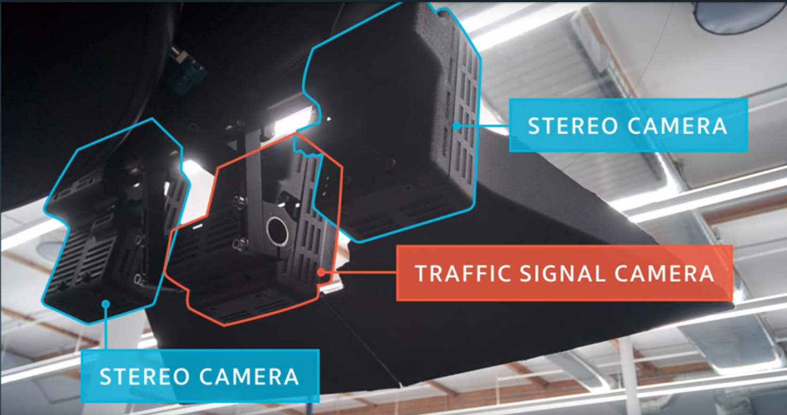

### Sensors for Benz

- two cameras: 
- Radars have been in automobiles for years, like adaptive cruise control, **blind spot warning**, collision warning and collision avoidance.
  - blind spot warning: 
  - Manhole covers(マンホールの蓋) or a soda can lying on the street can have high radar reflectivity even though they are relatively small.
    - This is called radar clutter, and it's why current automotive radars usually **disregard static objects**.
  - Can sense non-light of sight objects.

- Lidar: most current lidars use light in the 900 nanometer wavelength range, although some lidars use longer wavelenghts, which perform better in rain and fog. 
  - In current lidars, **a rotating swivel scans the laser beam across the field of view**.
  - The lasers are **pulsed**, and pulses are reflected by objects.

- Sensor comparison chart: 

