### Tracking Intro

- Kalman filter: continuous, uni-modal (分布に１つpeak).
- Monte Carlo localization: discrete, multi-modal.
- Particle filters: continuous, multi-modal.

### Gaussian Intro

- Monte Carlo localization分布やkalman filter分布：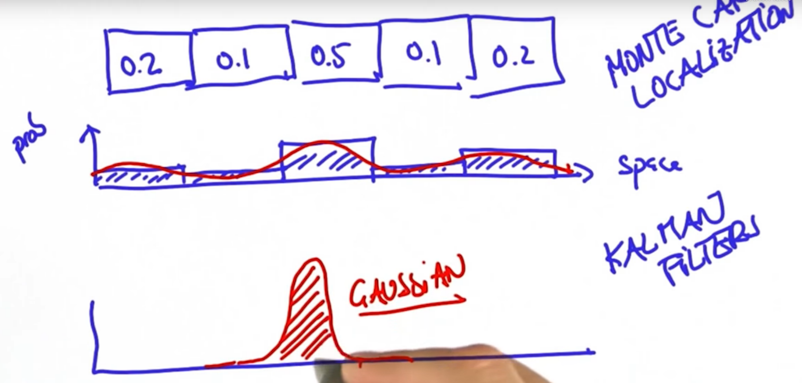

### Measurement and Motion

- The Kalman Filter represents distributions by Gaussians and iterates on two main cycles.

- The first cycle is the Measurement Update.

  - require a **product**.
  - use **Bayes rule**. 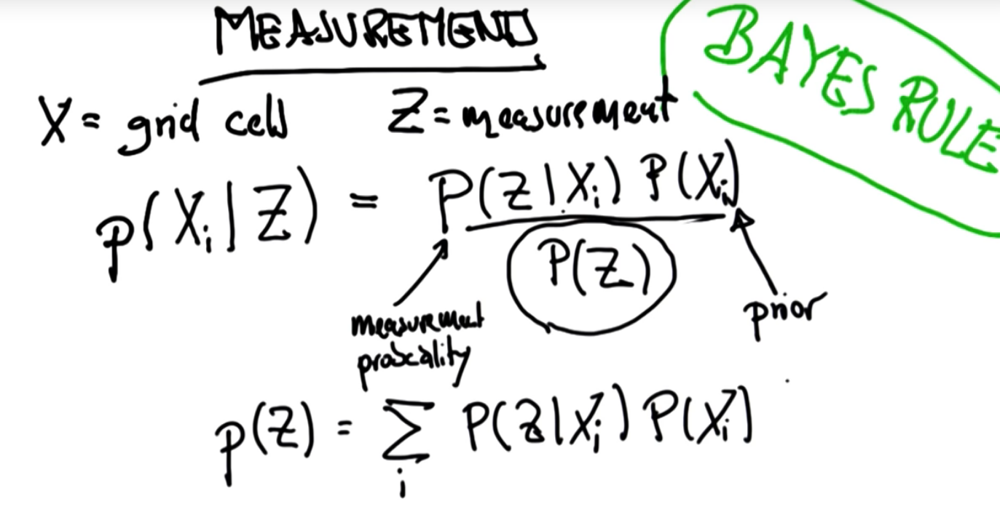

  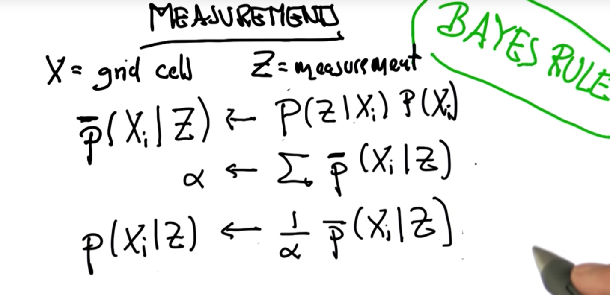

  - $\alpha$: **normalizer**.

- The second cycle is the Motion Update.

  - involve a convolution.
  - use total probability. 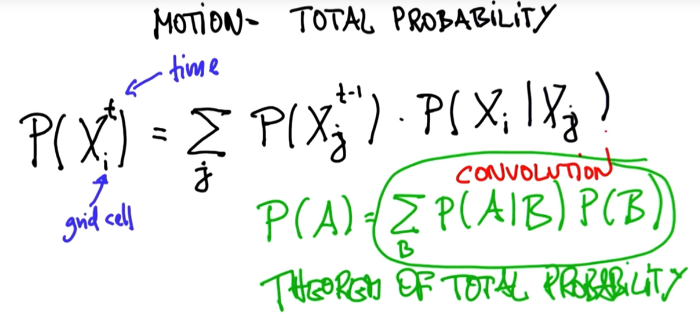

- Measurement Update gaussian:

  - Two gaussiansの結果のGaussianのpeakはさらに高くなる。varianceは低くなる。これこそKalman Filterを使う理由だ！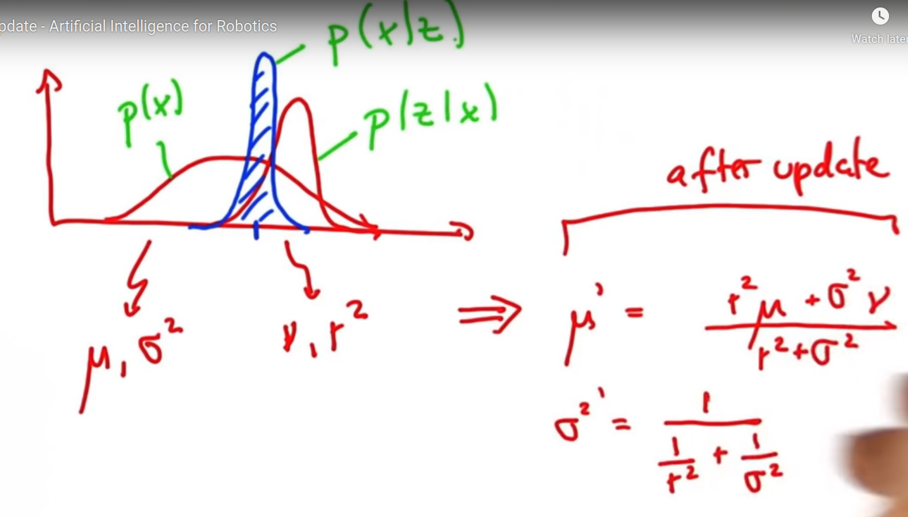
  - 直感的に、データが多くるので、uncertaintyも低くなる。
  - New sigma-squared is obtained **independent of the means**. なので、2分布どんなに離れても、マージした分布のvarianceは変わらない。

- Motion Update gaussian: 足し算。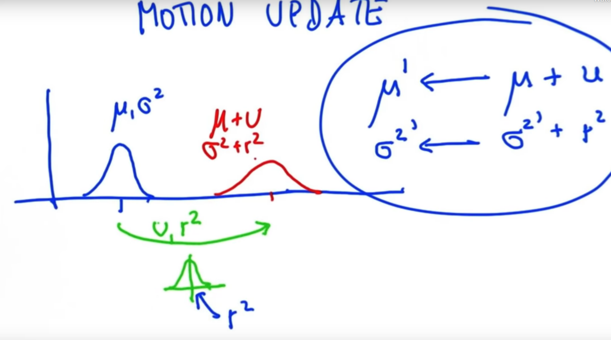

- 簡単な１D Kalman Filter in Python:

  ```python
  # Write a program that will iteratively update and
  # predict based on the location measurements 
  # and inferred motions shown below. 
  
  def update(mean1, var1, mean2, var2):
      new_mean = float(var2 * mean1 + var1 * mean2) / (var1 + var2)
      new_var = 1./(1./var1 + 1./var2)
      return [new_mean, new_var]
  
  def predict(mean1, var1, mean2, var2):
      new_mean = mean1 + mean2
      new_var = var1 + var2
      return [new_mean, new_var]
  
  measurements = [5., 6., 7., 9., 10.]
  motion = [1., 1., 2., 1., 1.]
  measurement_sig = 4.
  motion_sig = 2.
  mu = 0.
  sig = 10000.
  
  #Please print out ONLY the final values of the mean
  #and the variance in a list [mu, sig]. 
  for measurement, motion in zip(measurements, motion):
      [mu, sig] = update(mu, sig, measurement, measurement_sig)
      [mu, sig] = predict(mu, sig, motion, motion_sig)
  
  print [mu, sig]
  ```

### Kalman Filter Land

- contourがtilted（傾いた）場合、correlationが出る（例えば、positionやvelocityがcorrelated ）：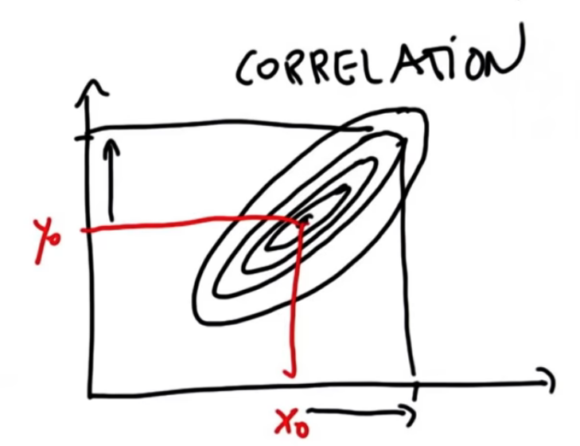
- X is observable, $\dot{X}$ is to be inferred. 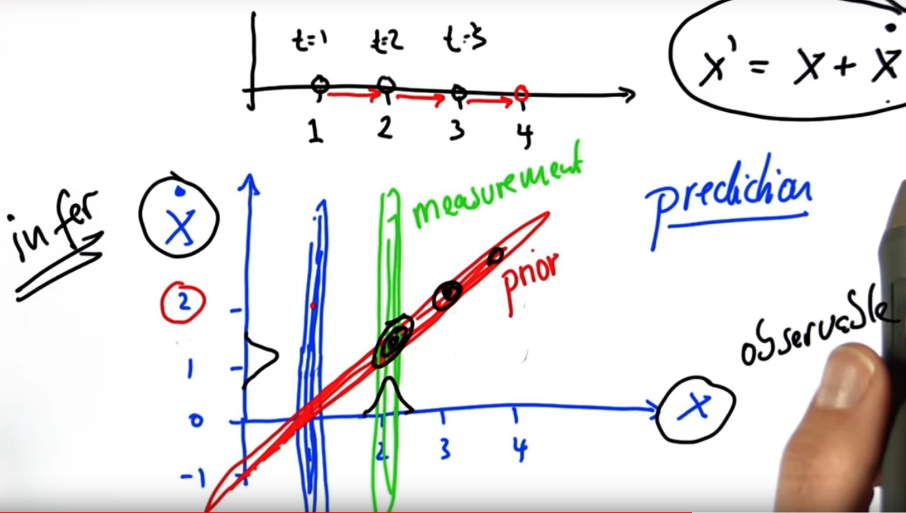
  - Prior contourが斜めになっている理由は、motion modelだ。
  - 傾いたprior contourや縦のmeasurement contourが交差しているcontourがkalman filterの結果。

- Kalman Filterにあるobservableやhidden states: 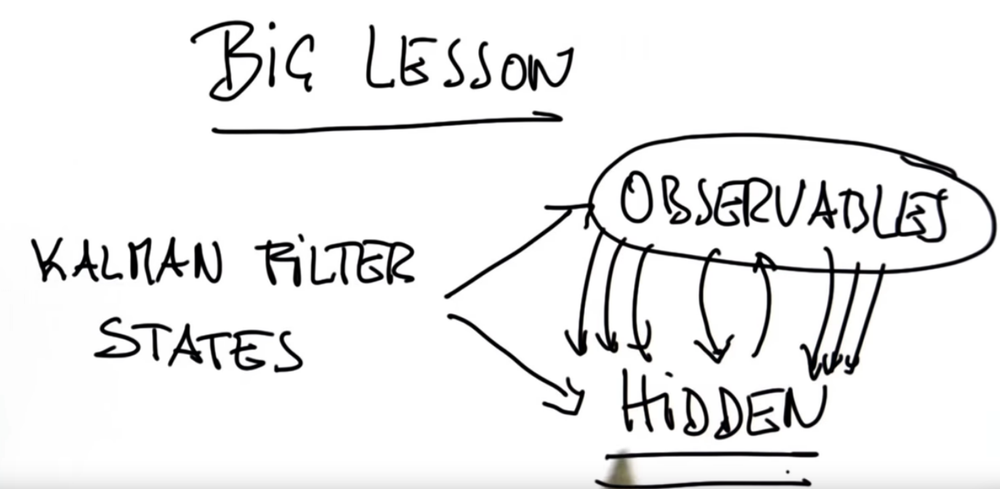
  - Because they interact, **subsequent observations of the observable variables give us information about these hidden variables**, so we can also estimate what hidden variables are.

### Kalman Filter Design

- 覚えなくていいKalman Filterの式：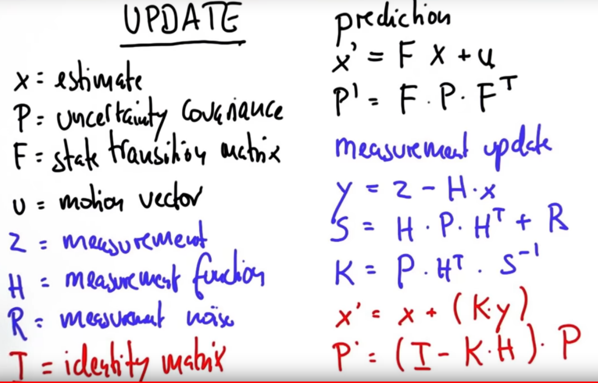

  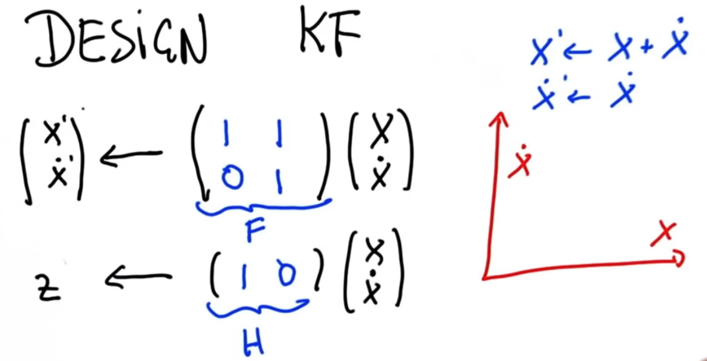

- サンプル：

  ```python
  # Write a function 'kalman_filter' that implements a multi-
  # dimensional Kalman Filter for the example given
  
  from math import *
  
  
  class matrix:
      
      # implements basic operations of a matrix class
      
      def __init__(self, value):
          self.value = value
          self.dimx = len(value)
          self.dimy = len(value[0])
          if value == [[]]:
              self.dimx = 0
      
      def zero(self, dimx, dimy):
          # check if valid dimensions
          if dimx < 1 or dimy < 1:
              raise ValueError, "Invalid size of matrix"
          else:
              self.dimx = dimx
              self.dimy = dimy
              self.value = [[0 for row in range(dimy)] for col in range(dimx)]
      
      def identity(self, dim):
          # check if valid dimension
          if dim < 1:
              raise ValueError, "Invalid size of matrix"
          else:
              self.dimx = dim
              self.dimy = dim
              self.value = [[0 for row in range(dim)] for col in range(dim)]
              for i in range(dim):
                  self.value[i][i] = 1
      
      def show(self):
          for i in range(self.dimx):
              print(self.value[i])
          print(' ')
      
      def __add__(self, other):
          # check if correct dimensions
          if self.dimx != other.dimx or self.dimy != other.dimy:
              raise ValueError, "Matrices must be of equal dimensions to add"
          else:
              # add if correct dimensions
              res = matrix([[]])
              res.zero(self.dimx, self.dimy)
              for i in range(self.dimx):
                  for j in range(self.dimy):
                      res.value[i][j] = self.value[i][j] + other.value[i][j]
              return res
      
      def __sub__(self, other):
          # check if correct dimensions
          if self.dimx != other.dimx or self.dimy != other.dimy:
              raise ValueError, "Matrices must be of equal dimensions to subtract"
          else:
              # subtract if correct dimensions
              res = matrix([[]])
              res.zero(self.dimx, self.dimy)
              for i in range(self.dimx):
                  for j in range(self.dimy):
                      res.value[i][j] = self.value[i][j] - other.value[i][j]
              return res
      
      def __mul__(self, other):
          # check if correct dimensions
          if self.dimy != other.dimx:
              raise ValueError, "Matrices must be m*n and n*p to multiply"
          else:
              # multiply if correct dimensions
              res = matrix([[]])
              res.zero(self.dimx, other.dimy)
              for i in range(self.dimx):
                  for j in range(other.dimy):
                      for k in range(self.dimy):
                          res.value[i][j] += self.value[i][k] * other.value[k][j]
              return res
      
      def transpose(self):
          # compute transpose
          res = matrix([[]])
          res.zero(self.dimy, self.dimx)
          for i in range(self.dimx):
              for j in range(self.dimy):
                  res.value[j][i] = self.value[i][j]
          return res
      
      # Thanks to Ernesto P. Adorio for use of Cholesky and CholeskyInverse functions
      
      def Cholesky(self, ztol=1.0e-5):
          # Computes the upper triangular Cholesky factorization of
          # a positive definite matrix.
          res = matrix([[]])
          res.zero(self.dimx, self.dimx)
          
          for i in range(self.dimx):
              S = sum([(res.value[k][i])**2 for k in range(i)])
              d = self.value[i][i] - S
              if abs(d) < ztol:
                  res.value[i][i] = 0.0
              else:
                  if d < 0.0:
                      raise ValueError, "Matrix not positive-definite"
                  res.value[i][i] = sqrt(d)
              for j in range(i+1, self.dimx):
                  S = sum([res.value[k][i] * res.value[k][j] for k in range(self.dimx)])
                  if abs(S) < ztol:
                      S = 0.0
                  try:
                     res.value[i][j] = (self.value[i][j] - S)/res.value[i][i]
                  except:
                     raise ValueError, "Zero diagonal"
          return res
      
      def CholeskyInverse(self):
          # Computes inverse of matrix given its Cholesky upper Triangular
          # decomposition of matrix.
          res = matrix([[]])
          res.zero(self.dimx, self.dimx)
          
          # Backward step for inverse.
          for j in reversed(range(self.dimx)):
              tjj = self.value[j][j]
              S = sum([self.value[j][k]*res.value[j][k] for k in range(j+1, self.dimx)])
              res.value[j][j] = 1.0/tjj**2 - S/tjj
              for i in reversed(range(j)):
                  res.value[j][i] = res.value[i][j] = -sum([self.value[i][k]*res.value[k][j] for k in range(i+1, self.dimx)])/self.value[i][i]
          return res
      
      def inverse(self):
          aux = self.Cholesky()
          res = aux.CholeskyInverse()
          return res
      
      def __repr__(self):
          return repr(self.value)
  
  
  ########################################
  def kalman_filter(x, P):
      for n in range(len(measurements)):
          
          # measurement update
          y = matrix([[measurements[n]]]) - H * x
          S = H * P * H.transpose() + R
          K = P * H.transpose() * S.inverse()
          x = x + K * y
          P = (I - K * H) * P
  
          # prediction
          x = F * x + u
          P = F * P * F.transpose()
          
      return x,P
  
  ############################################
  ### use the code below to test your filter!
  ############################################
  
  measurements = [1, 2, 3]
  
  x = matrix([[0.], [0.]]) # initial state (location and velocity)
  P = matrix([[1000., 0.], [0., 1000.]]) # initial uncertainty
  u = matrix([[0.], [0.]]) # external motion
  F = matrix([[1., 1.], [0, 1.]]) # next state function
  H = matrix([[1., 0.]]) # measurement function
  R = matrix([[1.]]) # measurement uncertainty
  I = matrix([[1., 0.], [0., 1.]]) # identity matrix
  
  print(kalman_filter(x, P))
  # output should be:
  # x: [[3.9996664447958645], [0.9999998335552873]]
  # P: [[2.3318904241194827, 0.9991676099921091], [0.9991676099921067, 0.49950058263974184]]
  ```

  