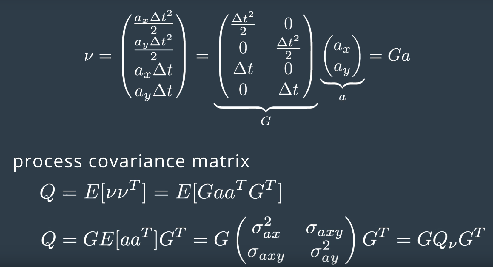

- You can apply Kalman Filters to almost any **tracking problem** in physical systems.

### Fusion Flow

- ここpredictやupdateは同周期だ。measurementが届く時のみ$\Delta t$での移動を予測して、またmeasurementを利用して、修正する。
- update: the Kalman filter will put more weight on either the predicted location or the measured location depending on the uncertainty of each value.

### Estimation Problem Refresh

- radarやlidar (laser)のupdateが違う理由は：While laser provides measurement in a Cartesian coordinate system, **radar provides measurements in a polar coordinate system**.

- sensor typeに関わらず：
  - ２つmeasurementが同時に到達しても、構わない。その中の１つmeasurementに対するpredictionの経る時間は０だけ。

### Kalman Filter Intuition

- **Process noise** refers to the uncertainty in the prediction step.

- State transition function: $x'=Fx+Bu+\nu$.
  - Then $Bu$ is crossed out leaving $x'=Fx+\nu$.
  - $B$ is a matrix called the **control input matrix** and $u$ is the **control vector**. 例えば加速度をモデルしたいとき（command signalがある時）、$Bu$ would represent the updated position of the car due to the **internal force of the motor**. なので、自車をモデルする時のみに使える。他車、自転車のinternal forcesは、分かるはずがない。

### State Prediction

- Process noise depends on both: the **elapsed time** and the **uncertainty of acceleration**.

### Process Covariance Matrix

- 加速度を考慮：
- The covariance matrix is defined as the **expectation value** of the noise vector * noise vector's transpose. 
  - The expectation of ax * ax, is the variance of ax. つまり$E[a_x^2]=\sigma_{a_x}^2, E[a_y^2]=\sigma_{a_y}^2$.
  - **ax and ay are assumed uncorrelated noise processes**. なので$E[a_x a_y]=0$.

- 最後にprocess covariance matrixは、
  - Sometimes, **$Q_\nu$ might be noted as $Q$**.

- Because our state vector only tracks position and velocity, we are modeling acceleration as a random noise.
  - The Q matrix **includes time $\Delta t$ to account for the fact that as more time passes, we become more uncertain about our position and velocity**.

### Laser Measurements

- $H$ is the matrix that projects your belief about the object's current state into the **measurement space** of the sensor.

### Radar Measurements

- radarの観測値：
  - Note that $\varphi$ is referenced **counter-clockwise from the x-axis**, なので上記図の中の$\varphi$はマイナス。
  - The range rate, $\dot{\rho}$, is the projection of the velocity $v$, onto the line, $L$.
- radar measurement modelのcovariance: 
  - radarのmeasurement functionはnonlinearになる（だから$H$が存在しない）：
- range rateの２つ導出方法：

### Extended Kalman Filter

- Gaussianをnonlinear functionで変換すると、Gaussianじゃなくなる。だからKalman Filterのupdate stepは使えなくなる：

### Jacobian Matrix

- Jacobian Matrix for radar measurement function: 

### EKF Algorithm Generalization

