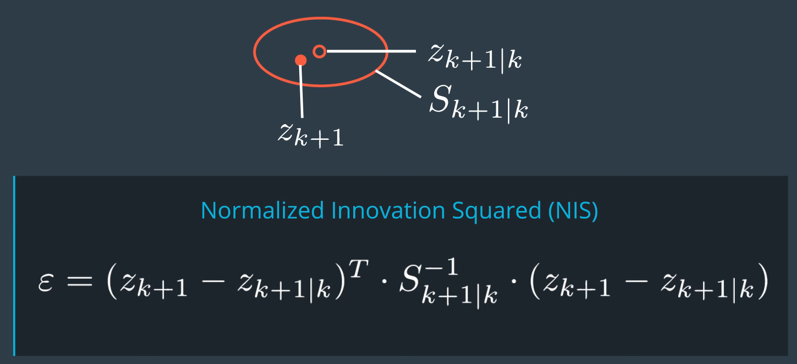

### The CTRV Model

- constant velocity model以外のモデル：
  - constant turn rate and velocity magnitude model (CTRV).
  - constant turn rate and acceleration (CTRA).
  - constant steering angle and velocity (CSAV).
  - constant curvature and acceleration (CCA).

### The CTVR Model State Vector


### CTRV Differential Equation


- 直接に$f(x_k,\nu_k)$を導出するのが難しいらしいので、先にdifferential equationを決める（CTRVの前提なので、$\dot{v}, \dot{\psi}$は全部0）。また導関数から関数を導出するかな？

### CTRV Integral

- 微分式があるので、簡単に前周期と現周期の関係式を書ける：
- 積分の一番上の２つの解決は、難しいので、ツールを使って計算：https://www.wolframalpha.com/input/?i=v+int+cos%28a+%2B+b+*+%28t+-+c+%29%29+dt%2C++t+%3D+c+to+d
- 積分結果：

- まだ１つ課題が残っている：$\dot{\psi_k}$が0だったら（直進）、divide by 0が発生。でも直進の場合の$p_x, p_y$の導出は簡単。

### CTRV Process Noise Vector


- ２つのノイズを考えている：longitudinal acceleration, yaw acceleration.


- yaw accelerationによるx, yの偏差は無視していて、longitudinal accelerationは直進方向をsimplifyして、a, bはそれぞれ$\frac{1}{2}(\Delta t)^2cos(\psi_k)\nu_{a,k}, \frac{1}{2}(\Delta t)^2sin(\psi_k)\nu_{a,k}$になる。

- **このmotionモデルは凄い、直進、カーブ全部含めている！！**

### What Problem Does the UKF Solve?


- updateが終わった後はPosteriorになると思う。updateは既に現在の観測値まで考慮した。
- predictionが終わった後は、A prioriになると思う。predictionはまだ前周期の観測値までしかみてない。
- nonlinear processで変換後、gaussianがなくなるが：
  - What the UKF does is keep going as if the prediction was still normally distributed.
  - This is **not an analytical path any more**. Of course, it is **an approximation**. 

### Generating Sigma Points

- Eigen libraryでのCholesky Decomposition: `P.llt().matrixL()` produces the lower triangular matrix `L` of the matrix `P` such that $P=L*L^T$.
- Eigen libraryでMatrixのcolumnを取る：`.col(i)`. 

### UKF Augmentation

- $\nu_k$の２つ可能な指しているもの：
  - 上の方はnoise要素だけ考える。下の方はそのnoise要素がどのようにstateに影響するかも考えていて、stateと同じサイズ。
  - Usually, 上の方is what authors mean when they write about the unscented kalman filter.

- 上の方を使うと、process noise covariance matrixは非常に簡単になる（2*2）。

- sigma pointsからQを計算する方法は、augmentationという。

- process noiseを考えない場合のsigma points: 

- process noiseも考慮する場合のsigma points (augmented): 

  - noise vectorをstateに入れて、noise covarianceもcovariance matrixに入れる。

  - Eigen libraryでの操作：

    ```c++
    // create augmented mean state
    x_aug.head(5) = x;
    x_aug(5) = 0;
    x_aug(6) = 0;
    
    // create augmented covariance matrix
    P_aug.fill(0.0); // 0.0が大事,0じゃない。
    P_aug.topLeftCorner(5,5) = P;
    P_aug(5,5) = std_a*std_a;
    P_aug(6,6) = std_yawdd*std_yawdd;
    ```

### Sigma Point Prediction


- CTRV motion modelの関数：

### Predicted Mean and Covariance


- 忘れやすいのはangleのnormalization: でもなぜcovarianceを計算するときだけやっているかはまだ見ていない。

  ```c++
  　// predicted state covariance matrix
    P.fill(0.0);
    for (int i = 0; i < 2 * n_aug + 1; ++i) {  // iterate over sigma points
      // state difference
      VectorXd x_diff = Xsig_pred.col(i) - x;
      // angle normalization
      while (x_diff(3)> M_PI) x_diff(3)-=2.*M_PI;
      while (x_diff(3)<-M_PI) x_diff(3)+=2.*M_PI;
  
      P = P + weights(i) * x_diff * x_diff.transpose() ;
    }
  ```

### Measurement Prediction

- **ここは再度サンプリングしていない！！調べよう！！Courseraの先生が言ってるのと違う。**
  - また、ここでaugmentationがいらない。理由は、noiseがadditiveだから。
  - The measurement noise in this case does not have a non-linear effect on the measurement but it's purely additive.

- 改めて、radarのmeasurement modelは：

### UKF Update


- $T$の計算式に２つ引き算があって、両方ともangleのnormalizationが必要！arctanで計算するときはいらない、そもそも範囲内になるから。
- State updateにも引き算があるので、もう一回チェック！

### Parameters and Consistency

- measurement noiseはsensorのmanualから取る。
- process noiseパラメータの選定はちょっと難しい。
  - In reality, **objects in a traffic environment don't move with white acceleration noise**.
  - This would mean **a driver constantly switches between gas and brake**.
  - So we really apply **a strong approximation** here, by assuming a white process noise.
- The rule of thumb says, choose **half of the maximum acceleration** you expect as process noise.
  - Whether this is a good value for you really depends on your application.
  - Is it important for your application to **react fast on changes**? : choose the process noise a little higher.
  - Is it important to provide smooth estimations? : choose the process noise a little lower.
- noiseの選択がよいかを判断するために：Consistency check.
  - uncertaintyをunderestimateした場合：
  - uncertaintyをoverestimateする場合：
- consistency check方法：Normalized Innovation Squared (NIS).
  - $\epsilon$の期待値は下記のテーブル：
    - df: **dimension of our measurement space**. この例ではdimensionが３なので、また95%データを含むthresholdを使う：7.815.
  - Underestimate: 
  - Overestimate: 
  - 良い結果：
- yaw acceleration noise parameterの直感：
  - Imagine the bicycle is traveling in a circle with a constant yaw rate of $\frac{\pi}{8} rad/s$. That means the bicycle would complete full circle in 16 seconds.

### UKFのメリット

- With the UKF, you will be able to take noisy measurement data as input and provide a smooth position and velocity estimation of dynamic objects around you, without introducing a delay.
- You can provide an estimation of the orientation and the yaw rate of other vehicles using sensors that can't even directly observe these states.
- You know that this covariance matrix is realistic if the UKF performs a consistency check.
  - The uncertainty of the estimation result is very important for self-driving cars. Because if the position of your leading vehicle is quite uncertain at some time, you better keep a little more distance.

### Projectでチューニングするパラメータ

- longitudinal acceleration noise.（モーションモデル）
- yaw acceleration noise.（モーションモデル）
- state vector, state covariance matrixの初期値。
- measurement model noiseも必要、もしsensor manualが提供してくれなかったら。

### 論文

- [2018] No Blind Spots: Full-Surround Multi-Object Tracking for Autonomous Vehicles using Cameras & LiDARs. https://arxiv.org/pdf/1802.08755.pdf
- [2017] VoxelNet: End-to-End Learning for Point Cloud Based 3D Object Detection. https://arxiv.org/pdf/1711.06396.pdf