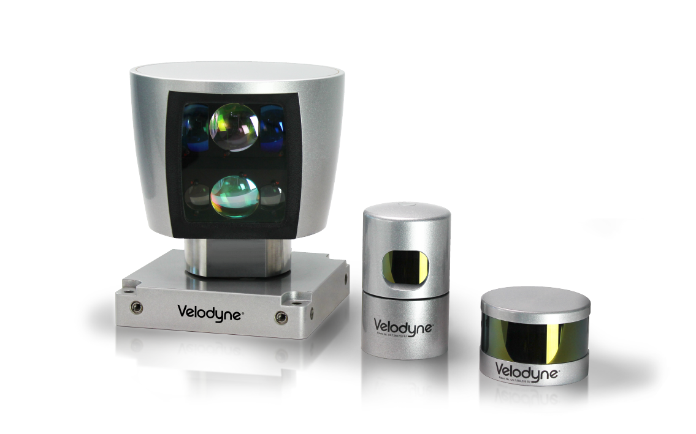
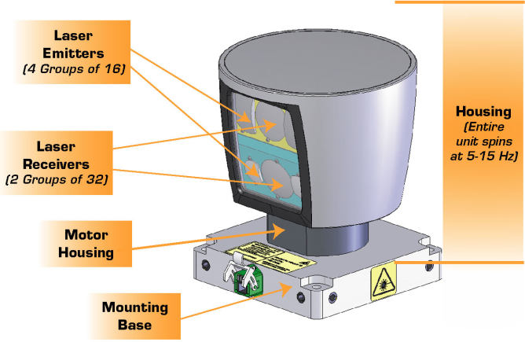

## 3. What is Lidar?

- You scan this laser beams across the field of view, which means you get for each point in the field of view, a distance to an object or no distance if there is no object there whatsoever.

## 4. Lidar Sensors

- Each laser ray is in the **infrared(赤外線、せきがいせん) spectrum**, and is sent out at many different angles, usually in a 360 degree range.
- The Lidar sends **thousands** of laser rays at different angles.
- **Laser intensity** value is also received and can be used to evaluate **material properties** of the object the laser reflects off of.

 

- Velodyne lidar sensors, with HDL 64, HDL 32, VLP 16 from left to right.
  - The larger the sensor, the higher the resolution.

- **HDL 64 lidar**.
  - The lidar has **64 layers**, where each layer is sent out at a **different angle from the z axis**, so **different inclines**(傾き).
  - **Each layer** covers a 360 degree view and has an **angular resolution of 0.08 degrees**.
  - On average the lidar scans **ten times a second**.
  - なので一秒は`10Hz * 64layers * 360degrees / 0.08resolution = 2880000点` を取る。でも１つscanは288000点を取る！実際は256000点らしい。

## 6. Point Clouds

### PCD Files

- Different intensity values are a different color.

### PCD Coordinates

- The coordinate system is **the same** as the **car's local coordinates**.
  - Y axis is pointing out to the left.
  - 注意点：beamの旅行時間は往復だ。距離の計算は旅行時間の半分だ。

## 8. The Point Cloud Library (PCL)

- Open source tool for PCD.
- Built in functions for filtering, segmentation, and clustering.
- **Rendering** for point clouds and shapes.

## 9. Using Lidar on an Autonomous Vehicle

- 縦の2 degrees in about 60 meters, can hide a pedestrian between two layers.

## 13. The PCL Viewer

- `viewer` is usually **passed in as a reference**.
  - That way the process is more streamlined because something doesn't need to get returned.

## 14. Representing Lidar in a Simulator

- Right now, we do not use a direct representation in a simulator, but working on **lidar models**.

## 15. Creating the Lidar Object

- Create a virtual Lidar, and use it to scan the environment and create some Point Cloud data with it.
- The `Lidar` pointer object should be created on the heap, using the `new` keyword.
  - By instantiating on the heap, we have more memory to work with than the 2MB on the stack.
  - However, it takes longer to look up objects on the heap, while stack lookup is very fast.

## 16. Using the Lidar Object

- The Ptr type from PointCloud indicates that the object is actually a pointer - 32 bit integer that contains the memory address of your point cloud object. ROSと同じだ。

## 17. Templates and Different Point Cloud Data

### Templates and Pointers

- `typename` is used whenever a pointer is used that **depends on a template**. 例えば：`typename pcl::PointCloud<PointT>::Ptr ProcessPointClouds<PointT>::FilterCloud(typename pcl::PointCloud<PointT>::Ptr cloud, float filterRes, Eigen::Vector4f minPoint, Eigen::Vector4f maxPoint)`. `PointT`はpoint type template.
- 理由：Given a piece of code with a type name parameter, like `pcl::PointCloud<PointT>::Ptr`, the compiler is **unable to determine if the code is a value or a type without knowing the value for the type name parameter**.
  - **The compiler will assume that the code represents a value. If the code actually represents a typename, you will need to specify that**.

## 18. Adjusting Lidar Parameters

## 19. Examining the Point Cloud

- sceneをrenderしない。自車周囲の４つの点が無い箇所は、多分beamが自車の屋根にぶつかったから。
- Adding noise will help you develop more robust point processing functions.