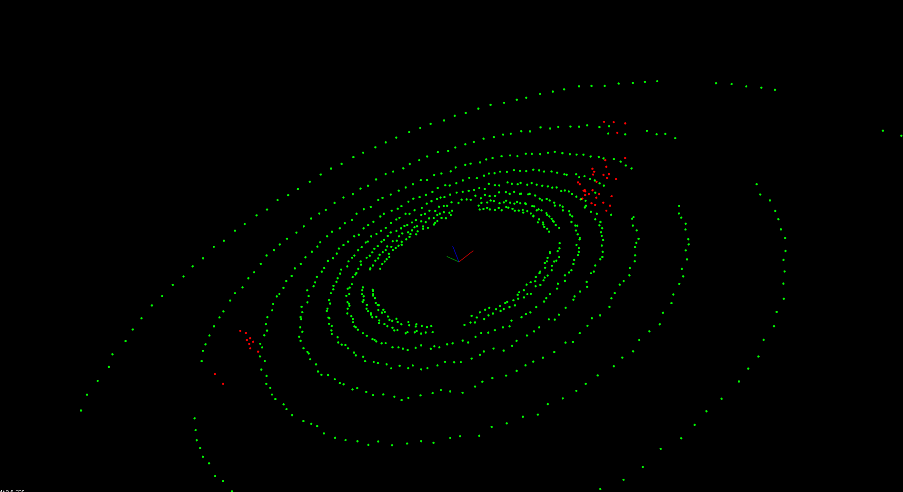
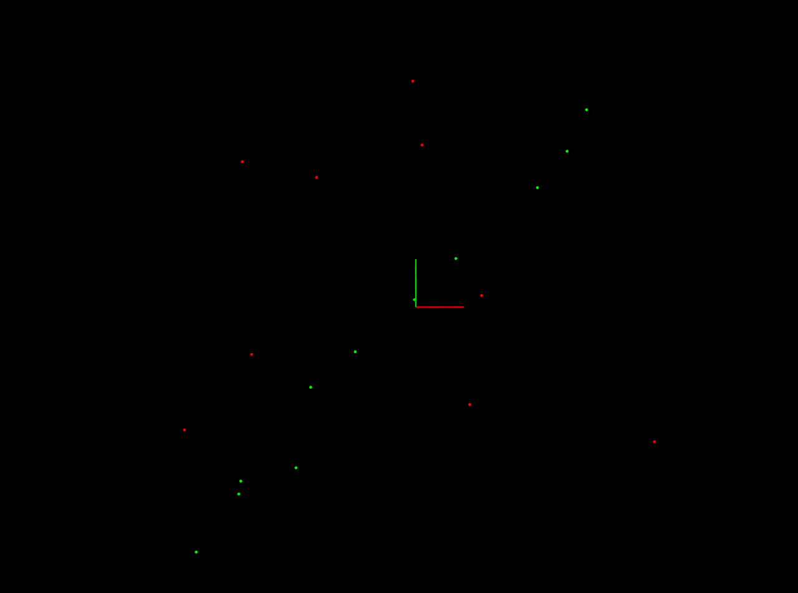
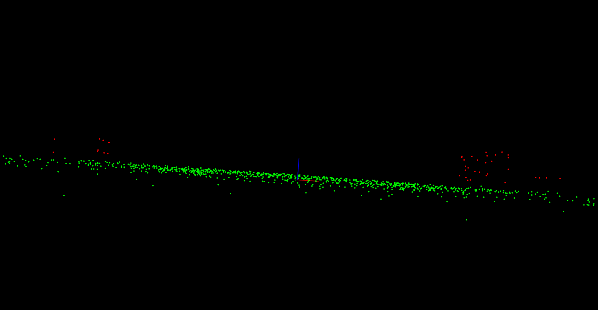

## 1. Segmentation

- 障害物じゃないオブジェクト：路面。
  - If the **road is flat** it's fairly straightforward to pick out road points from non-road points.
  - Use a method called **Planar Segmentation** which uses the **RANSAC (random sample consensus(コンセンサス、一致))** algorithm.

## 4. Segmenting the Plane with PCL

- SegmentPlane function accepts a point cloud, max iterations, and distance tolerance as arguments.
  - **Segmentation uses an iterative process**.
  - The segmentation algorithms **fits a plane to the points** and uses the distance tolerance to decide which points belong to that plane.
- `std::pair`がリターンされる：obstacle point cloud and road point cloud.
- 参考コード：https://pointclouds.org/documentation/tutorials/extract_indices.html#extract-indices

## 6. RANSAC

- The iteration with the highest number of inliers or the lowest noise is used as the best model.
- One type of RANSAC version selects the **smallest possible subset** of points to fit.
  - For a line, that would be two points, and for a plane three points.

- Other methods of RANSAC could **sample some percentage** of the model points, for example 20% of the total points, and then fit a line to that.
  - Then the **error** of that line is calculated, and the **iteration with the lowest errors** is the best model.
  - This method might have some advantages since not every point at each iteration needs to be considered.

## 7. Implementing RANSAC for Lines

- uniform random numberのmodern C++のやり方：https://en.cppreference.com/w/cpp/numeric/random/uniform_int_distribution

## 8. Extending RANSAC to Planes

