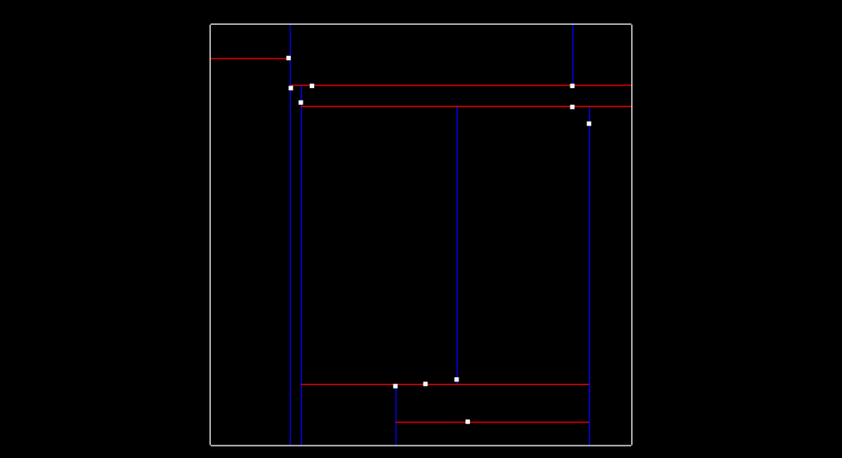
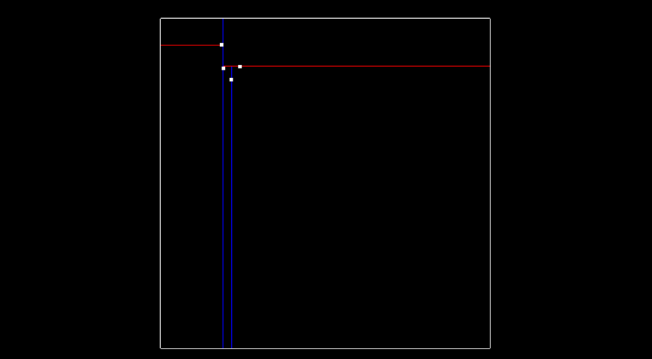

## 2. Clustering Obstacles

- To do a nearest neighbor search effectively, you use a KD-Tree data structure which on average speeds up your lookup time from O(n) to O(log(n)).

## 3. Euclidean Clustering with PCL

### Euclidean Clustering Arguments

- 参考：http://pointclouds.org/documentation/tutorials/cluster_extraction.html

  ```c++
  // Creating the KdTree object for the search method of the extraction
    pcl::search::KdTree<pcl::PointXYZ>::Ptr tree (new pcl::search::KdTree<pcl::PointXYZ>);
    tree->setInputCloud (cloud_filtered);
  
    std::vector<pcl::PointIndices> cluster_indices;
    pcl::EuclideanClusterExtraction<pcl::PointXYZ> ec;
    ec.setClusterTolerance (0.02); // 2cm
    ec.setMinClusterSize (100);
    ec.setMaxClusterSize (25000);
    ec.setSearchMethod (tree);
    ec.setInputCloud (cloud_filtered);
    ec.extract (cluster_indices);
  
    int j = 0;
    for (std::vector<pcl::PointIndices>::const_iterator it = cluster_indices.begin (); it != cluster_indices.end (); ++it)
    {
      pcl::PointCloud<pcl::PointXYZ>::Ptr cloud_cluster (new pcl::PointCloud<pcl::PointXYZ>);
      for (std::vector<int>::const_iterator pit = it->indices.begin (); pit != it->indices.end (); ++pit)
        cloud_cluster->push_back ((*cloud_filtered)[*pit]); //*
      cloud_cluster->width = cloud_cluster->size ();
      cloud_cluster->height = 1;
      cloud_cluster->is_dense = true;
  
      std::cout << "PointCloud representing the Cluster: " << cloud_cluster->size () << " data points." << std::endl;
      std::stringstream ss;
      ss << "cloud_cluster_" << j << ".pcd";
      writer.write<pcl::PointXYZ> (ss.str (), *cloud_cluster, false); //*
      j++;
    }
  ```

  - `min, max`: If a cluster is really small, it's probably just noise and we are not concerned with it.
  - If a cluster is very large it might just be that many other clusters are overlapping.


## 4. Implementing KD-Tree

- A KD-Tree is a binary tree that splits points between **alternating axes**.
  - x軸とy軸のどれを分割するかは、ノードのdepthを見る、depth % 2が0だったら、x軸で分割。depth % 2が1だったら、y軸で分割。
- By **separating space by splitting regions**, **nearest neighbor search** can be made **much faster** when using an algorithm like euclidean clustering.



## 5. Inserting Points into KD-Tree

- 1点目をを挿入する、root. (-6.2, 7) 
- 2点目を挿入する、rootがX軸で分割しているので、2点目のxをrootのxと比較する。左childになる。また、depthが１なので、y軸を分割 (-6.3, 8.4)：
- 3点目(-5.2, 7.1)を挿入するとき、まずrootのxと比べて、右childに行く。y軸を分割する。4点目(-5.7, 6.3)を挿入する時、まずrootのxと比べて、右に行く。また、右childのy（7.1）と比べて、小さいので、左childになる。depthが２なので、x軸を分割する。
- 木の様子：
- Improving the Tree: 2D example, **insert x median(中央値), then y median, then x median, etc**.


```c++
void insertHelper(Node **node, std::vector<float> point, int id, int depth) {
    if (!(*node)) {
        *node = new Node(point, id);
    } else {
        // odd layer, compare y; even layer, compare x
        if (point[depth%2] < (*node)->point[depth%2]) {
            insertHelper(&((*node)->left), point, id, depth + 1);
        } else {
            insertHelper(&((*node)->right), point, id, depth + 1);
        }
    }
}
```


## 7. Searching Points in a KD-Tree

- The KD-Tree is able to split regions and allows certain regions to be **completely ruled out**, speeding up the process of finding nearby neighbors.
- With the KD-Tree, you can compare distance with a **boxed square** that is `2 * distanceTol` for length, centered around the target point.
  - If the current node point is within this box then you can directly calculate the distance and see if the point id should be added to the list of nearby ids.
  - If the **box region** is not inside some **division region**, you completely skip that branch.
  - もしbox regionがnodeの左右に跨いでいれば、左右全部探す。

- searchの時`**`がいらない！

## 8. Euclidean Clustering

- Euclidean clusteringのpseudocode

  ```pseudocode
  Proximity(point,cluster):
      mark point as processed
      add point to cluster
      nearby points = tree(point)
      Iterate through each nearby point
          If point has not been processed
              Proximity(cluster)
  
  EuclideanCluster():
      list of clusters 
      Iterate through each point
          If point has not been processed
              Create cluster
              Proximity(point, cluster)
              cluster add clusters
      return clusters
  ```

## 9. Bounding Boxes


## 11. Extra Challenge: PCA Boxes


やっていない。

## 3Dの場合のKD-Tree

- 僕の理解は、2Dの場合、各層が扱う軸がdepth%2だったら、3Dの場合、各layerが扱う軸はdepth%3です。
  - `depth%3==0`: compare x with this node.
  - `depth%3==1`: compare y with this node.
  - `depth%3==2`: compare z with this node.
- 自動的にPointTからpointの次元を取れる？
- minClusterSizeやmaxClusterSizeどうやって実現？ただclusterのsizeを見る？
- 今kdtree.hのNodeのpointは`std::vector<float>`だけど、PointTにした方がいい？PCLはそうしている。
- 挿入時のsort。
  - 講師の話だと「Improving the Tree: 2D example, **insert x median(中央値), then y median, then x median, etc**.」なぜx, y, x, y, ...でいけるかはまだ理解できていない。なぜなら、3点目以降、この点がx軸とy軸のどれを分割するかは、depthを見ないと行けないでしょう？
  - もしn点があれば、quick sortはnlog(n), ダメな気がする。3回だけでいいでしょう。3次元だったら。
- x, y, z軸でそれぞれでsortして、3 vectorが出る。cloudのもともとのindexは0~N-1.
  - processed_vector: 0~N-1.
  - x_order: size n
  - y_order: size n
  - z_order: size n
  - number_not_inserted--
  - insert_orderが分かるはず。

## 速度を改善

- pcl APIを使う場合、自分が実現したAPIを使う場合の差

<table border="0">
    <tr>
        <td><b style="font-size:30px">PCL API</b></td>
        <td><b style="font-size:30px">MY API</b></td>
        <td><b style="font-size:30px">改善後</b></td>
    </tr>
    <tr>
        <td><span style="white-space: pre-line">Loaded 119978 data points from ../src/sensors/data/pcd/data_1/0000000000.pcd
filtering took 7 milliseconds
plane segmentation took 1 milliseconds
clustering took 10 milliseconds and found 7 clusters
cluster size: 992
cluster size: 869
cluster size: 596
cluster size: 540
cluster size: 465
cluster size: 161
cluster size: 57
Loaded 118703 data points from ../src/sensors/data/pcd/data_1/0000000001.pcd
filtering took 6 milliseconds
plane segmentation took 1 milliseconds
clustering took 10 milliseconds and found 7 clusters
cluster size: 1005
cluster size: 967
cluster size: 625
cluster size: 533
cluster size: 446
cluster size: 163
cluster size: 45
Loaded 116651 data points from ../src/sensors/data/pcd/data_1/0000000002.pcd
filtering took 7 milliseconds
plane segmentation took 1 milliseconds
clustering took 9 milliseconds and found 7 clusters
cluster size: 1116
cluster size: 800
cluster size: 569
cluster size: 524
cluster size: 452
cluster size: 174
cluster size: 55
Loaded 115651 data points from ../src/sensors/data/pcd/data_1/0000000003.pcd
filtering took 6 milliseconds
plane segmentation took 1 milliseconds
clustering took 9 milliseconds and found 8 clusters
cluster size: 1290
cluster size: 757
cluster size: 488
cluster size: 448
cluster size: 397
cluster size: 185
cluster size: 57
cluster size: 44
Loaded 115151 data points from ../src/sensors/data/pcd/data_1/0000000004.pcd
filtering took 7 milliseconds
plane segmentation took 1 milliseconds
clustering took 10 milliseconds and found 8 clusters
cluster size: 1514
cluster size: 653
cluster size: 436
cluster size: 374
cluster size: 325
cluster size: 221
cluster size: 125
cluster size: 53
Loaded 114969 data points from ../src/sensors/data/pcd/data_1/0000000005.pcd
filtering took 6 milliseconds
plane segmentation took 1 milliseconds
clustering took 10 milliseconds and found 9 clusters
cluster size: 1731
cluster size: 627
cluster size: 443
cluster size: 246
cluster size: 242
cluster size: 172
cluster size: 167
cluster size: 53
cluster size: 48
Loaded 114396 data points from ../src/sensors/data/pcd/data_1/0000000006.pcd
filtering took 7 milliseconds
plane segmentation took 1 milliseconds
clustering took 9 milliseconds and found 8 clusters
cluster size: 1621
cluster size: 591
cluster size: 465
cluster size: 244
cluster size: 213
cluster size: 180
cluster size: 56
cluster size: 46
Loaded 114874 data points from ../src/sensors/data/pcd/data_1/0000000007.pcd
filtering took 6 milliseconds
plane segmentation took 1 milliseconds
clustering took 11 milliseconds and found 8 clusters
cluster size: 1633
cluster size: 572
cluster size: 486
cluster size: 483
cluster size: 285
cluster size: 203
cluster size: 55
cluster size: 46
Loaded 115237 data points from ../src/sensors/data/pcd/data_1/0000000008.pcd
filtering took 6 milliseconds
plane segmentation took 2 milliseconds
clustering took 11 milliseconds and found 8 clusters
cluster size: 1565
cluster size: 557
cluster size: 554
cluster size: 536
cluster size: 285
cluster size: 241
cluster size: 74
cluster size: 50
Loaded 115048 data points from ../src/sensors/data/pcd/data_1/0000000009.pcd
filtering took 6 milliseconds
plane segmentation took 1 milliseconds
clustering took 9 milliseconds and found 9 clusters
cluster size: 1199
cluster size: 576
cluster size: 482
cluster size: 413
cluster size: 322
cluster size: 263
cluster size: 190
cluster size: 67
cluster size: 43
Loaded 116007 data points from ../src/sensors/data/pcd/data_1/0000000010.pcd
filtering took 6 milliseconds
plane segmentation took 1 milliseconds
clustering took 11 milliseconds and found 8 clusters
cluster size: 1337
cluster size: 773
cluster size: 600
cluster size: 429
cluster size: 339
cluster size: 263
cluster size: 85
cluster size: 49
Loaded 118644 data points from ../src/sensors/data/pcd/data_1/0000000011.pcd
filtering took 6 milliseconds
plane segmentation took 2 milliseconds
clustering took 12 milliseconds and found 7 clusters
cluster size: 1485
cluster size: 842
cluster size: 642
cluster size: 484
cluster size: 354
cluster size: 279
cluster size: 93
Loaded 120123 data points from ../src/sensors/data/pcd/data_1/0000000012.pcd
filtering took 7 milliseconds
plane segmentation took 2 milliseconds
clustering took 12 milliseconds and found 7 clusters
cluster size: 1433
cluster size: 832
cluster size: 588
cluster size: 526
cluster size: 378
cluster size: 324
cluster size: 108
Loaded 120571 data points from ../src/sensors/data/pcd/data_1/0000000013.pcd
filtering took 7 milliseconds
plane segmentation took 2 milliseconds
clustering took 11 milliseconds and found 7 clusters
cluster size: 1282
cluster size: 824
cluster size: 660
cluster size: 458
cluster size: 398
cluster size: 355
cluster size: 124
Loaded 120769 data points from ../src/sensors/data/pcd/data_1/0000000014.pcd
filtering took 7 milliseconds
plane segmentation took 2 milliseconds
clustering took 10 milliseconds and found 7 clusters
cluster size: 1089
cluster size: 791
cluster size: 658
cluster size: 431
cluster size: 371
cluster size: 349
cluster size: 133
Loaded 121069 data points from ../src/sensors/data/pcd/data_1/0000000015.pcd
filtering took 7 milliseconds
plane segmentation took 1 milliseconds
clustering took 9 milliseconds and found 7 clusters
cluster size: 772
cluster size: 699
cluster size: 655
cluster size: 431
cluster size: 420
cluster size: 361
cluster size: 138
Loaded 121064 data points from ../src/sensors/data/pcd/data_1/0000000016.pcd
filtering took 7 milliseconds
plane segmentation took 1 milliseconds
clustering took 8 milliseconds and found 7 clusters
cluster size: 750
cluster size: 691
cluster size: 462
cluster size: 443
cluster size: 415
cluster size: 353
cluster size: 169
Loaded 120942 data points from ../src/sensors/data/pcd/data_1/0000000017.pcd
filtering took 7 milliseconds
plane segmentation took 1 milliseconds
clustering took 7 milliseconds and found 6 clusters
cluster size: 751
cluster size: 563
cluster size: 510
cluster size: 498
cluster size: 354
cluster size: 186
Loaded 120929 data points from ../src/sensors/data/pcd/data_1/0000000018.pcd
filtering took 6 milliseconds
plane segmentation took 1 milliseconds
clustering took 7 milliseconds and found 6 clusters
cluster size: 796
cluster size: 512
cluster size: 509
cluster size: 499
cluster size: 298
cluster size: 197
Loaded 120854 data points from ../src/sensors/data/pcd/data_1/0000000019.pcd
filtering took 7 milliseconds
plane segmentation took 1 milliseconds
clustering took 7 milliseconds and found 6 clusters
cluster size: 864
cluster size: 555
cluster size: 526
cluster size: 479
cluster size: 283
cluster size: 222
Loaded 121098 data points from ../src/sensors/data/pcd/data_1/0000000020.pcd
filtering took 7 milliseconds
plane segmentation took 1 milliseconds
clustering took 7 milliseconds and found 7 clusters
cluster size: 937
cluster size: 606
cluster size: 569
cluster size: 423
cluster size: 276
cluster size: 205
cluster size: 44
Loaded 121208 data points from ../src/sensors/data/pcd/data_1/0000000021.pcd
filtering took 7 milliseconds
plane segmentation took 1 milliseconds
clustering took 7 milliseconds and found 6 clusters
cluster size: 996
cluster size: 624
cluster size: 588
cluster size: 418
cluster size: 277
cluster size: 65</span></td>
        <td><span style="white-space: pre-line">Loaded 119978 data points from ../src/sensors/data/pcd/data_1/0000000000.pcd
filtering took 7 milliseconds
plane segmentation took 233 milliseconds
clustering took 174 milliseconds and found 7 clusters
cluster size: 914
cluster size: 516
cluster size: 430
cluster size: 867
cluster size: 579
cluster size: 55
cluster size: 164
Loaded 118703 data points from ../src/sensors/data/pcd/data_1/0000000001.pcd
filtering took 7 milliseconds
plane segmentation took 231 milliseconds
clustering took 192 milliseconds and found 7 clusters
cluster size: 518
cluster size: 889
cluster size: 988
cluster size: 386
cluster size: 48
cluster size: 632
cluster size: 165
Loaded 116651 data points from ../src/sensors/data/pcd/data_1/0000000002.pcd
filtering took 6 milliseconds
plane segmentation took 239 milliseconds
clustering took 189 milliseconds and found 7 clusters
cluster size: 505
cluster size: 731
cluster size: 383
cluster size: 56
cluster size: 569
cluster size: 1091
cluster size: 186
Loaded 115651 data points from ../src/sensors/data/pcd/data_1/0000000003.pcd
filtering took 6 milliseconds
plane segmentation took 238 milliseconds
clustering took 201 milliseconds and found 8 clusters
cluster size: 425
cluster size: 1275
cluster size: 680
cluster size: 354
cluster size: 486
cluster size: 56
cluster size: 42
cluster size: 189
Loaded 115151 data points from ../src/sensors/data/pcd/data_1/0000000004.pcd
filtering took 6 milliseconds
plane segmentation took 251 milliseconds
clustering took 202 milliseconds and found 8 clusters
cluster size: 366
cluster size: 602
cluster size: 1486
cluster size: 289
cluster size: 53
cluster size: 435
cluster size: 111
cluster size: 219
Loaded 114969 data points from ../src/sensors/data/pcd/data_1/0000000005.pcd
filtering took 6 milliseconds
plane segmentation took 225 milliseconds
clustering took 214 milliseconds and found 9 clusters
cluster size: 619
cluster size: 163
cluster size: 1725
cluster size: 53
cluster size: 246
cluster size: 155
cluster size: 443
cluster size: 42
cluster size: 220
Loaded 114396 data points from ../src/sensors/data/pcd/data_1/0000000006.pcd
filtering took 6 milliseconds
plane segmentation took 235 milliseconds
clustering took 171 milliseconds and found 8 clusters
cluster size: 570
cluster size: 1608
cluster size: 164
cluster size: 51
cluster size: 204
cluster size: 242
cluster size: 44
cluster size: 465
Loaded 114874 data points from ../src/sensors/data/pcd/data_1/0000000007.pcd
filtering took 6 milliseconds
plane segmentation took 216 milliseconds
clustering took 194 milliseconds and found 8 clusters
cluster size: 198
cluster size: 1628
cluster size: 514
cluster size: 55
cluster size: 463
cluster size: 285
cluster size: 44
cluster size: 486
Loaded 115237 data points from ../src/sensors/data/pcd/data_1/0000000008.pcd
filtering took 6 milliseconds
plane segmentation took 209 milliseconds
clustering took 197 milliseconds and found 8 clusters
cluster size: 515
cluster size: 213
cluster size: 66
cluster size: 491
cluster size: 50
cluster size: 283
cluster size: 557
cluster size: 1565
Loaded 115048 data points from ../src/sensors/data/pcd/data_1/0000000009.pcd
filtering took 6 milliseconds
plane segmentation took 198 milliseconds
clustering took 175 milliseconds and found 9 clusters
cluster size: 186
cluster size: 263
cluster size: 68
cluster size: 574
cluster size: 1197
cluster size: 402
cluster size: 320
cluster size: 478
cluster size: 42
Loaded 116007 data points from ../src/sensors/data/pcd/data_1/0000000010.pcd
filtering took 6 milliseconds
plane segmentation took 202 milliseconds
clustering took 197 milliseconds and found 8 clusters
cluster size: 242
cluster size: 80
cluster size: 734
cluster size: 577
cluster size: 1329
cluster size: 336
cluster size: 429
cluster size: 49
Loaded 118644 data points from ../src/sensors/data/pcd/data_1/0000000011.pcd
filtering took 6 milliseconds
plane segmentation took 220 milliseconds
clustering took 228 milliseconds and found 7 clusters
cluster size: 268
cluster size: 97
cluster size: 622
cluster size: 355
cluster size: 1469
cluster size: 781
cluster size: 482
Loaded 120123 data points from ../src/sensors/data/pcd/data_1/0000000012.pcd
filtering took 6 milliseconds
plane segmentation took 231 milliseconds
clustering took 233 milliseconds and found 7 clusters
cluster size: 119
cluster size: 334
cluster size: 776
cluster size: 582
cluster size: 382
cluster size: 1405
cluster size: 502
Loaded 120571 data points from ../src/sensors/data/pcd/data_1/0000000013.pcd
filtering took 6 milliseconds
plane segmentation took 253 milliseconds
clustering took 209 milliseconds and found 7 clusters
cluster size: 326
cluster size: 607
cluster size: 1271
cluster size: 117
cluster size: 748
cluster size: 397
cluster size: 454
Loaded 120769 data points from ../src/sensors/data/pcd/data_1/0000000014.pcd
filtering took 6 milliseconds
plane segmentation took 256 milliseconds
clustering took 187 milliseconds and found 7 clusters
cluster size: 1085
cluster size: 745
cluster size: 350
cluster size: 434
cluster size: 360
cluster size: 128
cluster size: 621
Loaded 121069 data points from ../src/sensors/data/pcd/data_1/0000000015.pcd
filtering took 6 milliseconds
plane segmentation took 295 milliseconds
clustering took 155 milliseconds and found 7 clusters
cluster size: 690
cluster size: 725
cluster size: 349
cluster size: 410
cluster size: 136
cluster size: 631
cluster size: 428
Loaded 121064 data points from ../src/sensors/data/pcd/data_1/0000000016.pcd
filtering took 7 milliseconds
plane segmentation took 270 milliseconds
clustering took 141 milliseconds and found 7 clusters
cluster size: 415
cluster size: 625
cluster size: 348
cluster size: 678
cluster size: 441
cluster size: 157
cluster size: 412
Loaded 120942 data points from ../src/sensors/data/pcd/data_1/0000000017.pcd
filtering took 6 milliseconds
plane segmentation took 273 milliseconds
clustering took 109 milliseconds and found 6 clusters
cluster size: 512
cluster size: 323
cluster size: 498
cluster size: 712
cluster size: 186
cluster size: 497
Loaded 120929 data points from ../src/sensors/data/pcd/data_1/0000000018.pcd
filtering took 7 milliseconds
plane segmentation took 278 milliseconds
clustering took 107 milliseconds and found 6 clusters
cluster size: 448
cluster size: 297
cluster size: 476
cluster size: 189
cluster size: 759
cluster size: 516
Loaded 120854 data points from ../src/sensors/data/pcd/data_1/0000000019.pcd
filtering took 6 milliseconds
plane segmentation took 269 milliseconds
clustering took 110 milliseconds and found 6 clusters
cluster size: 435
cluster size: 274
cluster size: 528
cluster size: 818
cluster size: 523
cluster size: 209
Loaded 121098 data points from ../src/sensors/data/pcd/data_1/0000000020.pcd
filtering took 6 milliseconds
plane segmentation took 257 milliseconds
clustering took 128 milliseconds and found 7 clusters
cluster size: 401
cluster size: 896
cluster size: 197
cluster size: 269
cluster size: 584
cluster size: 553
cluster size: 44
Loaded 121208 data points from ../src/sensors/data/pcd/data_1/0000000021.pcd
filtering took 7 milliseconds
plane segmentation took 272 milliseconds
clustering took 127 milliseconds and found 6 clusters
cluster size: 363
cluster size: 590
cluster size: 569
cluster size: 915
cluster size: 255
cluster size: 49</span></td>
        <td><span style="white-space: pre-line">Loaded 119978 data points from ../src/sensors/data/pcd/data_1/0000000000.pcd
filtering took 7 milliseconds
plane segmentation took 27 milliseconds
clustering took 43 milliseconds and found 7 clusters
cluster size: 514
cluster size: 907
cluster size: 418
cluster size: 866
cluster size: 584
cluster size: 57
cluster size: 166
Loaded 118703 data points from ../src/sensors/data/pcd/data_1/0000000001.pcd
filtering took 6 milliseconds
plane segmentation took 27 milliseconds
clustering took 46 milliseconds and found 7 clusters
cluster size: 915
cluster size: 523
cluster size: 999
cluster size: 417
cluster size: 613
cluster size: 45
cluster size: 164
Loaded 116651 data points from ../src/sensors/data/pcd/data_1/0000000002.pcd
filtering took 7 milliseconds
plane segmentation took 26 milliseconds
clustering took 42 milliseconds and found 7 clusters
cluster size: 741
cluster size: 508
cluster size: 388
cluster size: 56
cluster size: 565
cluster size: 1092
cluster size: 176
Loaded 115651 data points from ../src/sensors/data/pcd/data_1/0000000003.pcd
filtering took 6 milliseconds
plane segmentation took 26 milliseconds
clustering took 46 milliseconds and found 8 clusters
cluster size: 444
cluster size: 744
cluster size: 389
cluster size: 1284
cluster size: 482
cluster size: 55
cluster size: 42
cluster size: 184
Loaded 115151 data points from ../src/sensors/data/pcd/data_1/0000000004.pcd
filtering took 6 milliseconds
plane segmentation took 26 milliseconds
clustering took 48 milliseconds and found 8 clusters
cluster size: 366
cluster size: 601
cluster size: 1497
cluster size: 303
cluster size: 52
cluster size: 434
cluster size: 124
cluster size: 224
Loaded 114969 data points from ../src/sensors/data/pcd/data_1/0000000005.pcd
filtering took 7 milliseconds
plane segmentation took 26 milliseconds
clustering took 49 milliseconds and found 9 clusters
cluster size: 596
cluster size: 1720
cluster size: 158
cluster size: 52
cluster size: 246
cluster size: 155
cluster size: 228
cluster size: 443
cluster size: 42
Loaded 114396 data points from ../src/sensors/data/pcd/data_1/0000000006.pcd
filtering took 6 milliseconds
plane segmentation took 25 milliseconds
clustering took 44 milliseconds and found 8 clusters
cluster size: 1603
cluster size: 517
cluster size: 164
cluster size: 52
cluster size: 201
cluster size: 244
cluster size: 44
cluster size: 465
Loaded 114874 data points from ../src/sensors/data/pcd/data_1/0000000007.pcd
filtering took 6 milliseconds
plane segmentation took 26 milliseconds
clustering took 49 milliseconds and found 8 clusters
cluster size: 1629
cluster size: 513
cluster size: 197
cluster size: 54
cluster size: 458
cluster size: 46
cluster size: 285
cluster size: 486
Loaded 115237 data points from ../src/sensors/data/pcd/data_1/0000000008.pcd
filtering took 7 milliseconds
plane segmentation took 25 milliseconds
clustering took 49 milliseconds and found 8 clusters
cluster size: 548
cluster size: 216
cluster size: 67
cluster size: 514
cluster size: 52
cluster size: 284
cluster size: 557
cluster size: 1565
Loaded 115048 data points from ../src/sensors/data/pcd/data_1/0000000009.pcd
filtering took 6 milliseconds
plane segmentation took 24 milliseconds
clustering took 44 milliseconds and found 9 clusters
cluster size: 484
cluster size: 327
cluster size: 1197
cluster size: 388
cluster size: 174
cluster size: 239
cluster size: 64
cluster size: 547
cluster size: 44
Loaded 116007 data points from ../src/sensors/data/pcd/data_1/0000000010.pcd
filtering took 6 milliseconds
plane segmentation took 25 milliseconds
clustering took 49 milliseconds and found 9 clusters
cluster size: 50
cluster size: 244
cluster size: 86
cluster size: 345
cluster size: 672
cluster size: 560
cluster size: 421
cluster size: 1306
cluster size: 49
Loaded 118644 data points from ../src/sensors/data/pcd/data_1/0000000011.pcd
filtering took 7 milliseconds
plane segmentation took 27 milliseconds
clustering took 54 milliseconds and found 7 clusters
cluster size: 264
cluster size: 90
cluster size: 600
cluster size: 353
cluster size: 1470
cluster size: 778
cluster size: 482
Loaded 120123 data points from ../src/sensors/data/pcd/data_1/0000000012.pcd
filtering took 7 milliseconds
plane segmentation took 28 milliseconds
clustering took 57 milliseconds and found 7 clusters
cluster size: 802
cluster size: 309
cluster size: 105
cluster size: 569
cluster size: 1429
cluster size: 525
cluster size: 373
Loaded 120571 data points from ../src/sensors/data/pcd/data_1/0000000013.pcd
filtering took 7 milliseconds
plane segmentation took 29 milliseconds
clustering took 53 milliseconds and found 7 clusters
cluster size: 752
cluster size: 606
cluster size: 457
cluster size: 1277
cluster size: 321
cluster size: 116
cluster size: 396
Loaded 120769 data points from ../src/sensors/data/pcd/data_1/0000000014.pcd
filtering took 7 milliseconds
plane segmentation took 30 milliseconds
clustering took 48 milliseconds and found 7 clusters
cluster size: 744
cluster size: 627
cluster size: 366
cluster size: 340
cluster size: 434
cluster size: 1083
cluster size: 134
Loaded 121069 data points from ../src/sensors/data/pcd/data_1/0000000015.pcd
filtering took 7 milliseconds
plane segmentation took 29 milliseconds
clustering took 41 milliseconds and found 7 clusters
cluster size: 690
cluster size: 723
cluster size: 349
cluster size: 409
cluster size: 136
cluster size: 630
cluster size: 429
Loaded 121064 data points from ../src/sensors/data/pcd/data_1/0000000016.pcd
filtering took 7 milliseconds
plane segmentation took 28 milliseconds
clustering took 38 milliseconds and found 7 clusters
cluster size: 623
cluster size: 407
cluster size: 171
cluster size: 444
cluster size: 709
cluster size: 322
cluster size: 442
Loaded 120942 data points from ../src/sensors/data/pcd/data_1/0000000017.pcd
filtering took 7 milliseconds
plane segmentation took 28 milliseconds
clustering took 33 milliseconds and found 6 clusters
cluster size: 547
cluster size: 714
cluster size: 350
cluster size: 483
cluster size: 497
cluster size: 176
Loaded 120929 data points from ../src/sensors/data/pcd/data_1/0000000018.pcd
filtering took 7 milliseconds
plane segmentation took 28 milliseconds
clustering took 31 milliseconds and found 6 clusters
cluster size: 447
cluster size: 295
cluster size: 472
cluster size: 188
cluster size: 757
cluster size: 512
Loaded 120854 data points from ../src/sensors/data/pcd/data_1/0000000019.pcd
filtering took 7 milliseconds
plane segmentation took 28 milliseconds
clustering took 34 milliseconds and found 6 clusters
cluster size: 433
cluster size: 268
cluster size: 542
cluster size: 218
cluster size: 828
cluster size: 526
Loaded 121098 data points from ../src/sensors/data/pcd/data_1/0000000020.pcd
filtering took 7 milliseconds
plane segmentation took 28 milliseconds
clustering took 36 milliseconds and found 7 clusters
cluster size: 387
cluster size: 206
cluster size: 569
cluster size: 890
cluster size: 569
cluster size: 259
cluster size: 44
Loaded 121208 data points from ../src/sensors/data/pcd/data_1/0000000021.pcd
filtering took 7 milliseconds
plane segmentation took 27 milliseconds
clustering took 34 milliseconds and found 6 clusters
cluster size: 390
cluster size: 576
cluster size: 937
cluster size: 588
cluster size: 255
cluster size: 49
</span></td>
    </tr>
</table>

- segmentationが200~300倍長かった。問題はsegmentationだ。

- clusteringが18倍長かった。

- さらに各関数の実行時間を測ると、

  ```bash
  Loaded 119978 data points from ../src/sensors/data/pcd/data_1/0000000000.pcd
  filtering took 8 milliseconds
  ransac took 258 milliseconds
  plane segmentation took 259 milliseconds
  GetInsertOrder took 162 milliseconds
  Insertion took 0 milliseconds
  Euclidean cluster took 41 milliseconds
  clustering took 205 milliseconds and found 7 clusters
  Loaded 118703 data points from ../src/sensors/data/pcd/data_1/0000000001.pcd
  filtering took 8 milliseconds
  ransac took 257 milliseconds
  plane segmentation took 257 milliseconds
  GetInsertOrder took 162 milliseconds
  Insertion took 1 milliseconds
  Euclidean cluster took 41 milliseconds
  clustering took 205 milliseconds and found 7 clusters
  Loaded 116651 data points from ../src/sensors/data/pcd/data_1/0000000002.pcd
  filtering took 7 milliseconds
  ransac took 242 milliseconds
  plane segmentation took 243 milliseconds
  GetInsertOrder took 170 milliseconds
  Insertion took 1 milliseconds
  Euclidean cluster took 42 milliseconds
  clustering took 214 milliseconds and found 7 clusters
  Loaded 115651 data points from ../src/sensors/data/pcd/data_1/0000000003.pcd
  filtering took 8 milliseconds
  ransac took 255 milliseconds
  plane segmentation took 256 milliseconds
  GetInsertOrder took 173 milliseconds
  Insertion took 1 milliseconds
  Euclidean cluster took 42 milliseconds
  clustering took 217 milliseconds and found 8 clusters
  Loaded 115151 data points from ../src/sensors/data/pcd/data_1/0000000004.pcd
  filtering took 8 milliseconds
  ransac took 238 milliseconds
  plane segmentation took 238 milliseconds
  GetInsertOrder took 168 milliseconds
  Insertion took 0 milliseconds
  Euclidean cluster took 47 milliseconds
  clustering took 217 milliseconds and found 8 clusters
  Loaded 114969 data points from ../src/sensors/data/pcd/data_1/0000000005.pcd
  filtering took 7 milliseconds
  ransac took 240 milliseconds
  plane segmentation took 240 milliseconds
  GetInsertOrder took 175 milliseconds
  Insertion took 0 milliseconds
  Euclidean cluster took 47 milliseconds
  clustering took 224 milliseconds and found 9 clusters
  Loaded 114396 data points from ../src/sensors/data/pcd/data_1/0000000006.pcd
  filtering took 8 milliseconds
  ransac took 246 milliseconds
  plane segmentation took 246 milliseconds
  GetInsertOrder took 137 milliseconds
  Insertion took 0 milliseconds
  Euclidean cluster took 42 milliseconds
  clustering took 180 milliseconds and found 8 clusters
  Loaded 114874 data points from ../src/sensors/data/pcd/data_1/0000000007.pcd
  filtering took 7 milliseconds
  ransac took 248 milliseconds
  plane segmentation took 249 milliseconds
  GetInsertOrder took 159 milliseconds
  Insertion took 1 milliseconds
  Euclidean cluster took 46 milliseconds
  clustering took 207 milliseconds and found 8 clusters
  Loaded 115237 data points from ../src/sensors/data/pcd/data_1/0000000008.pcd
  filtering took 7 milliseconds
  ransac took 231 milliseconds
  plane segmentation took 231 milliseconds
  GetInsertOrder took 161 milliseconds
  Insertion took 0 milliseconds
  Euclidean cluster took 45 milliseconds
  clustering took 208 milliseconds and found 8 clusters
  ```

  - 問題はransacやGetInsertOrderだ。GetInsertOrderが77%の時間（clusteringの中に）、許せない。
  - GetInsertOrderの中に、quick sortは2ミリかかった。なので、GetMedianが大問題だ。

## RANSACの改善

- https://pointclouds.org/documentation/sac__model__line_8hpp_source.html

- PCLのransacを参考すると、**countWithinDistanceやselectWithinDistanceを分けている**。

- そうしたら、ransacの時間めっちゃ下がった：

  ```bash
  Loaded 119978 data points from ../src/sensors/data/pcd/data_1/0000000000.pcd
  ransac took 28 milliseconds
  plane segmentation took 28 milliseconds
  GetInsertOrder took 160 milliseconds
  Euclidean cluster took 42 milliseconds
  clustering took 205 milliseconds and found 7 clusters
  Loaded 118703 data points from ../src/sensors/data/pcd/data_1/0000000001.pcd
  ransac took 28 milliseconds
  plane segmentation took 28 milliseconds
  GetInsertOrder took 167 milliseconds
  Euclidean cluster took 40 milliseconds
  clustering took 209 milliseconds and found 7 clusters
  Loaded 116651 data points from ../src/sensors/data/pcd/data_1/0000000002.pcd
  ransac took 27 milliseconds
  plane segmentation took 27 milliseconds
  GetInsertOrder took 155 milliseconds
  Euclidean cluster took 37 milliseconds
  clustering took 194 milliseconds and found 7 clusters
  Loaded 115651 data points from ../src/sensors/data/pcd/data_1/0000000003.pcd
  ransac took 28 milliseconds
  plane segmentation took 28 milliseconds
  GetInsertOrder took 159 milliseconds
  Euclidean cluster took 39 milliseconds
  clustering took 201 milliseconds and found 8 clusters
  Loaded 115151 data points from ../src/sensors/data/pcd/data_1/0000000004.pcd
  ransac took 28 milliseconds
  plane segmentation took 28 milliseconds
  GetInsertOrder took 157 milliseconds
  Euclidean cluster took 42 milliseconds
  clustering took 201 milliseconds and found 8 clusters
  Loaded 114969 data points from ../src/sensors/data/pcd/data_1/0000000005.pcd
  ransac took 28 milliseconds
  plane segmentation took 28 milliseconds
  GetInsertOrder took 165 milliseconds
  Euclidean cluster took 44 milliseconds
  clustering took 211 milliseconds and found 9 clusters
  ```

  - 230~250ミリから28ミリに下がった！

## InsertOrder改善

- 僕以前の方法は間違っていたかもしれない。
- 下記の論文を読もう：https://arxiv.org/abs/1410.5420
  - [1410] Building a Balanced k-d Tree in O(kn log n) Time. Russell A. Brown.

- sortByDepth(depth, cloud, vector)
  - if vector.size==1
    - insert(cloud[vector[0]], vector[0]);
  - sort vector by depth%3
  - get medianのindex, vector[size/2], insert(cloud[median_index], median_index)
  - sortByDepth(depth+1, cloud, vector[:size/2-1])
  - sortByDepth(depth+1, cloud, vector[size/2+1:])

- 最終的に、下記のようなコードを書いた：

  ```c++
  template <typename PointT>
  void ProcessPointClouds<PointT>::BuildHelper(int depth,
                                               const typename pcl::PointCloud<PointT>::Ptr& cloud,
                                               std::vector<int>& indices,
                                               std::vector<int>::iterator beginIt,
                                               std::vector<int>::iterator endIt,
                                               KdTree<PointT>* kdTree){
      int size = std::distance(beginIt, endIt);
      if (size == 0)
          return;
      else if (size == 1) {
          kdTree->insert(cloud->points[indices[0]], indices[0]);
      } else {
          // when size of vector is larger or equal to 2, sort it by depth%3
          std::sort(beginIt, endIt, [&](int a, int b){
              return (cloud->points[a]).data[depth%3] < (cloud->points[b]).data[depth%3];
          });
          auto medianIt = beginIt + size/2;
          int median_index = *(medianIt);
          int median_value = indices[median_index];
  
          // insert the median point sorted by depth%3
          kdTree->insert(cloud->points[median_value], median_value);
  
          // process the left half and right half respectively.
          // sort does not include end iterator, so pass medianIt rather than medianIt-1.
          BuildHelper(depth+1, cloud, indices, beginIt, medianIt, kdTree);
          BuildHelper(depth+1, cloud, indices, medianIt+1, endIt, kdTree);
      }
  }
  ```

- 課題はclusterが少ないこと。多分挿入しきれていない？また、棒も消えている。

- cloudのサイズとKD-Treeのサイズが一緒なのは、確認した。

- 改善後結果は「速度を改善」のところに貼り付けている。

- 不具合の原因は、KD-Treeのところです。

  - 重複挿入した点があった。iteratorを使っていた。例えばbegin_iterator, end_iterator、でもsort後、実は彼らは全部変わったのに、僕気づいていなかった。結局integerのbegin_index, end_indexを使った。

  - つまり上記のコードはバグっている。正しいコードは下記：

    ```c++
    template <typename PointT>
    void ProcessPointClouds<PointT>::BuildHelper(int depth,
                                                 const typename pcl::PointCloud<PointT>::Ptr& cloud,
                                                 std::vector<int>& indices,
                                                 int beginIndex,
                                                 int endIndex,
                                                 KdTree<PointT>* kdTree){
        if (endIndex < beginIndex)
            return;
        else if(endIndex == beginIndex) {
            kdTree->insert(cloud->points[indices[beginIndex]], indices[beginIndex]);
        } else {
            // when size of vector is larger or equal to 2, sort it by depth%3
            std::sort(indices.begin()+beginIndex, indices.begin()+endIndex+1, [&](int a, int b){
                return (cloud->points[a]).data[depth%3] < (cloud->points[b]).data[depth%3];
            });
            int median_index = beginIndex + (endIndex-beginIndex+1)/2;
            int median_value = indices[median_index];
    
            // insert the median point sorted by depth%3
            kdTree->insert(cloud->points[median_value], median_value);
    
            // process the left half and right half respectively.
            // sort does not include end iterator, so pass medianIt rather than medianIt-1.
            BuildHelper(depth+1, cloud, indices, beginIndex, median_index-1, kdTree);
            BuildHelper(depth+1, cloud, indices, median_index+1, endIndex, kdTree);
        }
    }
    ```

    

