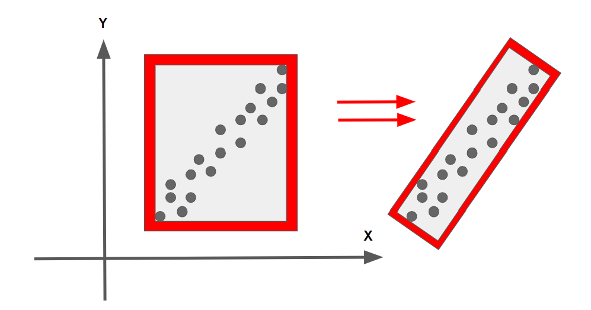

## 2. Clustering Obstacles

- To do a nearest neighbor search effectively, you use a KD-Tree data structure which on average speeds up your lookup time from O(n) to O(log(n)).

## 3. Euclidean Clustering with PCL

### Euclidean Clustering Arguments

- 参考：http://pointclouds.org/documentation/tutorials/cluster_extraction.html

  ```c++
  // Creating the KdTree object for the search method of the extraction
    pcl::search::KdTree<pcl::PointXYZ>::Ptr tree (new pcl::search::KdTree<pcl::PointXYZ>);
    tree->setInputCloud (cloud_filtered);
  
    std::vector<pcl::PointIndices> cluster_indices;
    pcl::EuclideanClusterExtraction<pcl::PointXYZ> ec;
    ec.setClusterTolerance (0.02); // 2cm
    ec.setMinClusterSize (100);
    ec.setMaxClusterSize (25000);
    ec.setSearchMethod (tree);
    ec.setInputCloud (cloud_filtered);
    ec.extract (cluster_indices);
  
    int j = 0;
    for (std::vector<pcl::PointIndices>::const_iterator it = cluster_indices.begin (); it != cluster_indices.end (); ++it)
    {
      pcl::PointCloud<pcl::PointXYZ>::Ptr cloud_cluster (new pcl::PointCloud<pcl::PointXYZ>);
      for (std::vector<int>::const_iterator pit = it->indices.begin (); pit != it->indices.end (); ++pit)
        cloud_cluster->push_back ((*cloud_filtered)[*pit]); //*
      cloud_cluster->width = cloud_cluster->size ();
      cloud_cluster->height = 1;
      cloud_cluster->is_dense = true;
  
      std::cout << "PointCloud representing the Cluster: " << cloud_cluster->size () << " data points." << std::endl;
      std::stringstream ss;
      ss << "cloud_cluster_" << j << ".pcd";
      writer.write<pcl::PointXYZ> (ss.str (), *cloud_cluster, false); //*
      j++;
    }
  ```

  - `min, max`: If a cluster is really small, it's probably just noise and we are not concerned with it.
  - If a cluster is very large it might just be that many other clusters are overlapping.


## 4. Implementing KD-Tree

- A KD-Tree is a binary tree that splits points between **alternating axes**.
  - x軸とy軸のどれを分割するかは、ノードのdepthを見る、depth % 2が0だったら、x軸で分割。depth % 2が1だったら、y軸で分割。
- By **separating space by splitting regions**, **nearest neighbor search** can be made **much faster** when using an algorithm like euclidean clustering.


## 5. Inserting Points into KD-Tree

- 1点目をを挿入する、root. (-6.2, 7) 
- 2点目を挿入する、rootがX軸で分割しているので、2点目のxをrootのxと比較する。左childになる。また、depthが１なので、y軸を分割 (-6.3, 8.4)：
- 3点目(-5.2, 7.1)を挿入するとき、まずrootのxと比べて、右childに行く。y軸を分割する。4点目(-5.7, 6.3)を挿入する時、まずrootのxと比べて、右に行く。また、右childのy（7.1）と比べて、小さいので、左childになる。depthが２なので、x軸を分割する。
- 木の様子：
- Improving the Tree: 2D example, **insert x median(中央値), then y median, then x median, etc**.


```c++
void insertHelper(Node **node, std::vector<float> point, int id, int depth) {
    if (!(*node)) {
        *node = new Node(point, id);
    } else {
        // odd layer, compare y; even layer, compare x
        if (point[depth%2] < (*node)->point[depth%2]) {
            insertHelper(&((*node)->left), point, id, depth + 1);
        } else {
            insertHelper(&((*node)->right), point, id, depth + 1);
        }
    }
}
```


## 7. Searching Points in a KD-Tree

- The KD-Tree is able to split regions and allows certain regions to be **completely ruled out**, speeding up the process of finding nearby neighbors.
- With the KD-Tree, you can compare distance with a **boxed square** that is `2 * distanceTol` for length, centered around the target point.
  - If the current node point is within this box then you can directly calculate the distance and see if the point id should be added to the list of nearby ids.
  - If the **box region** is not inside some **division region**, you completely skip that branch.
  - もしbox regionがnodeの左右に跨いでいれば、左右全部探す。

- searchの時`**`がいらない！

## 8. Euclidean Clustering

- Euclidean clusteringのpseudocode

  ```pseudocode
  Proximity(point,cluster):
      mark point as processed
      add point to cluster
      nearby points = tree(point)
      Iterate through each nearby point
          If point has not been processed
              Proximity(cluster)
  
  EuclideanCluster():
      list of clusters 
      Iterate through each point
          If point has not been processed
              Create cluster
              Proximity(point, cluster)
              cluster add clusters
      return clusters
  ```

## 9. Bounding Boxes


## 11. Extra Challenge: PCA Boxes



やっていない。