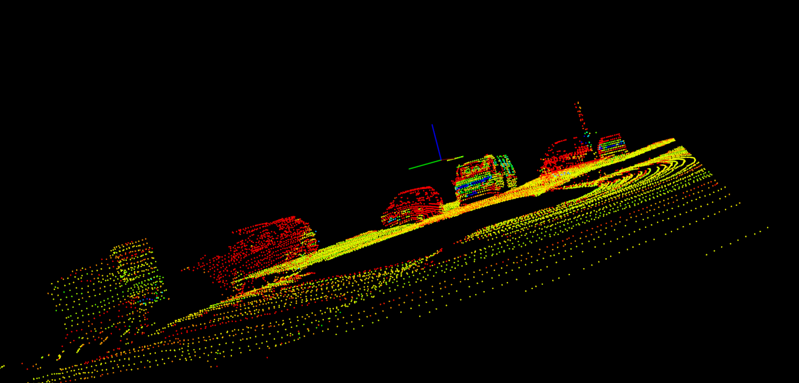

## 2. Load PCD


- If the color is not specified in the `renderPointCloud` function argument, it will default to using the intensity color coding.

## 5. Filtering with PCL

- Voxel Grid Filtering
- 参考：**Downsampling** a PointCloud using a VoxelGrid filter. https://pointclouds.org/documentation/tutorials/voxel_grid.html
- The `VoxelGrid` class creates a **3D voxel grid** (think about a voxel grid as a set of **tiny 3D boxes** in space) over the input point cloud data.
  - Then, in each *voxel*, all the points present will be approximated (i.e., downsampled) with their **centroid** (voxelのcenterじゃない).

- CropBox is a filter that allows the user to filter all the data inside of a given box. https://pointclouds.org/documentation/classpcl_1_1_crop_box_3_01pcl_1_1_p_c_l_point_cloud2_01_4.html
- For picking a good region.
  - try having a good amount of space in **front** of the car, so it could react quickly in time to any obstacles moving towards it.
  - for the sides, try to cover at least the width of the road.

- 最初Leaf sizeを0.01fにしたが、下記のワーニングが出ている：

  ```bash
  Loaded 119978 data points from ../src/sensors/data/pcd/data_1/0000000000.pcd
  [pcl::VoxelGrid::applyFilter] Leaf size is too small for the input dataset. Integer indices would overflow.filtering took 24 milliseconds
  ```



## 6. Steps for Obstacle Detection

### Step 1. Segment the filtered cloud into two parts, road and obstacles


### Step 2. Cluster the obstacle cloud


### Step 3. Find bounding boxes for the clusters

## 7. Stream PCD

### Stream PCD

- Pass in the point processor to the `cityBlock` function, this is because you don't want to have to recreate this object at every **frame**.

### PCL Viewer Update Loop

```c++
while (!viewer->wasStopped ())
{

  // Clear viewer
  viewer->removeAllPointClouds();
  viewer->removeAllShapes();

  // Load pcd and run obstacle detection process
  inputCloudI = pointProcessorI->loadPcd((*streamIterator).string());
  cityBlock(viewer, pointProcessorI, inputCloudI);

  streamIterator++;
  if(streamIterator == stream.end())
    streamIterator = stream.begin();

  viewer->spinOnce ();
}
```

- The `viewer->spinOnce()` call controls the frame rate, by default it waits 1 time step, which would make it run as fast as possible.
  - Depending on how timing efficient your obstacle detection functions were set up, the faster the viewer's frame rate will be.

- 左クリックでstopできる。主に調整しているhyperparametersは
  - region of interestのmaxPointのy。壁を完全に除くように。
  - clusterのclusterTolerance。違う車が同じboundingbox（cluster）にならないように。
  - clusterのminSize, maxSize。minSizeが大きいと、棒などがなくなる。maxSizeが小さいと、車（大きいオブジェクト）がなくなる。

- 最終的に、下記のhyperparameterでコースのgifになれた。

  ```c++
  auto filtered_cloud = point_processor.FilterCloud(input_cloud, 0.1f,
                                                        Eigen::Vector4f(-10, -6, -2, 1),
                                                        Eigen::Vector4f(30, 7, 1, 1));
      // step 1: segment road and obstacles
      auto segment_cloud = point_processor.SegmentPlane(filtered_cloud, 100, 0.2);
      renderPointCloud(viewer, segment_cloud.second, "plane_cloud", Color(0,1,0));
  
      // step 2: cluster the obstacle cloud and find bounding boxes for them
      auto cloud_clusters = point_processor.Clustering(segment_cloud.first, 0.4, 40, 2000);
  ```

  - 先生はFilterCloudでのresolutionは0.3fにしている（従って、clusterのdistance tolerance, min size, max sizeは0.53, 10, 500にしている（僕のパラメータの1/4））。


- 上記のgifはコースに張っているもの。僕の結果もこれになれた。

## 9. Tracking and Challenge Problem

### Tracking Discussion

- You can create **associations** between detections in frames and use that to track objects.
- One way to create associations between two different frames is by how close in proximity two detections are to each other, and how similar they look.