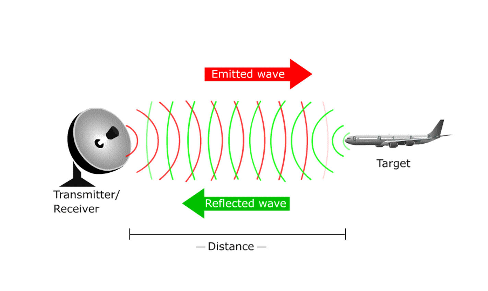
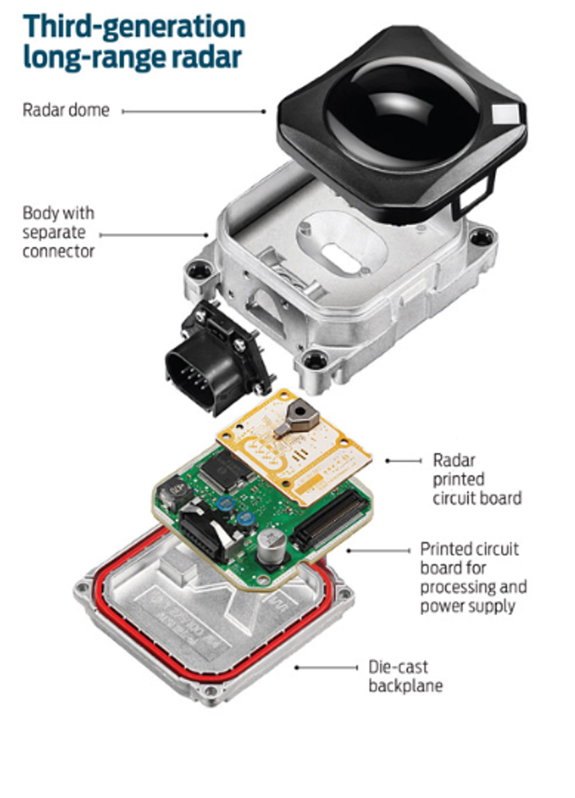
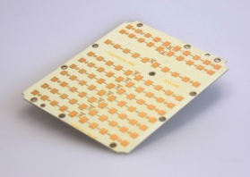
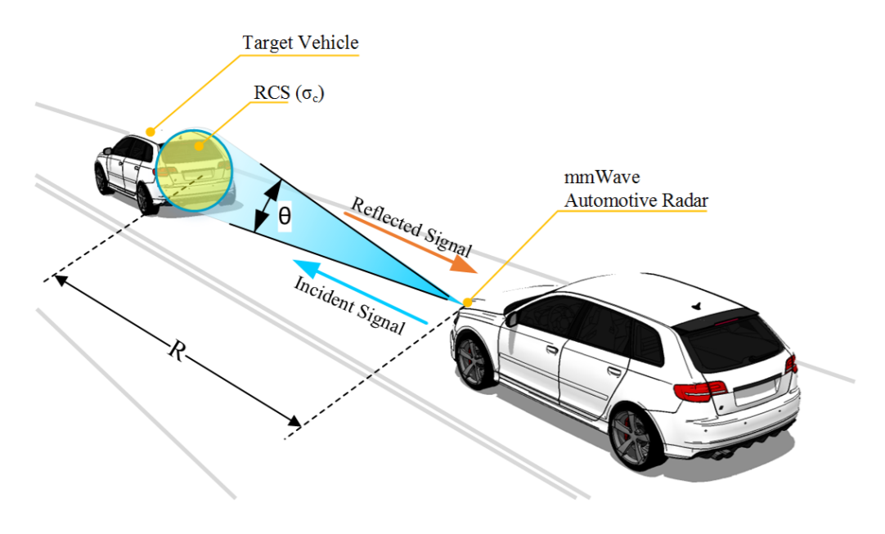
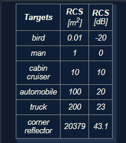
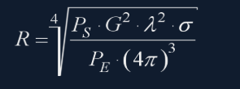
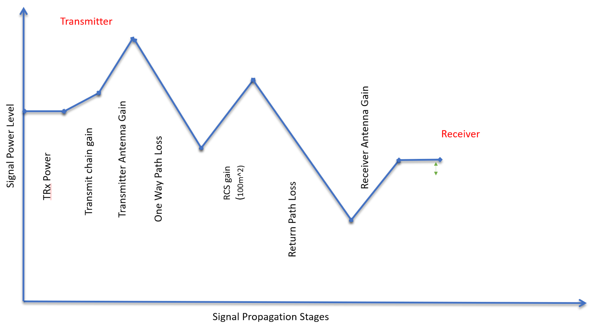
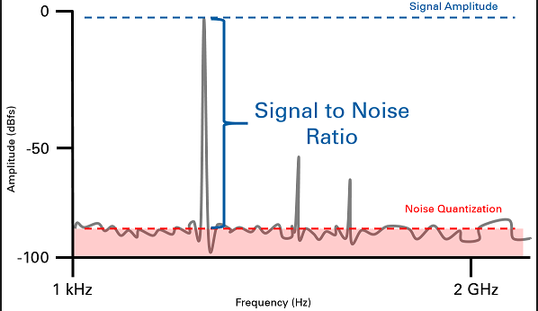

## 2. The Radar Sensor

### Radar Operation

### Radar Construction

- Bosch Automotive Radar:
  - The automotive radars are small size sensors that can easily fit **beneath the front grill(フロントグリル) or the bumper(バンパー)**.
  - **Radar Dome or Radome**.
    - A radome is a structural, **weatherproof** enclosure that protects a radar antenna.
    - The radome is constructed of material that **minimally attenuates(弱める)** the electromagnetic signal transmitted or received by the antenna, effectively **transparent to radio waves**.
  - Radar printed circuit board: radar transceiver and antenna needed for radio wave generation.
  - Printed circuit board and processing: **digital signal processing**.

### Radar vs. Lidar

- Tesla relies on Radar as its primary sensor and doesn't include LIDAR in its sensor fusion system.
- Lidar is the preferred technology at Waymo.

## 3. Signal Properties

### Single wave parameters

- Wavelength: $\lambda=\frac{speed of light}{frequency}$.
  - $\frac{1}{frequency}$は時間なので、$\lambda$は長さ。
- The automotive radar generally operates at W band (76GHz - 81GHz).
  - The signal at this frequency is referred to as millimeterWave since the wavelength is in mm.
- The **Bandwidth** of a signal is the difference between the highest and the lowest frequency components in a continuous band of frequencies.
- Higher the **amplitude** of the Radar signal, more is the visibility of radar.
  - Automotive Radar can operate at max of 55 dBm output power (316W).
- dB, dBm, mW, and W conversions: https://www.rapidtables.com/electric/dBm.html

### Phase of a Signal

- Phase is a **particular point in time on the cycle of a waveform**, measured as an angle in degrees.

- The difference between the phases of two periodic signals is called the **phase difference**.
  - difference is zero: **in phase**; otherwise: **out of phase**. 

### General Equation of a Wave: $y(t)=Acos(2\pi f_c t+\phi)$

## 4. FMCW (Frequency-Modulated Continuous Wave)

### FMCW Chirps(チャープ信号)

- The two most common waveform patterns used for FMCW radars are **sawtooth(鋸歯「きょし」) and triangular**.
  - Triangular waveform uses both **upramps and downramps**.
  - Sawtooth waveform uses upramps.
- **Each chirp is defined by its slope**. $Slope=\frac{B}{T_s}$.
  - The **range resolution** requirement decides the $B$.
  - The **maximum velocity** capability of a radar is determined by chirp time $T_s$.
- One **chirp sequence or segment** comprises of multiple chirps.
  - Each chirp is sampled multiple times to give multiple range measurements and radar transmits in order to measure doppler velocity accurately.
  - In the course project, sample each chirp 1024 times and send 128 of these chirps to estimate the range and doppler velocity. つまり1024回のサンプリングが１つchirpを作る？
    - The segment in this case would comprise of 128 chirps.

## 5. FMCW Hardware and Antenna

- Frequency Synthesizer: generate the frequency to bring the chirp frequency all the way to 77GHz in case of automotive radar.
- Antenna: **converts the electrical energy into electromagnetic waves** which radiate through the air, hit the target, and get reflected back toward the radar receiver antenna.
  - The Antenna also increases the strength of the signal by **focusing the energy in the desired direction**.
  - The **antenna pattern** determines the **field of view** for the radar.

- **Mixer**: multiply **return signal with sweeping signal** generated by the frequency synthesizer.
  - The operation works as **frequency subtraction** to give the **frequency delta** - also known as **frequency shift** or **intermediate frequency (IF)**.

### The Antenna Pattern

- Antenna radiation not only comprises of the main beam but the **sidelobes** as well.
  - Antenna side lobes can generate false alarms and pick interference from **undesired direction**.
  - Critical to **suppress** the sidelobe levels to more than 30dB from the peak of the main beam.

### Antenna Types

- Patch Array Antenna: 
  - Many types of antenna (dipole双極子「そうきょくし」, patch, horn) can be used at 77GHz, but the most commonly used antenna type in automotive radar is the patch antenna (low cost, easy fabrication, low profile控えめな).

## 6. Radar Cross Section

- 上記図：https://arxiv.org/pdf/1607.02434.pdf
- The **size and ability** of a **target** to reflect radar energy is defined by a single term, $\sigma$, known as the **radar cross section**, which has units of $m^2$.
  - This unit shows the radar cross section is **an area**.
- RCSの決定要素：
  - The target's physical geometry and exterior features. 
    - **Sharp corners** will focus the return signal back in the direction of the source, leading to higher RCS.
  - The direction of the illuminating radar; radar transmitter's frequency; material.

### RCS Units

- $RCS_{dB}=10log(RCS_{m^2})$: 

## 7. Radar Range Equation

- $P_s$: transmitted power from radar (dBm); 
- $G$: gain of the transmit/receive antenna (dBi);
- $\lambda$: wavelength of the signal (m).
- $\sigma$: radar cross section ($m^2$).
- $P_E$: **minimum received power radar can detect**.

- **RCS gain**: on getting reflected from the target, the signal gets amplified based on the RCS of the target. なぜ増幅「ぞうふく」されたかは分かっていない。

### Radar Detection

- A radar cannot detect a signal that is below the noise level.
  - The noise level is determined by the thermal noise(熱雑音) **generated by the receiver**.

- *Signal to noise ratio* (SNR).
  - Higher SNR is desirable for successful detection of the target.
  - Generally, a 7-13dB SNR ensures successful detection in a road scenario.