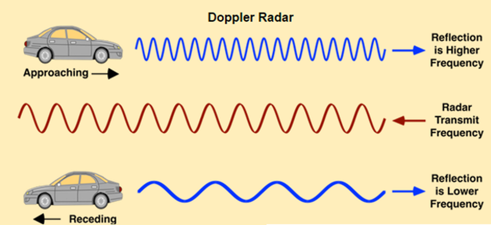
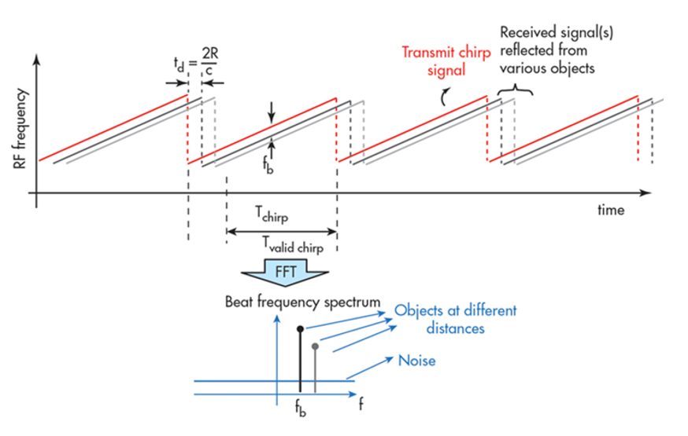

## 1. Range, Velocity, and Angle Resolution

- ３つmeasurement resolution: 
  - Capability of a radar to **resolve two targets** based on differences in their distance, angle and velocity.
- Range resolution: solely dependent on the bandwidth of the chirp: $d_{res}=\frac{c}{2B_{sweep}}$.この式の意味は分かっていない。
  - radarのrange resolutionの基本考え方は$S_r\geq\frac{c_0\tau}{2}$.https://www.radartutorial.eu/01.basics/Range%20Resolution.en.html
  - $\tau/2$の意味は**pulse width time**の半分。そうすると、遠い方objectに当たって跳ね返って、近い方objectに到達する時、近い方objectに当たって跳ね返ったpulseは既に全部離れた。そうすると、２つ跳ね返ったpulseは分けられる。
- Velocity resolution
  - **If two targets have the same range, they can still be resolved if they are travelling at different velocities**.
  - **The velocity resolution is dependent on the number of chirps**.
  - A higher number of chirps increases the velocity resolution, but it also takes longer to process the signal.
- Angle resolution: depend on different parameters depending on the angle estimation technique used.

## 2. Range Estimation

- trip timeの計算：by measuring the **shift in the frequency**.

### Range Estimation Equation

- If radar can determine the delta between the received frequency and **hardware's continuously ramping frequency** then it can calculate the trip time and hence the range. 
  - **If a target is stationary** then a transmitted frequency and received frequency are the same. 
  - **beat frequency**: $f_b=f_{ramping}-f_{received}$.

### System Level Range Calculation

## 3. Doppler Estimation

- Used in the radar guns to catch the speed violators, or even in sports to measure the speed of a ball.

### FMCW Doppler Measurements

- Doppler shift is proportional to the velocity of the target: $f_D=\frac{2v_r}{\lambda}$.
- **The beat frequency comprises of both frequency components: $f_r$ (frequency delta due to the range) and $f_d$ (frequency shift due to velocity)**.
  - In the case of automotive radar, the $f_d$ is very small in comparison to the $f_r$.
  - Hence, the doppler velocity is calculated by measuring the **rate of change of phase** across multiple chirps. $\frac{d\Phi}{dt}=frequency$.

### Doppler Phase Shift

- **The phase change occurs due to small displacement of a moving target for every chirp duration**.
- If the path between a target and the radar is changed by an amount $\Delta x$, the phase of the wave received by radar is shifted by $\Delta \varphi=\frac{\Delta x}{\lambda}$.
- The resulting change in observed frequency: $\Delta f=\frac{\Delta \varphi}{\Delta t}$.

## 4. Fast Fourier Transform (FFT)

- For a radar to **efficiently** process measurements digitally, the signal need to be converted from analog to digital domain, and further from time domain to frequency domain.
  - Conversions to frequency domain is important to do the **spectral analysis** of the signal and **determine the shifts in frequency due to range and doppler**. 
- The travelling signal is in time domain.
  - Time domain signal comprises of **multiple frequency components**. 違うobjectから戻ったpulseが重なるので、FFTで彼らを分ける。

### FFT and FMCW

- **Range FFT**s are run for every sample on each chirp. 
  - Since **each chirp is sampled N times**, it will generate a range FFT block of **N * (Number of chirps)**.
  - For each sample, it produces a range bin.
  - Each bin in every column of block represents increasing range value, so that the end of last bin represents the maximum range of a radar.

## 5. The 2D FFT

- Once the range bins are determined by running range FFT across all the chirps, a second FFT is implemented **along the second dimension** to determine the doppler frequency shift.
- The output of the first FFT gives the beat frequency, amplitude, and phase for each target.
  - **This phase varies** as we move from one chirp to another (one bin to another on each row) due to the target's small displacements.
- The output of Range Doppler response represents an image with Range on one axis and Doppler on the other.
  - This image is called as **Range Doppler Map** (RDM). 