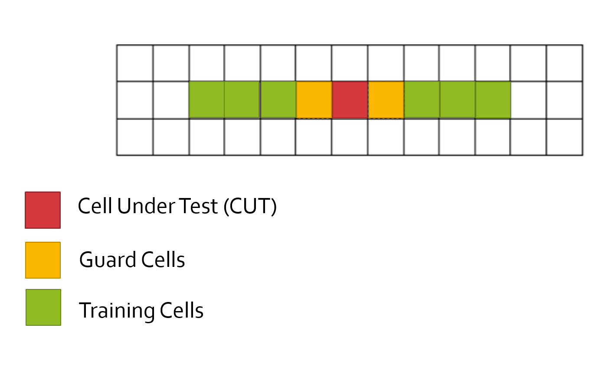
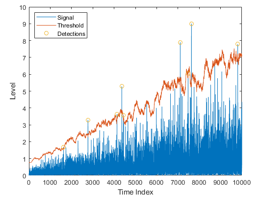
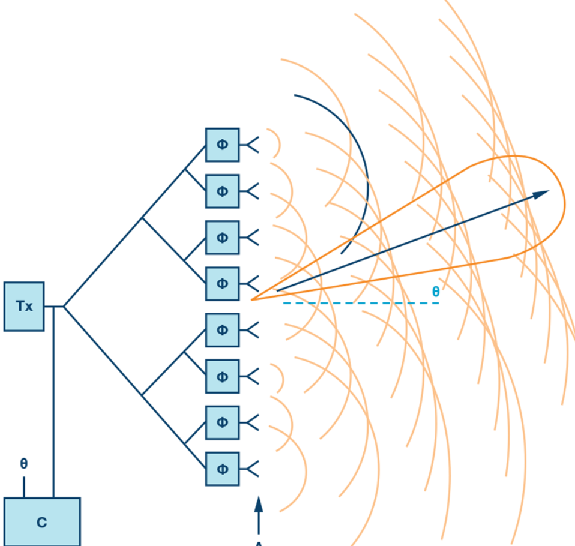
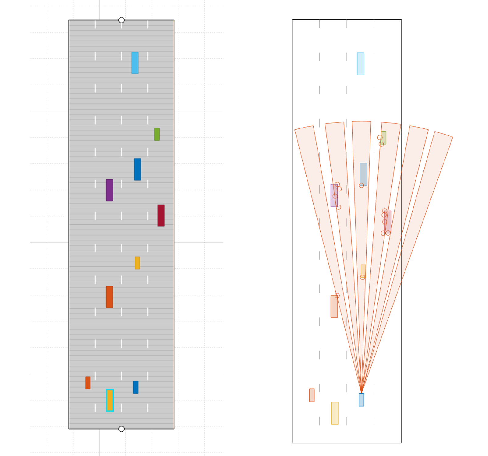
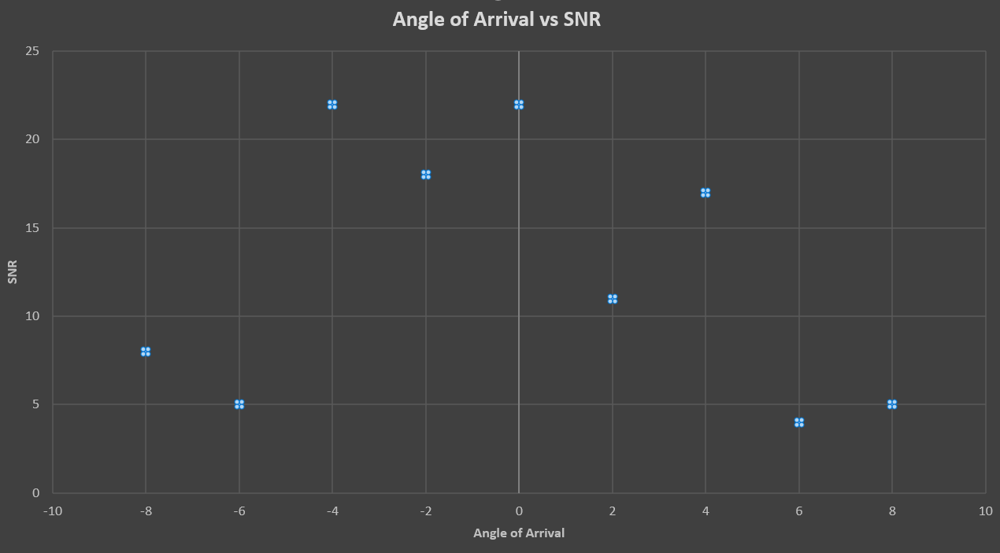

- The backscatter(後方散乱) from unwanted sources is called clutter.
  - These unwanted signals are generally produced by the reflections from the ground, sea, buildings, trees, rain, fog, etc.

### Clutter Thresholding

- 方法１：remove the signals having 0 doppler velocity, since the clutter in the driving scenario are often created by the stationary targets.
  - デメリット：would not be able to detect stationary targets in its path.でも移動している自車に対して静的ものもdoppler velocityがあるでしょう？

- 方法2: fixed clutter thresholding.

### Dynamic Thresholding

- CFAR (Constant False Alarm Rate).
  - The noise at every or group of range/doppler bins is monitored and the signal is compared to the local noise level.
  - This comparison is used to create a threshold which holds the false alarm rate constant.

## 3. CFAR

- CFAR varies detection threshold based on the vehicle surroundings.
- The process loops across all the range cells and decides the presence of target based on the noise estimate.
- The basis of the process is that when noise is present, **the cells around the cell of interest will contain a good estimate of the noise**, i.e. it assumes that the noise or interference is spatially or temporarily homogeneous.
- Theoretically, it will produce a constant false alarm rate, which is independent of the noise or clutter level.
- CFAR種類：
  - Cell Averaging CFAR (CA-CFAR).
  - Ordered Statistics CFAR (OS CFAR).
  - Maximum Minimum Statistic (MAMIS CFAR).
  - multiple variants of CA-CFAR.

## 4. CA-CFAR

- The FFT blocks are generated on implementing range and doppler FFTs across the number of chirps.
- The CFAR process includes the **sliding window** across the cells in FFT blocks.

- Training Cells:
  - Can be divided into two regions, the cells lagging the CUT, called Lagging Training Cells and the cells leading the CUT, called Leading Training Cells.
  - The noise is estimated by averaging the noise under the training cells.
  - In some case either leading or lagging cell average is taken, while in the other, the leading and lagging cell average is combined and the higher of two is considered for noise level estimate.
- Threshold Factor (Offset): to scale the noise threshold.なぜこれが必要か分かっていない。

## 5. CFAR 2D

> 1. Determine the number of Training cells for each dimension Tr and Td. Similarly, pick the number of guard cells Gr and Gd. 
> 2. Slide the Cell Under Test (CUT) across the complete cell matrix
> 3. Select the grid that includes the training, guard and test cells. Grid Size = (2Tr+2Gr+1)(2Td+2Gd+1).
> 4. The total number of cells in the guard region and cell under test. (2Gr+1)(2Gd+1).
> 5. This gives the Training Cells  : (2Tr+2Gr+1)(2Td+2Gd+1) - (2Gr+1)(2Gd+1)
> 6. Measure and average the noise across all the training cells. This gives the threshold
> 7. Add the offset (if in signal strength in dB) to the threshold to keep the false alarm to the minimum. 
> 8. Determine the signal level at the Cell Under Test. 
> 9. If the CUT signal level is greater than the Threshold,  assign a value of 1, else equate it to zero. 
> 10. Since the cell under test are not located at the edges, due to the  training cells occupying the edges, we suppress the edges to zero. Any  cell value that is neither 1 nor a 0, assign it a zero.    

## 6. Angle of Arrival Introduction

- A **phased array antenna** is an antenna array that **steers the beam electronically in the desired direction**.
  - The array steers the beam if each antenna element in an array is excited by the signal with **certain phase** values.
  - This phenomenon is referred to as beam scanning.
  - $\Phi$ represents the **phase shifter**s.

- For antenna beam to steer in a desired direction, the phase shifters are programmed to have **constant phase increments**.

  - If an antenna comprises of 6 radiating elements and the phase delta required to steer a beam in a given direction is 15 degrees, then phase value on each element would be [0, 15, 30, 45, 60, 75] degrees. ここの15度はphase deltaで、beam directionじゃね！

- phase deltaやbeam directionの関係：$\Phi=360\cdot d\cdot \sin(\theta)/\lambda$.

  - $\Phi$: incremental phase shift.
  - $d$: spacing between antenna elements.
  - $\theta$: steering direction from the normal of the antenna surface.
  - $\lambda$: wavelength of the signal.

- As the radar scan the surroundings by steering the beam at the programmed angles, it can sense the angle of the return signal.

  - This helps radar create a spatial perception of the environment.

    

### Angle of Arrival

