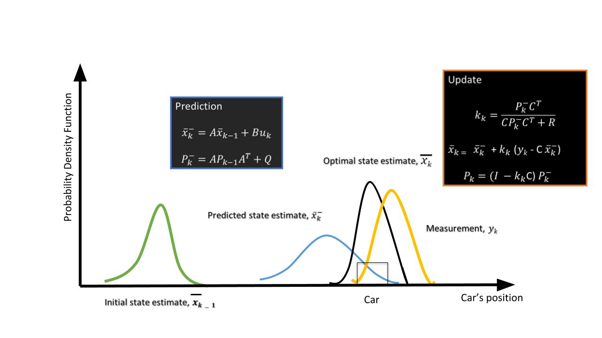

## 2. Clustering

- If a tracker is assigned to every detection from the same target, then it can overburden the processing unit.
  - Hence, cluster the detections from every target and assign a single track for each.

- Lidar点群のclusteringアルゴリズムと一緒。euclidean distance proximityベース。

## 3. Kalman Tracking

## 4. Matlab Sensor Fusion Guided Walkthrough

- The scenario generation and sensor simulation can have different time steps.
  - This is useful for modeling actor motion with high accuracy independently from the sensor's measurement rate.