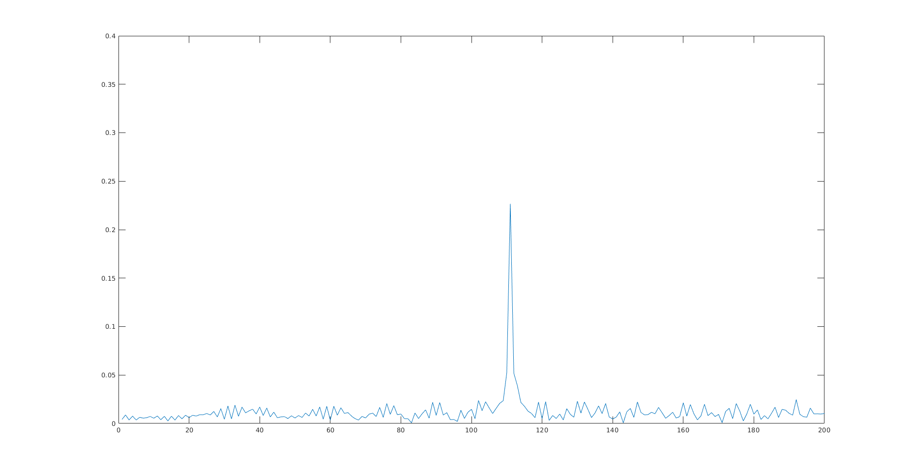
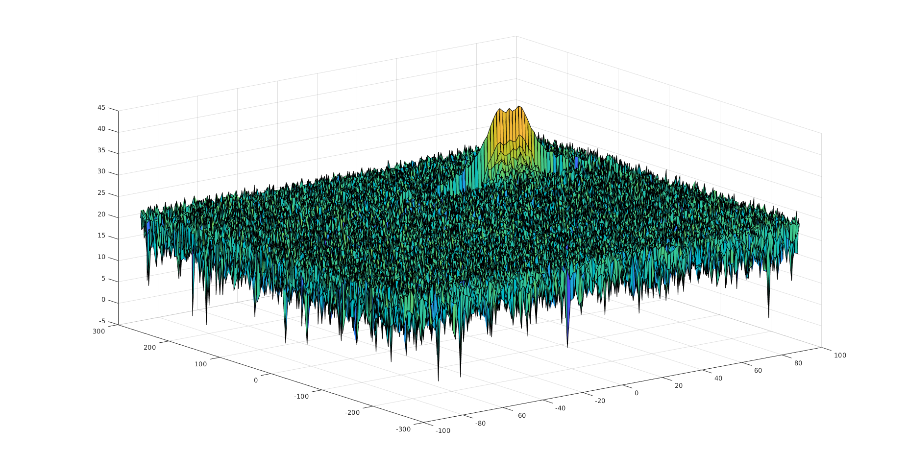
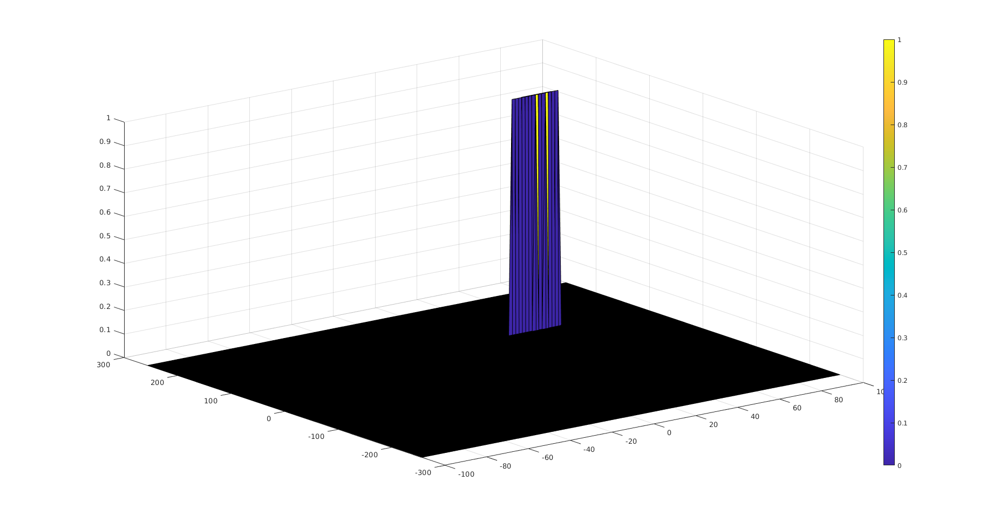

## 1. Project Overview

### Radar System Requirements

- sweep bandwidth: $Bandwidth(B_{sweep})=speed of light/(2*rangeResolution)$.
- sweep time: $T_{chirp}=5.5*2*R_{max}/c$.
- sweep slope: $Slope=Bandwidth/T_{chirp}$.

## 2. Target Generation and Detection

- $\tau$ is the trip time for signal.
- $\cos\alpha \cos\beta=\frac{\cos(\alpha+\beta)+\cos(\alpha-\beta)}{2}$.
- Tx.*Rx結果の導出は分かっていない。
  - vはvelocity target?

### 3. FFT Operation

- Implement the 1D FFT on the Mixed Signal 
- Reshape the vector into Nr*Nd array. 
- Run the FFT on the beat signal along the range bins dimension (Nr) 
- **Normalize the FFT output**. 
- Take the absolute value of that output.
- Keep one half of the signal
- Plot the output
- There should be a peak at the initial position of the target 

### 4. 2D CFAR

- Determine the number of Training cells for each dimension. Similarly, pick the number of guard cells.
- Slide the cell under test across the complete matrix. Make sure the CUT has margin for Training and Guard cells from the edges.
- For every iteration sum the signal level within all the training  cells. To sum convert the value from logarithmic to linear using db2pow  function. 
- Average the summed values for all of the training cells used. After averaging convert it back to logarithmic using pow2db.
- Further add the offset to it to determine the threshold. 
- Next, compare the signal under CUT against this threshold. 
- If the CUT level > threshold assign it a value of 1, else equate it to 0.

- To keep the map size same as it was before CFAR, equate all the non-thresholded cells to 0.

- 2D FFT: 
- 2D CFAR: 

